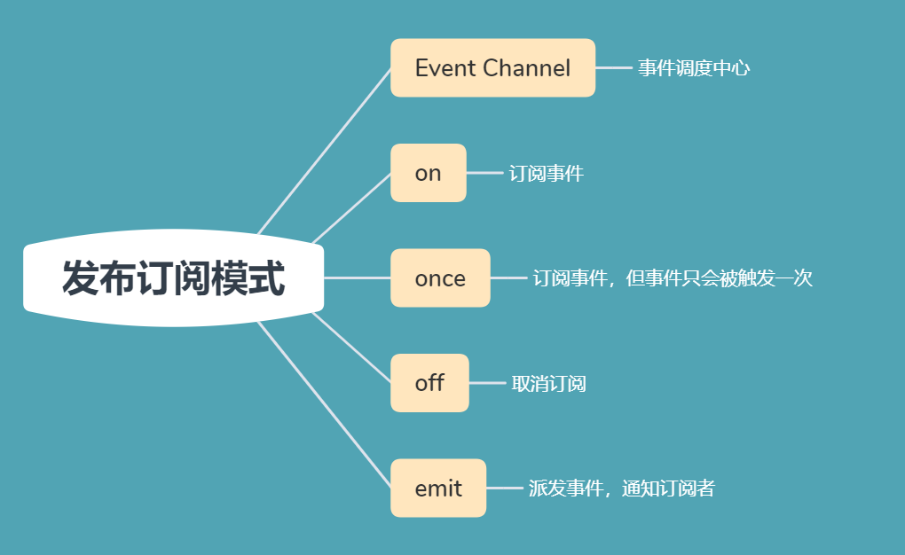
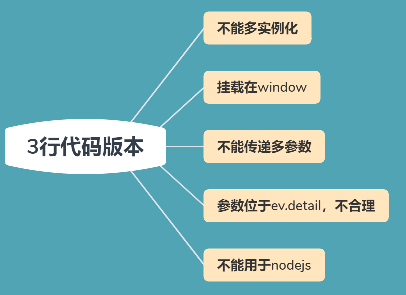

## 阅读本文，你将学会：

- 彻底掌握发布订阅模式
- 学会使用 `3` 行，`6` 行，`8` 行代码来实现发布订阅模式，惊叹面试官
- 学会标准发布订阅模式的编写

## 前言

前几天在学习时，碰巧发现一个很狂的课程，分别使用 `3` 行，`6` 行，`8` 行代码来实现发布订阅模式，小包第一瞬间感觉有点麻，第二瞬间感觉这个世界在骗我，世界已经卷成这样了吗？怀揣着不信的、打假的念头进入学习。

没想到竟然真的能实现，不得不说有些佩服，下面带大家了解一番。

## 发布订阅模式

> 什么是发布订阅模式那？基于一个事件(主题)通道，希望接收通知的对象 `Subscriber` 通过自定义事件订阅主题，被激活事件的对象 `Publisher` 通过发布主题事件的方式通知各个订阅该主题的 `Subscriber` 对象。

追剧就是最简单的案例。某平台上线了一部热剧，小包时刻盼望着更新，但打工人小包还是非常繁忙的，不能一直盯着平台。平台可是个会赚钱的行家，发生了这个问题，推出了订阅功能，当小包选择订阅电视剧后，平台会在更新第一时间给小包发送消息通知。于是一个摸鱼怪兽就诞生了。

追剧案例中，电视剧就是发布者 `Publisher` ，小包就是订阅者 `Subscriber` ，平台则承担了事件通道(`Event Channel`) 中介作用。

上面的文字有些抽象，把它编程化一下，一个完善的发布订阅模式通常由如下部分组成:



发布订阅模式有这么多部分组成，那大佬是如何实现超精简代码的那？其实是借助了 `DOM` 接口 `EventTarget`。

`EventTarget` 由可以接收事件、并且可以创建侦听器的对象实现，上面挂载了三个非常常用的方法，`addEventListener`，`removeListener`，`dispatchEvent`。`EventTarget` 在前端的继承链地位是非常高的，`Element`，`document` 和 `window` 都继承了 `EventTarget`，因此在写原生 `JavaScript` 事件监听时，这几个方法我们经常是基于元素 `element` 或者 `window` 使用。

### 3 行代码

`3` 行代码的版本非常简单，就是直接借用 `EventTarget` 的三个方法，而且作者耍了一个小心机，发布订阅模式有四个方法，如何使用 `3` 行代码实现呐？逗号运算符，两行变一行，只能说的确是精简到精髓了，佩服佩服。

`on` 方法和 `off` 方法可以直接借助 `EventTarget` 上的 `addEventListener` 和 `removeEventListener`。

实现难点主要在于 `emit` 方法和 `once` 方法。`addEventListener` 方法不止可以接收两个参数，第三个参数是 `options` 配置项，`options` 中有两个比较有意义的配置，利用这两个配置，可以轻松实现 `once` 方法。

- capture: `listener` 会在该类型的事件捕获阶段传播到该 `EventTarget` 时触发
- once: `listener` 在添加之后最多只调用一次

发布订阅模式中的事件可以自由定义，并不拘束于浏览器的事件，因此寻找自定义事件的方法来配合 `dispatchEvent` 使用， `JavaScript` 真是神通广大，同时也提供了对应的`CustomEvent` 接口，但该接口定义的事件存在一个缺陷，必须通过规定的 `detail` 传递数据。具体语法:

```js
void initCustomEvent(in DOMString type, in boolean canBubble, in boolean cancelable, in any detail);
```

借助上面基础知识的铺垫，`3` 行代码就可以成功实现了

```js
// 直接借用方法
(window._on = window.addEventListener),
  (window._off = window.removeEventListener);
// 自定义事件，利用 detail 属性传递数据，利用 dispatch 派发事件
window._emit = (type, data) =>
  window.dispatchEvent(new CustomEvent(type, { detail: data }));
// 利用配置项实现一次订阅效果
window._once = (type, listener) =>
  window.addEventListener(type, listener, { once: true, capture: true });
```

上面的代码的确非常精炼，但问题还是比较多的。



下面我们来优化一下，推出 `6` 行版本。

### 6 行版本

上文讲过，`window`，`element` 都是继承于 `EventTarget`，那我们也可以直接继承于 `EventTarget`，编写自己的 `EventEmitter` 类，将发布订阅从 `window` 上摘下来，同时也可以实现多实例化。

```js
// 核心思想还是一样的
class EventEmitter extends EventTarget {
  on = this.addEventListener;
  off = this.removeEventListener;
  emit = (type, data) =>
    this.dispatchEvent(new CustomEvent(type, { detail: data }));
  once = (type, listener) =>
    this.on(type, listener, { once: true, capture: true });
}
```

`6` 行代码版本虽然可以实现多实例，但仍然需要从 `detail` 上获取参数，并且不支持多参数，因此我们继续优化一下，推出 `8` 行版本。

### 8 行代码

多参数的支持是比较容易扩展的，使用 `ES6` 提供的 `...` 运算符直接收集起来即可。

`6` 行代码中，当触发 `emit` 事件后，传递的数据为对象格式 `{detail: data}`，因此 `listener` 接受的数据也会是对象格式，需要从 `detail` 获取数据，这种使用方式明显不符合程序员自由的心，我可不想要每次编写程序还得带个莫名其妙的 `detail` 属性，所以我们决定提前对其进行抽离。

抽离方式很简单，只需要再 `listener` 外层包裹一层函数，函数中将 `detail` 属性进行抽离，`on` 注册的是包裹函数，这样就可以避免后续使用中的 `detail` 属性。但要注意，如果使用了包裹函数，`off` 也许进行对应修改，因此选择将包裹函数挂载至 `listener.__wrap__`属性上

```js
class EventEmitter extends EventTarget {
  on = (type, listener, options) =>
    this.addEventListener(
      type,
      function wrap(e) {
        // 包裹函数，将包裹函数挂载到 __wrap__
        return (listener.__wrap__ = wrap), listener.apply(this, e.detail || []);
      },
      options
    );
  // off时删除 __wrap__
  off = (type, listener) => this.removeEventListener(type, listener.__wrap__);
  emit = (type, ...args) =>
    this.dispatchEvent(new CustomEvent(type, { detail: args }));
  once = (type, listener) =>
    this.on(type, listener, { once: true, capture: true });
}
```

## 标准的发布订阅模式实现

上面的实现方法属实有些太狠了，为了以防万一，咱们也得学会一下标准的发布订阅模式的实现思路及源码，标准的，精炼的都掌握住，那这部分就无懈可击了。

### 定义 EventEmitter 及事件通道

```js
function EventEmitter() {
  this._events = Object.create(null);
}
```

### on 方法

> on 方法是为指定事件注册一个监听器，接受一个字符串 event 和一个回调函数。

`on` 的逻辑比较简单，就不做详解。

```js
EventEmitter.prototype.on = function (type, listener) {
  // 获取事件通道
  let events = this._events;
  if (events === undefined) {
    events = this._events = Object.create(null);
  }

  // 如果该事件存在构造函数，直接压入即可，否则单独为该事件开启分区
  if (!events[type]) {
    events[type] = [listener];
  } else {
    events[type].push(listener);
  }
};
```

### once 方法

> once 为指定事件注册一个单次监听器，即监听器最多只会触发一次，触发后立刻解除该监听器。

`once` 方法就有一些门道了，`once` 注册的事件会有两种解除方式：第一种，执行完毕后事件解除；第二种事件执行前通过 `off` 方法解除。因此这两种情况我们都需要进行考虑。

**Case1：事件执行完毕后解除**

`once` 与 `on` 事件的注册本质是相同的，只不过 `once` 执行一次后会调用 `off` 解除该事件，因此我们可以将 `once` 监听的事件处理函数与 `off` 解除方法捆绑在一起，形成一个新的回调函数，让后利用注册该回调函数。

```js
EventEmitter.prototype.once = function (type, listener) {
  // 监听器执行后移除
  const onceApply = (...args) => {
    // 事件回调函数执行
    listener.call(this, ...args);
    this.off(type, listener);
  };
  // 注册监听器
  this.on(type, onceApply);
};
```

**Case2：事件未执行，通过 off 方法解除**

`Case1` 中我们把回调函数与 `off` 解除包裹在 `onceApply` 函数中，而 `off` 方法的调用传入的是 `type,listener`，`on` 方法注册的是 `onceApply`，因此发生了函数不对应，`off` 方法是无法成功删除 `listener` 方法。实现思路也非常简单，咱们给 `onceApply` 加个标识，指引 `listener`，`off` 时判断该标识位即可。

```js
// 挂载标识
onceApply.listener = listerner;
```

### off 方法

> off 是移除指定事件的某个监听器，监听器必须是该事件已经注册过的监听器。

有了 `once` 部分的分析，`off` 方法也需要处理两类情况: `on` 方法注册的事件处理函数 `listener`，`once` 方法注册的事件处理函数挂载在 `.listener` 属性。

而 `on` 方法和 `once` 方法同时只会执行一个，因此我们只需对两者进行过滤即可。

```js
EventEmitter.prototype.off = function (type, listener) {
  const events = this._events;
  // 边界情况
  if (events === undefined) {
    return this;
  }
  const listenerList = events[type];
  if (listenerList === undefined) {
    return this;
  }

  // 处理两种情况
  events[type] = events[type].filter((fn) => {
    // on 调用 && 前半部分为 false
    // once 调用 && 后半部分为 false
    return fn !== listener && fn.listener !== listener;
  });
};
```

### emit 方法

> emit 方法按监听器的顺序执行执行每个监听器，如果事件有注册监听返回 true，否则返回 false。

`emit` 方法唯一需要注意的就是，某事件有可能会注册多个回调函数，当事件触发后，回调函数依次执行。

```js
EventEmitter.prototype.emit = function (type, ...args) {
  const events = this._events[type];
  // 边界情况处理
  if (events === undefined) {
    return false;
  }
  const handler = events[type];
  if (handler === undefined) {
    return false;
  }
  // 执行 emit 事件对应的监听器
  handler.forEach((fn) => {
    fn.call(this, ...args);
  });
  return true;
};
```
