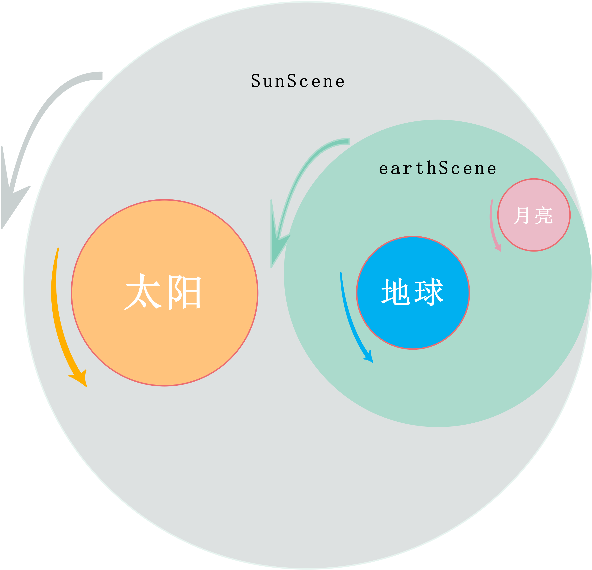
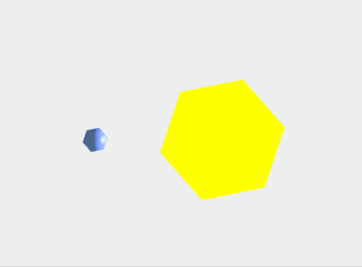
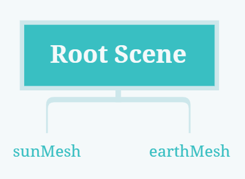
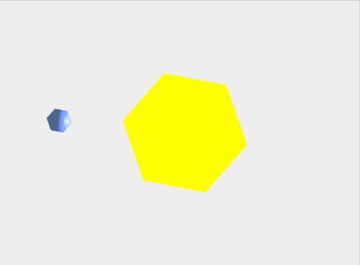
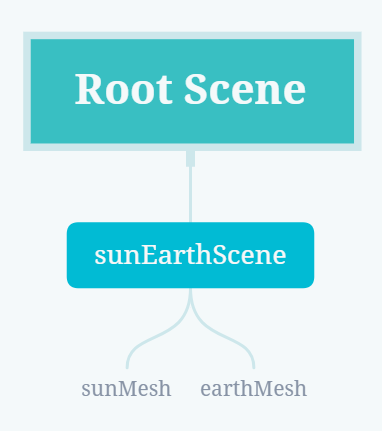
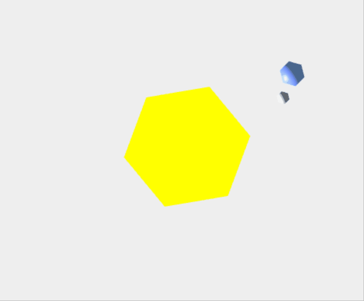
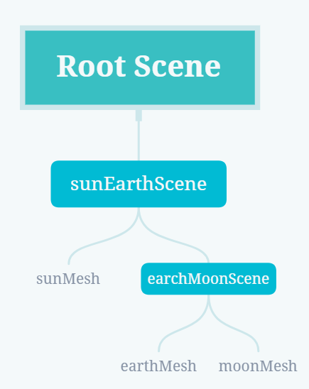
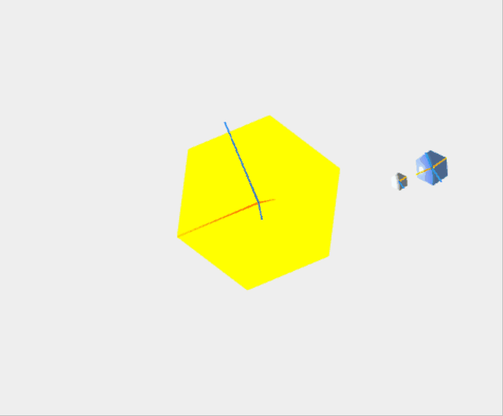
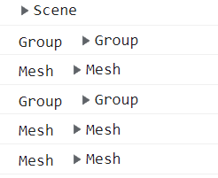

> 本文为稀土掘金技术社区首发签约文章，14 天内禁止转载，14 天后未获授权禁止转载，侵权必究！
> 本篇是 `Three` 从入门到进阶的第 3 篇，[关注专栏](https://juejin.cn/column/7140955761605083150)

## 前言

上一篇文章[用摄影的故事来敲开 `Three`js 世界的大门](https://juejin.cn/post/7165656785309663245) 讲解了 `Three` 入门基础，本文讲解 `Three` 中非常核心的概念——场景图，用好场景图，能极大程度提高开发效率，更好的理解 `Three`js 机理。

## 场景图

什么叫场景图那？

> `Three`.js's core is arguably its scene graph. A scene graph in a 3D engine is a hierarchy of nodes in a graph where each node represents a local space. ——官方文档

场景图代表了 `Three` 中节点的层次结构，每个节点代表一个局部空间。

听起来有些难以理解，小包来举个例子。

在太阳系中，太阳是中心，地球绕着太阳转，月亮又绕着地球转，与此同时它们都进行自转。那现在需求来了，如何来实现太阳、地球、月亮的旋转案例。

我们来拆解一下上述需求的实现步骤:

1. 要实现太阳、地球、月亮三个球体
2. 三个球体都发生自转
3. 地球绕着太阳旋转，月亮绕着地球旋转

上一篇文章讲过，`Three` 基础三件套之一为场景 scene，所有的模型放置于 scene 中，因此先将太阳、地球、月亮三个模型都添加到 scene 中。

`Three` 中大部分对象都继承于 `Object3D` 类，`Object3D` 对象上有 rotation 属性，来控制物体的局部旋转。

模型和 scene 都继承于 `Object3D`，因此自转可以使用模型上的 rotation 属性进行实现。

scene 同样具备 rotation 属性，如果 scene 中只有地球和太阳，可通过设置 scene 旋转实现。但月亮就没有立足之地了，除非去计算月亮随太阳的转动方程，这未免有些舍近求远，如果月亮能和地球绑定在一起，月亮只针对地球设置将简单多了。具体演示见下图:



真实案例中通常会有多组相关的旋转或者更复杂的关系，只有一个 scene 很难进行实现，于是 `Three` 就提出了场景图的概念，它允许我们开启局部空间，也可以理解为总 scene 下包含多个子 scene，以此类推可以构成一个 scene 树。

接下来我们来复现一下太阳-地球-月亮的案例，体悟一下 `Three` 中场景图的具体使用。

`Three`js 的默认配置请参考[用摄影的故事来敲开 `Three`js 世界的大门](https://juejin.cn/post/7165656785309663245)，这里不做赘述。

修改一下 `camera` 的基本配置:

```js
const camera = new `Three`.PerspectiveCamera(
  40,
  window.innerWidth / window.innerHeight,
  0.1,
  1000
);
camera.position.set(0, 50, 0);
camera.up.set(0, 0, 1);
camera.lookAt(0, 0, 0);
```

三个模型本质上是相同的，先实现一个公共的几何体，后续通过 `scale` 方法进行放大和缩小。

```js
const radius = 1;
const widthSegments = 6;
const heightSegments = 6;
const sphereGeometry = new `Three`.SphereGeometry(
  radius,
  widthSegments,
  heightSegments
);
```

由上面绘制的演示图可知，这个案例中会有多个模型以及局部空间的旋转，我们预设一个旋转数组，`render` 函数更新时同步更新旋转数组中的所有节点。

```js
// 要更新旋转角度的对象数组
const rotations = [];
const render = (time) => {
  time *= 0.001;
  renderer.render(scene, camera);
  controls && controls.update();
  rotations.forEach((obj) => {
    obj.rotation.y = time;
  });
  requestAnimationFrame(render);
};
```

**Step1: 实现地日旋转**

```js
// 定义太阳模型
const sunMaterial = new `Three`.MeshPhongMaterial({ emissive: 0xffff00 });
const sunMesh = new `Three`.Mesh(sphereGeometry, sunMaterial);
sunMesh.scale.set(5, 5, 5); // 通过scale放大模型
scene.add(sunMesh);
rotations.push(sunMesh); // 添加到旋转数组中

// 定义地球模型
const earthMaterial = new `Three`.MeshPhongMaterial({
  color: 0x2233ff,
  emissive: 0x112244,
});
const earthMesh = new `Three`.Mesh(sphereGeometry, earthMaterial);
// 移动一下地球位置，要不会被太阳遮盖
earthMesh.position.x = 10;
rotations.push(earthMesh);
scene.add(earthMesh);
```



太阳和地球的自转就实现了，场景图结构如下图:



接下来我们为太阳和地球开启一块局部空间，同时设置局部空间的自转。

```js
// 通过 Object3D 来声明空的场景图
const sunEarchScene = new `Three`.Object3D();
scene.add(sunEarchScene);
rotations.push(sunEarchScene);

const sunMaterial = new `Three`.MeshPhongMaterial({ emissive: 0xffff00 });
const sunMesh = new `Three`.Mesh(sphereGeometry, sunMaterial);
sunMesh.scale.set(5, 5, 5);
rotations.push(sunMesh);
// scene.add(sunMesh); // 添加至新的场景图节点中

// 定义地球模型
const earthMaterial = new `Three`.MeshPhongMaterial({
  color: 0x2233ff,
  emissive: 0x112244,
});
const earthMesh = new `Three`.Mesh(sphereGeometry, earthMaterial);
// 移动一下地球位置，要不会被太阳遮盖
earthMesh.position.x = 10;
rotations.push(earthMesh);
// scene.add(earthMesh);  // 添加至新的场景图节点中
```



场景图结构如下:



**Step2: 实现地月旋转**

地月位于一个新的局部空间中，再次添加一个空场景图节点 `earchMoonScene`，将地球和月亮放置到里面，同时将 `earchMoonScene` 添加到 `sunEarchScene` 中。

```js
const earchMoonScene = new `Three`.Object3D();
earchMoonScene.position.x = 10;
sunEarchScene.add(earchMoonScene);
rotations.push(earchMoonScene);
// 添加月亮
const moonMaterial = new `Three`.MeshPhongMaterial({
  color: 0x888888,
  emissive: 0x222222,
});
const moonMesh = new `Three`.Mesh(sphereGeometry, moonMaterial);
moonMesh.scale.set(0.5, 0.5, 0.5);
moonMesh.position.x = 2;
earchMoonScene.add(moonMesh);
rotations.push(moonMesh);
```



最终的场景图结构如下:



如果还不能彻底理解上述过程，可以添加坐标轴辅助线 `AxesHelper` 对象来辅助理解。

```js
// 为每个节点添加一个AxesHelper
objects.forEach((node) => {
  const axes = new `Three`.AxesHelper();
  axes.material.depthTest = false;
  axes.renderOrder = 1;
  node.add(axes);
});
```



添加辅助线后，我们可以特别清晰的看到地球和太阳处有两个坐标系，这分别来自于自身模型以及局部空间。

### 注意

上面讲到 `Object3D` 时 `Three` 中大多数对象的基类，基类作为基石一般的存在，最好不要在代码中反复出现，因此 `Three` 官方提出了 `Group` 的概念，来增加层级结构之间的清晰性及逻辑性，`Group` 本质上与 `Object3D` 是完全相同的，因此更推荐使用 `Group` 对象来创建新的场景(局部空间)。

## 层次结构模型

太阳-地球-月亮绘制的场景图结构讲的官方一些就是 `Three` 的层次结构模型，它本质是一个树结构，子节点通过 `Object3D` 或者 `Group` 来扩展。

层次结构树的搭建主要通过两个方法，都继承于 `Object3D` 对象:

- add: 给父对象添加子对象
- remove: 删除父对象中的子对象
- children(附带讲一下): 获取父对象的所有子对象

add 方法案例中已经反复使用过，例如 scene 中添加模型，添加新的局部空间以及局部空间中添加太阳、地球、月亮等。通过 Group 和 add 方法，就可以一层一层的搭建对应需求的层次结构树。

日常开发中，无论是自己搭建层次结构树，还是引入外部模型，都不免对模型上的某个节点进行操作。例如经典的换肤案例，核心思想在于 Mesh 模型材质属性的修改。因此就不免产生了另一种需求，需要遍历层次结构树上的所有节点，对指定节点进行操作。

上文讲到了 children 方法，但 children 仅能获取当前父对象的子对象，不能获取所有的节点。对此，`Three` 专门设计了 API .traverse() 递归遍历方法，可以获取层次结构树的所有子节点，每个节点都带有自身的属性标识，借此可以区分 Mesh、Group 以及其他类型，来看一下具体用法。

```js
scene.traverse((obj) => {
  if (obj.type === "Group") {
    console.log("Group ", obj);
  }
  if (obj.type === "Mesh") {
    console.log("Mesh ", obj);
  }
});
```



其余更精细的操纵及使用，后面的模型篇会更细致的讲解。

## 总结

场景图是 `Three` 非常核心的概念，理解场景图是用好 `Three` 的关键一步。`Three` 涉及三维立体空间，物体的旋转和移动可能需要一些复杂的数学逻辑，通过场景图，将案例进行合理有效划分，能极大程度降低计算难度。例如文章提到的太阳-地球-月亮的案例，月亮绕太阳的运动计算起来就非常复杂。
