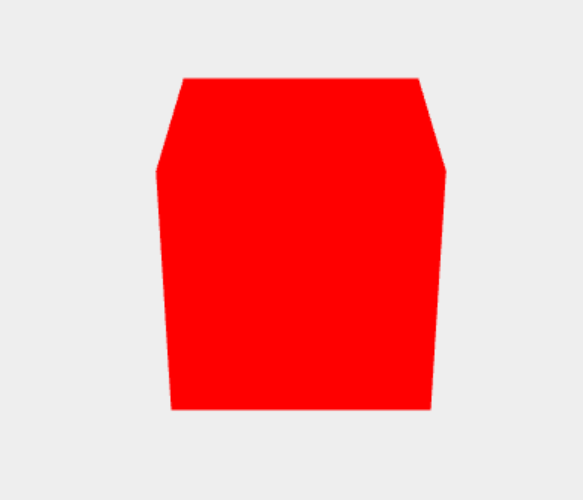
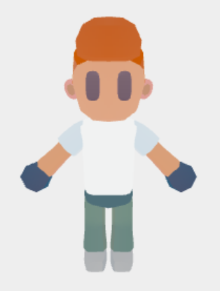
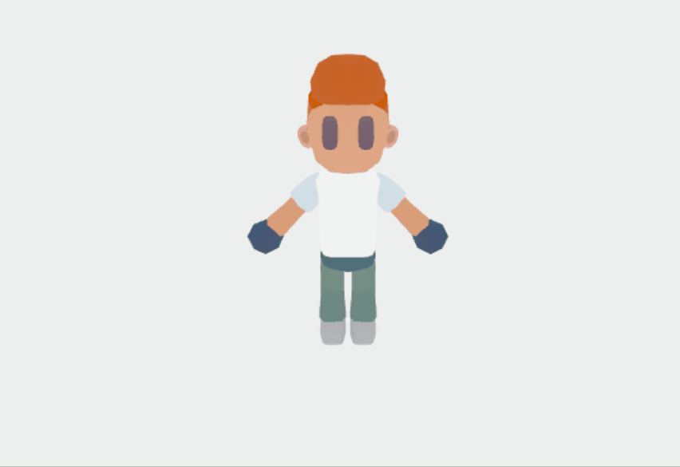
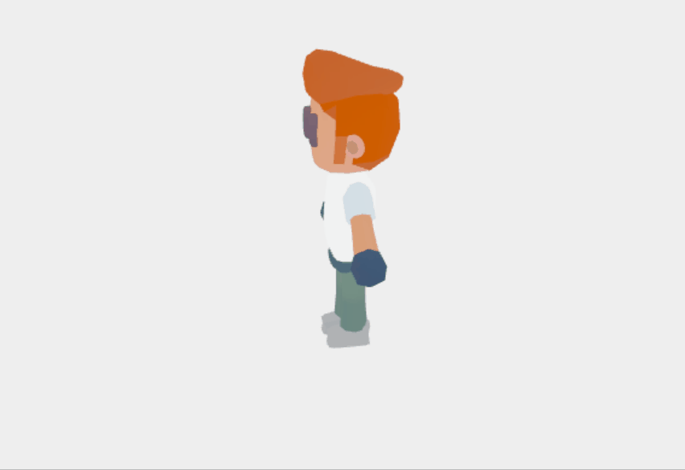
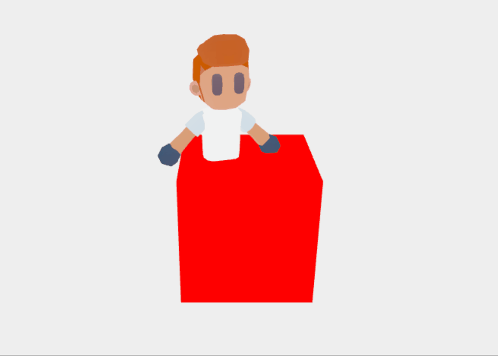

## 前言

上一篇文章中，小包带大家实现了一个 3D 爱心跳跃效果，代码和实现都不复杂，但没有详细介绍 `Threejs` 的各种概念和知识，本文小包便使用摄影的故事来讲述 `Threejs` 的入门知识，带大家快乐的学习 3D 开发。

## 故事背景

秋冬之际，天气开始逐渐转凉，郁郁葱葱的树啊、花啊都开始零零落落，落叶枯枝装束大地，自然风霜和满世荒凉衍化出一幕幕绝美的画章，万物苍凉却万事尽美，在这按捺不住的美景中，小包便成为了自然的写实之一。

心里想的和手里做的总是有几分差异，摄影技术不达标啊，于是小包就雇了专属**model——大帅**，来提升自身的摄影水平。

为什么要铺垫一段故事呐？小包感觉 `Threejs` 的入门其实就是个摄影的过程，so what？不信，咱们一起来瞅瞅。

## 拍摄准备工作 | Three 三件套

虽然小包是个摄影的初阶选手，但摄影的基本三件套跑不了：选景、相机、拍摄。啪嚓，一张美照就拍好了。`Threejs` 又是如何对应这三件套那？

**Step1: 场景 scene**

大帅对小包的拍摄水平极度不自信，为了保证自己的帅气，必须选一个好的场景，在点缀一番，才愿意当我的模特。

`Threejs` 中的场景就跟现实选取的背景类似，是一个三维立体空间，是 `Threejs` 渲染的总容器，后续所有的模型啊、背景啊都会加入到场景中。

```js
// 搭建场景
const scene = new Three.Scene();
```

**Step2: 相机 camera**

千辛万苦，终于满足了大帅的选景标准，没想到这小子还有幺蛾子，"包啊，给我介绍介绍你的金刚钻，让我有个底？"，竟然还挑剔小包的设备，是可忍熟不可忍。

`Threejs` 中的相机跟认知的相机没有什么不同，都是来选定显示的范围，同时也支持相机的角度、位置及方向等的调整。

`Threejs` 提供了两类相机: 透视相机和正交相机。这里介绍一下透视相机。

透视相机的原理与人眼所看的景象类似，共有四个参数:

- fov: 表示相机的角度范围，类似于人的视角。
- aspect: 表示渲染窗口的长宽比
- near/far: near/far 分别代表摄像机的近剪切面和远剪切面，相机只能渲染出 near 和 far 之间的场景


接下来就设置一下相机的基本参数并把它添加到场景中。

```js
// 设置相机
const camera = new THREE.PerspectiveCamera(
  45,
  window.innerWidth / window.innerHeight,
  0.1,
  1000
);
// 设置相机位置
camera.position.set(0, 2, 4);
// 设置相机朝向
camera.lookAt(0, 0, 0);
// 将相机添加到场景中
scene.add(camera);
```

**Step3: 渲染器 renderer**

选景和相机都安排好了，接下来就有请关键人物——战场小包摄影师隆重登场。问题来了，`Threejs` 中谁来充当拍摄者的位置那？**渲染器**

`Threejs` 基于 `WebGL` 渲染场景，使用 `WebGLRenderer` 来初始化场景，可以理解程序中的拍摄者，它决定了渲染的结果。

```js
// 设置渲染器
const renderer = new THREE.WebGLRenderer({
  antialias: true, // 抗锯齿
});
// 设置渲染器的渲染范围
renderer.setSize(window.innerWidth, window.innerHeight);
// 将渲染器的结果渲染到屏幕中
// 可以理解为将拍摄的照片上传
document.body.appendChild(renderer.domElement);
// 拍摄
renderer.render(scene, camera);
```

## 拍摄开始

准备工作完成后，到了大帅的表现时间了。无独有偶，`Threejs` 也提供了类似的概念，称作模型。模型可以简单的理解为三维空间内的各种物体的抽象总结。

### 模型

模型中有两个重要的概念: 几何体和材质。几何体就是模型的立体几何结构，对应的就是没有装饰(赤裸裸)的大帅；材质就是几何体的装饰，来标明几何体应该如何渲染，渲染成什么样子，就像大帅穿不同的衣服一样。一个基本的模型通常都是由几何体和材质两部分组成。`Threejs` 官方提供了多种几何体和材质的 API，可供日常开发所用。

模型粗略的可以划分为两类: 利用 API 绘制的简单模型和外部设计的 3D 模型。两类模型本质是相同的，但外部引用的模型通常经过专业人士的设计，比纯使用 API 绘制的精美一些。这里小包各举一个案例。

**Case1: 实现立方体**

```js
// 创建一个立方体几何体
const geometry = new THREE.BoxGeometry(1, 1, 1);
// 创建材质，颜色设置为红色
const meterial = new THREE.MeshBasicMaterial({ color: "#ff0000" });
// 将几何体和材质进行组装，生成一个立体模型
const cube = new THREE.Mesh(geometry, meterial);
// 设置立方体位置
cube.position.set(1, 0, 0);
// 将模型添加到网络中
scene.add(cube);
```



用立方体模型来类比小包亲爱的大帅老师太过不尊了(主要怕挨揍)，因此小包就寻找了一个比较帅气的 3D 外部模型，顺便介绍一下 3D 模型的导入(后续会有专门的文章介绍外部模型)。

**Case2: 外部模型**

外部模型的导入并不复杂，但外部模型的格式五花八门，导致模型的导入也有多种方式，`Threejs` 官方推荐使用 glTF 格式，glTF 专注于在程序运行时呈现三维物体，传输效率高，加载速度快。这里小包主要介绍 glTF 格式模型的引入。

```js
import { GLTFLoader } from "three/examples/jsm/loaders/GLTFLoader.js";
// 使用 GLTFLoader 进行导入
const loader = new GLTFLoader();

loader.load("/model/boxer.glb", (modal) => {
  scene.add(modal.scene);
});
```

几句简单的代码，就可以成功导入一个精美的外部模型了。



### 轨道控制器

作为一个专业的拍 sir，需要学会反复调整自己的位置来保证拍摄照片的高质量。`Threejs` 作为最专业的摄影师，提供了 OrbitControls（轨道控制器）组件，该组件可以使得相机围绕目标进行轨道运动，咱们来看一下具体效果。

```js
// 引入轨道控制器
import { OrbitControls } from "three/examples/jsm/controls/OrbitControls";

// 声明控制器并更新
controls = new OrbitControls(camera, renderer.domElement);
controls.update();
```



### 模型动效

为了更深刻的压榨大帅老师，小包让他疯狂的摆动作，疯狂的动，疯狂的抓拍，嘿嘿，全是黑照。

同样的，咱们也得让 `Threejs` 的模型动起来，来制造更多炫酷的效果。

上一篇文章我们借助 `requestAnimationFrame` 形成了帧动画效果，`Threejs` 的动效实现也是类似的，在每帧中修改对应想运动的属性。

例如添加一个让 model 转起来的效果，即在 render 函数中不断修改 model 的 rotation 值。

```js
function animate() {
  requestAnimationFrame(animate);
  cube.rotation.y += 0.01;
  renderer.render(scene, camera);
}

animate();
```



上面的方案成功实现了模型的简单动效，但 `Threejs` 场景中通常不会只有一个模型，如果存有多个模型的动效，上面的方法就有点捉襟见肘了。

gsap 闪亮登场，想必好多大佬都已经使用过 [gsap](https://greensock.com/)，gsap 作为一个老牌的动画库，用来配合 `Threejs` 最合适不过了。

```js
// 给大帅和立方体同时添加一下动画效果
gsap.to(cube.position, { x: 2, duration: 10 });
gsap.to(model.rotation, { y: Math.PI, duration: 10 });
```



### 自适应

还有一个很基础的情况，当渲染的画布发生变化后，场景和相机应该对应自适应发生变化，可以类比于自动聚焦效果。

```js
// 监听 resize 事件
// 更新renderer渲染大小
// 更新相机渲染长宽比及渲染矩阵
window.addEventListener("resize", () => {
  renderer.setSize(window.innerWidth, window.innerHeight);
  camera.aspect = window.innerWidth / window.innerHeight;
  camera.updateProjectionMatrix();
});
```

## 总结

本文以小包日常摄影的故事带大家一起捋了一遍 `Threejs` 的基础入门知识，下面来总结一下初级阶段 `Threejs` 开发具体流程，这也是 `Threejs` 初级开发的基本框架。

**Step1: 摄影三件套**

1. 定义场景
2. 设置相机
3. 设置渲染器

```js
const scene = new Three.Scene();
const camera = new THREE.PerspectiveCamera(
  45,
  window.innerWidth / window.innerHeight,
  0.1,
  1000
);
camera.position.set(0, 2, 4);
camera.lookAt(0, 0, 0);
scene.add(camera);
const renderer = new THREE.WebGLRenderer({
  antialias: true,
});
renderer.setSize(window.innerWidth, window.innerHeight);
document.body.appendChild(renderer.domElement);
renderer.render(scene, camera);
```

**Step2: 添加模型**

```js
const geometry = new THREE.BoxGeometry(1, 1, 1);
const meterial = new THREE.MeshBasicMaterial({ color: "#ff0000" });
const cube = new THREE.Mesh(geometry, meterial);
cube.position.set(1, 0, 0);
scene.add(cube);
```

**Step3: 添加轨道渲染器**

```js
import { OrbitControls } from "three/examples/jsm/controls/OrbitControls";
controls = new OrbitControls(camera, renderer.domElement);
controls.update();
```

**Step4: 设置自适应**

```js
window.addEventListener("resize", () => {
  renderer.setSize(window.innerWidth, window.innerHeight);
  camera.aspect = window.innerWidth / window.innerHeight;
  camera.updateProjectionMatrix();
});
```

**Step5: 设置动效**

```js
function animate() {
  requestAnimationFrame(animate);
  cube.rotation.y += 0.01;
  renderer.render(scene, camera);
}
animate();
```
