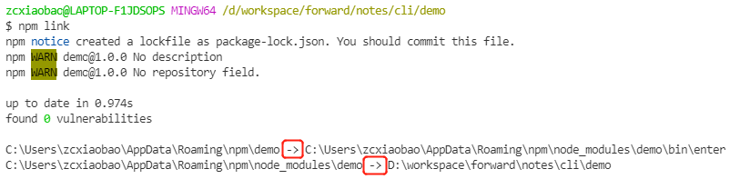
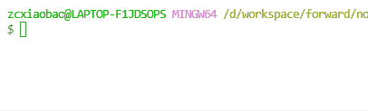
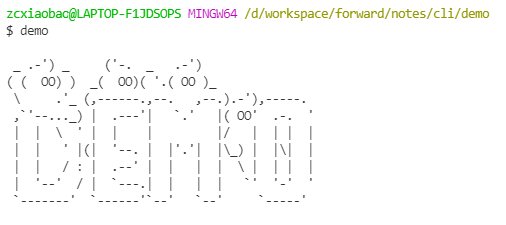

## 前言

看这篇文章之前，你肯定会疑惑，为什么你会写一个属于自己的脚手架？

脚手架相比大家都不陌生，比如我们经常使用 vue-cli ，它可以帮助我们快速的初始化一个项目，无需从零配置，极大方便我们的开发。但强大是有限的，公共的脚手架并不能满足我们的实际开发。

[史上最贴心前端脚手架开发辅导](https://juejin.cn/post/6844903999758401549) 讲到几点理由，我认为还是很合适的:

公司中已经积累了部分项目逻辑，例如换肤、接口请求、项目架构、国际化等，如果此时公司新启一个项目，我们需要将原有项目的公共逻辑 `ctrl + c`， `ctrl + v`。

但这种复制粘贴的方式是存有很多缺点的:

- 重复性劳动，繁琐且浪费时间
- 容易忽略项目中的配置设置
- `copy` 过来的模板会存有重复代码

诸如此类，如果我们自己开发一套脚手架，自己定制自己的模板，复制粘贴的人工流程就会转换为 `cli` 的自动化流程。怎么样，心动吗？

但对小包来说，小包的工作经验并没有那么多，还考虑不到工作中的种种繁琐，小包有自己的想法，主要有几点:

- `vue-cli` 的痛击 : 小包最近使用 `vue-cli` 创建项目时总是爆出莫名其妙的错误，解决方案一直未能查找到，每次只能卸载重装一遍然后才能正常使用
- 多个 `cli` 的繁琐: 最近小包也开始学习 `react` ，小包一直幻想如果两者使用一个脚手架就好了
- 架构成长: **架构**这两个字太吸引人了，脚手架的搭建在小包心里一直是架构的必备技能。

学习本文，你能收获:

- 🌟 掌握开发脚手架的全流程
- 🌟 学会命令行开发常用的多种第三方模块
- 🌟 拥有一个属于自己的脚手架

## 脚手架实现分析

我们以 `vue-cli` 为例子，来分析一下简单脚手架需要具备的一些功能:

`vue-cli` 使用 `vue` 作为全局命令，同时提供了很多指令。

- `vue --version` 可以查看 vue 版本
- `vue --help` 可以查看帮助文档
- `vue create xxx` 可以创建一个项目
- ...

### vue 创建项目

我们以 `vue` 创建项目为例子，分析一下脚手架应该具备的功能

**Step1: 运行创建命令**

```js
vue create demo
```

**Step2: 交互式用户选择**


用户可以在命令行中选择自己需要的版本或者配置。

**Step3: 用户选择完毕后，根据用户选择生成用户需求的项目文件**

从上面的脚手架流程来看，我们可以大致总结出脚手架的功能:

- 通过命令行与用户交互
- 根据用户的选择生成对应的文件

## 流程分析

基于 `vue-cli` 的使用经验，我们来分析一下脚手架的基本实现流程:

1. 首先我们要初始化一个项目
   - 创建项目 `zc-cli`，配置项目所需的信息
   - `npm link` 项目至全局，这样本地可以临时调用指令
2. 项目开发
   - 基础指令配置: 例如 `--help --version` 等
   - 复杂指令配置: `create` 指令
   - 实现命令行交互功能: 基于 `inquirer` 实现命令行交互
   - 拉取项目模板
   - 根据用户的选择动态生成项目

## 使用的三方库

我们在开发 `cli` 时，会用到很多第三方模块，接下来先给大家介绍一下使用的第三方模块。为了介绍起来更加清晰，我们先来创建一个 `demo` 项目用作演示。

### 初始化 demo 项目

1. 创建 `demo` 文件夹，执行 `npm init -y` 初始化仓库，生成 `package.json` 文件

```json
{
  "name": "demo",
  "version": "1.0.0",
  "description": "",
  "main": "index.js",
  "scripts": {
    "test": "echo \"Error: no test specified\" && exit 1"
  },
  "keywords": [],
  "author": "",
  "license": "ISC"
}
```

2. 在 `demo` 下创建 `bin` 文件夹，并在里面创建 `node` 入口文件 `enter`
3. 编辑 `enter` 文件，并将其配置到 `package.json` 中的 `bin` 字段

```js
// enter
#! /usr/bin/env node
// 为了方便测试
console.log("hello demo");
```

```json
// package.json
// bin 字段也支持对象模式配置
"bin": "bin/enter",
```

为什么需要在文件头部添加 **#! /usr/bin/env node**？

- `#!` 符号的名称叫 `Shebang`，用于指定脚本的解释程序
- 开发 `npm` 包时，需要在入口文件指定该指令，否则会抛出 `No such file or directory` 错误

4. `npm link` 到全局

在 `demo` 文件目录下运行 `npm link` 将项目链接到本地环境，就可以临时实现 `demo` 指令全局调用。(`--force` 参数可以强制覆盖原有指令)



5. 运行 `demo` 命令，命令行成功打印出 `hello demo`。 `demo` 项目配置成功。

### commander —— 命令行指令配置

第三方库 `commander` 来实现脚手架命令的配置。更多详细信息可以参考[commander 中文文档](https://github.com/tj/commander.js/blob/master/Readme_zh-CN.md)

**Step1: 安装 `commander` 依赖，并导入 `demo` 项目中**

```js
// 安装依赖
npm install commmander
```

```js
// enter
const program = require("commander");

// 解析用户执行时输入的参数
// process.argv 是 nodejs 提供的属性
// npm run server --port 3000
// 后面的 --port 3000 就是用户输入的参数
program.parse(process.argv);
```

`commander` 自身附带了 `--help` 指令，导入成功后，在命令行执行 `demo --help`，可以打印出基本的帮助提示。


**Step2: version 方法可以配置版本信息提示**

**Step3: name 和 usage 方法分别配置 cli 名称和 --help 第一行提示**

```js
program.name("demo").usage(`<command> [option]`).version(`1.0.0`);
```

再次执行 `demo --help`，命令行的消息提示就比较完善了。


更复杂的方法我们边使用边介绍。

### chalk —— 命令行美化工具

[chalk](https://github.com/chalk/chalk) 可以美化我们在命令行中输出内容的样式，例如实现多种颜色，花里胡哨的命令行提示等。

**Step1: 首先先安装 chalk 依赖并引入**

**Step2: 就可以开始输出各种花里胡哨的命令行提示**

```js
//enter

const chalk = require("chalk");
console.log(`hello ${chalk.blue("world")}`);
console.log(chalk.blue.bgRed.bold("Hello world!"));
console.log(
  chalk.green(
    "I am a green line " +
      chalk.blue.underline.bold("with a blue substring") +
      " that becomes green again!"
  )
);
```


怎么样，够花里胡哨吧。但**安装 chalk 时一定要注意安装 4.x 版本(小包使用的是 4.0.0)，否则会因为版本过高，爆出错误**

### inquirer —— 命令行交互工具

上面我们再使用 `vue create` 命令时，其中有一个步骤是**交互式用户选择**，这个交互式功能就是由 `inquirer` 实现的。

[inquirer](https://github.com/SBoudrias/Inquirer.js) 支持 `Confirm` 确认，`List` 单选，`Checkbox` 多选等多种交互方式。

这里我们来模拟实现 `vue` 的多选功能:

```js
new Inquirer.prompt([
  {
    name: "vue",
    // 多选交互功能
    // 单选将这里修改为 list 即可
    type: "checkbox",
    message: "Check the features needed for your project:",
    choices: [
      {
        name: "Babel",
        checked: true,
      },
      {
        name: "TypeScript",
      },
      {
        name: "Progressive Web App (PWA) Support",
      },
      {
        name: "Router",
      },
    ],
  },
]).then((data) => {
  console.log(data);
});
```


### ora —— 命令行 loading 效果

`ora` 使用非常简单，可以直接看下面的案例。更多使用: [ora 文档](https://github.com/sindresorhus/ora)

利用 `ora` 来实现一个简单的命令行 `loading` 效果。

```js
const ora = require("ora");
// 定义一个loading
const spinner = ora("Loading unicorns");
// 启动loading
spinner.start();
setTimeout(() => {
  spinner.color = "yellow";
  spinner.text = "Loading rainbows";
}, 1000);

// loading 成功
spinner.succeed();
// loading 失败
spinner.fail();
```



### fs-extra —— 更友好的文件操作

[fs-extra](https://github.com/jprichardson/node-fs-extra) 模块是系统 `fs` 模块的扩展，提供了更多便利的 `API`，并继承了 `fs` 模块的 `API`。比 `fs` 使用起来更加友好。

### download-git-repo —— 命令行下载工具

[download-git-repo](https://gitlab.com/flippidippi/download-git-repo) 可以从 `git` 中下载并提取一个 `git repository`。

`download-git-repo` 仓库提供 的 `download` 函数接收四个参数(下面代码是 download-git-repo 源码中截取的):

```js
/**
 * download-git-repo 源码
 * Download `repo` to `dest` and callback `fn(err)`.
 *
 * @param {String} repo 仓库地址
 * @param {String} dest 仓库下载后存放路径
 * @param {Object} opts 配置参数
 * @param {Function} fn 回调函数
 */

function download(repo, dest, opts, fn) {}
```

> 注意: `download-git-repo` 不支持 `Promise`

### figlet —— 生成基于 ASCII 的艺术字

[figlet](https://github.com/patorjk/figlet.js) 模块可以将 `text` 文本转化成生成基于 `ASCII` 的艺术字。具体效果不好解释，直接来看效果。

```js
// enter 入口文件
console.log(
  "\r\n" +
    figlet.textSync("demo", {
      font: "Ghost",
      horizontalLayout: "default",
      verticalLayout: "default",
      width: 80,
      whitespaceBreak: true,
    })
);
```



`figlet` 提供了多种字体，可以去官网选择你喜欢的字体。

## 命令配置

初始化项目部分与上文类似，就不多做赘述，直接进入正文。

### 配置版号

`commander` 提供了 `version` 方法，`.version()` 方法可以设置版本，其默认选项为 `-V` 和 `--version`，设置了版本后，命令行会输出当前的版本号。

```js
// package.json 中存取了项目的版本号 version
// 直接使用该属性
program.version(`zc-cli ${require("../package.json").version}`);
```

在命令行执行 `zc-cli --version`

```js
zc-cli 1.0.0
```

### 配置首行提示

`commander` 还提供了 `.usage` 和 `.name` 方法，通过这两个选项可以修改帮助提示的首行文字。利用这两个方法修改一下 `--help` 的首行提示。

```js
// name 是配置脚手架名称
// usage 是配置命令格式
program.name("zc-cli").usage(`<command> [option]`);
```

执行 `zc-cli --help`，现在 `--help` 的打印就完善多了。

```js
Usage: zcxiaobao <command> [option]

Options:
  -V, --version  output the version number
  -h, --help     display help for command
```

### 配置 create 命令

> `commander` 提供了 `command` 方法， `command` 方法的第一参数为命令名称，命令参数跟随在名称后面(必选参数使用 `<>` 表示，可选参数使用 `[]` 表示)

我们来配置 `create` 命令，该命令负责创建项目。同时在这里我们添加 `--force` 参数，默认覆盖当前项目。(**关于存在同名目录的情况，后文有详细处理**)

> `option` 方法可以定义选项，同时可以附加选项的简介。每个选项可以定义一个短选项名称（-后面接单个字符）和一个长选项名称（--后面接一个或多个单词），使用逗号、空格或|分隔。

```js
program
  .command("create <project-name>") // 增加创建指令
  .description("create a new project") // 添加描述信息
  .option("-f, --force", "overwrite target directory if it exists") // 强制覆盖
  .action((projectName, cmd) => {
    // 处理用户输入create 指令附加的参数
    console.log(projectName, cmd);
  });
```

我们来测试一下 `create` 命令是否添加成功。


通过 `--help` 查看到 `create [options] <project-name>` ，接下来来测试一下 `create` 的功能。

```js
$ zc-cli create
error: missing required argument 'project-name'

$ zc-cli create xxx
xxx {}

$ zc-cli create xxx --force
xxx { force: true }
```

成功获取到命令行输入的参数信息。`Yes!!!`

### 配置 config 命令

脚手架中 `config` 命令也是经常使用的，因此我们再添加个 `config` 命令，同时也熟练一下 `commander` 的使用。

```js
program
  .command("config [value]") // config 命令
  .description("inspect and modify the config")
  .option("-g, --get <key>", "get value by key")
  .option("-s, --set <key> <value>", "set option[key] is value")
  .option("-d, --delete <key>", "delete option by key")
  .action((value, keys) => {
    // value 可以取到 [value] 值，keys会获取到命令参数
    console.log(value, keys);
  });
```

### 优化 --help 提示

执行 `vue --help`，我们可以发现帮助提示部分最下面还有一句提示，并且高亮了 `vue <command> --help`，人性化啊，我们来模仿一下。


给我们 `zc-cli` 也添加上此功能:

> `commander` 可以自动通过 `on` 方法来监听指令执行。

```js
// 监听 --help 指令
program.on("--help", function () {
  // 前后两个空行调整格式，更舒适
  console.log();
  console.log(
    " Run zc-cli <command> --help for detailed usage of given command."
  );
  console.log();
});
```

执行 `zc-cli --help` 测试一下:


### 给 --help 提示上色

文章第三方模块处提到 `chalk` ，可以美化命令行，因此我们利用 `chalk` 将 `zc-cli <command> --help` 高亮一下。

```js
// 使用 cyan 颜色
program.on("--help", function () {
  // 前后两个空行调整格式，更舒适
  console.log();
  console.log(
    `Run ${chalk.cyan(
      "zc-cli <command> --help"
    )} for detailed usage of given command.`
  );
  console.log();
});
```

命令行执行 `zc-cli --help` ，我们就可以看到高亮的 `zc-cli <command> --help`。


指令配置部分暂时就可以告一段落，休息休息，进入核心部分。🎉🎉🎉

## 创建项目

### create 模块

我们为创建功能单独建立一个模块，存放在 `lib/create.js` 中，同时在 `zc` 入口文件配置 `create` 指令处引入

```js
//  zc 入口文件
program
  .command("create <project-name>") // 增加创建指令
  .description("create a new project") // 添加描述信息
  .option("-f, --force", "overwrite target directory if it exists") // 强制覆盖
  .action((projectName, cmd) => {
    // 引入 create 模块，并传入参数
    require("../lib/create")(projectName, cmd);
  });

// create.js
// 当前函数中可能存在很多异步操作，因此我们将其包装为 async
module.exports = async function (projectName, options) {
  console.log(projectName, options);
};
```

我们来测试一下 `create` 模块是否可以接收到参数。

```js
$ zc-cli create xxx --force
xxx { force: true }
```

### 存在同名目录

创建 `create` 命令时我们配置了 `--force` 参数，意为强制覆盖。那我们我们在创建一个项目目录时，就会出现三种情况:

- 创建项目时使用 `--force` 参数，不管是否有同名目录，直接创建
- 未使用 `--force` 参数，且当前工作目录中不存在同名目录，直接创建
- 未使用 `--force` 参数，且当前工作目录中存在同名项目，需要给用户提供选择，由用户决定是取消还是覆盖

我们来梳理一下这部分的实现逻辑:

1. 通过 `process.cwd` 获取当前工作目录，然后拼接项目名得到项目目录
2. 检查是否存在同名目录
3. 存在同名目录
   - 用户创建项目时使用了 `--force` 参数，直接删除同名目录
   - 未使用 `--force` 参数，给用户提供交互选择框，由用户决定
4. 不存在同名目录，继续创建项目

```js
const path = require("path");
const fs = require("fs-extra");
const Inquirer = require("inquirer");

module.exports = async function (projectName, options) {
  // 获取当前工作目录
  const cwd = process.cwd();
  // 拼接得到项目目录
  const targetDirectory = path.join(cwd, projectName);
  // 判断目录是否存在
  if (fs.existsSync(targetDirectory)) {
    // 判断是否使用 --force 参数
    if (options.force) {
      // 删除重名目录(remove是个异步方法)
      await fs.remove(targetDirectory);
    } else {
      let { isOverwrite } = await new Inquirer.prompt([
        // 返回值为promise
        {
          name: "isOverwrite", // 与返回值对应
          type: "list", // list 类型
          message: "Target directory exists, Please choose an action",
          choices: [
            { name: "Overwrite", value: true },
            { name: "Cancel", value: false },
          ],
        },
      ]);
      // 选择 Cancel
      if (!isOverrite) {
        console.log("Cancel");
        return;
      } else {
        // 选择 Overwirte ，先删除掉原有重名目录
        console.log("\r\nRemoving");
        await fs.remove(targetDirectory);
      }
    }
  }
};
```

我们在当前目录创建一个 `aaa` 文件夹，测试一下是否实现对重名目录的处理:


### 项目创建 Creator 类

为了项目更方便管理，我们将创建项目部分抽离成 `Creator` 类。

```js
// Creator.js

class Creator {
  // 项目名称及项目路径
  constructor(name, target) {
    this.name = name;
    this.target = target;
  }
  // 创建项目部分
  create() {
    console.log(this.name, this.target);
  }
}

module.exports = Creator;

// create.js
const creator = new Creator(projectName, targetDirectory);

creator.create();
```

命令行执行 `zc-cli create aaa`，成功打印出项目名与项目路径

```js
aaa D:\workspace\forward\notes\cli\aaa
```

项目的模板存放在 `github` 中，项目使用 [zhurong-cli](https://github.com/zhurong-cli) 的模板仓库，`zhurong-cli` 分别提供了 `vue2` 及 `vue3` 的仓库，并且每个仓库下提供多个版本。

`github` 提供了官方的 `api` ，我们可以通过调用官方的 `api` 获取到仓库及版本信息。

- [仓库信息](https://api.github.com/orgs/zhurong-cli/repos)
- [版本信息](https://api.github.com/repos/zhurong-cli/vue3.0-template/tags)

因此可以把创建项目整体划分成下面步骤:

1. 通过获取仓库的 `API` 获取模板信息: `Vue2 or Vue 3`
2. 将模板信息渲染为交互框，用户选择自己需要的模板
3. 根据用户选择的模板，获取版本信息
4. 将版本信息渲染成交互框，用户选择需要的版本
5. 通过用户选取的模板及版本，下载对应模板到指定目录
6. 将模板渲染为项目

## 获取模板及版本

### api 请求模块

由于脚手架中要发送多种请求，因此我们单独设置 `api.js` 负责处理模板和版本信息的获取。

```js
const axios = require("axios");

// 拦截全局请求响应
axios.interceptors.response.use((res) => {
  return res.data;
});

/**
 * 获取模板
 * @returns Promise 仓库信息
 */
async function getZhuRongRepo() {
  return axios.get("https://api.github.com/orgs/zhurong-cli/repos");
}

/**
 * 获取仓库下的版本
 * @param {string} repo 模板名称
 * @returns Promise 版本信息
 */
async function getTagsByRepo(repo) {
  return axios.get(`https://api.github.com/repos/zhurong-cli/${repo}/tags`);
}

module.exports = {
  getZhuRongRepo,
  getTagsByRepo,
};
```

### 获取模板信息

`api` 部分已经封装了模板信息的获取方法，这里直接调用该方法，获取模板信息，然后使用 inquirer 渲染成命令行交互选择框。

```js
// 获取模板信息及用户最终选择的模板
async function getRepoInfo() {
  // 获取组织下的仓库信息
  let repoList = await getZhuRongRepo();
  // 提取仓库名
  const repos = repoList.map((item) => item.name);
  // 选取模板信息
  let { repo } = await new inquirer.prompt([
    {
      name: "repo",
      type: "list",
      message: "Please choose a template",
      choices: repos,
    },
  ]);
  return repo;
}
```

测试一下模板选取是否成功。


### 获取版本信息

获取到模板信息后，我们就可以根据模板名调用第二个 `api` 获取到 `tag` (版本信息)

```js
// 获取版本信息及用户选择的版本
async getTagInfo(repo) {
  let tagList = await getTagsByRepo(repo);
  const tags = tagList.map((item) => item.name);
  // 选取模板信息
  let { tag } = await new inquirer.prompt([
    {
      name: "repo",
      type: "list",
      message: "Please choose a version",
      choices: tags,
    },
  ]);
  return tag;
}
```

测试版本是否拉取成功。


### 添加 loading 效果

模板拉取需要消耗一定的时间，添加一个 `loading` 效果让用户体验更好。

我们可以借助第三方库 `ora` 实现 `loading` 方法。

```js
/**
 * loading加载效果
 * @param {String} message 加载信息
 * @param {Function} fn 加载函数
 * @param {List} args fn 函数执行的参数
 * @returns 异步调用返回值
 */
async function loading(message, fn, ...args) {
  const spinner = ora(message);
  spinner.start(); // 开启加载
  let executeRes = await fn(...args);
  spinner.succeed();
  return executeRes;
}
```

我们将 `loading` 方法添加到模板获取和版本获取部分。


### 失败重新拉取

远程加载有时候有可能会遭遇网络不佳或者远程资源丢失情况，因此我们添加一个失败重拉功能，来提高用户体验。

但是我们要限制失败重拉的频率，太频繁拉取，给用户造成不好的体验。

```js
/**
 * 睡觉函数
 * @param {Number} n 睡眠时间
 */
function sleep(n) {
  return new Promise((resolve, reject) => {
    setTimeout(() => {
      resolve();
    }, n);
  });
}

async loading(message, fn, ...args) {
  const spinner = ora(message);
  spinner.start(); // 开启加载
  try {
    let executeRes = await fn(...args);
    // 加载成功
    spinner.succeed();
    return executeRes;
  } catch (error) {
    // 加载失败
    spinner.fail("request fail, refetching");
    await sleep(1000);
    // 重新拉取
    return loading(message, fn, ...args);
  }
}
```


## 模板下载

上文中我们已经成功获取到了模板及版本的信息，下面我们就可以去下载模板了。

`download-git-repo` 模块并不支持 Promise ，因此我们先借助 `node` 的 `util` 模块提供的 `promisify` 方法将其转化为支持 `Promise` 的方法。

```js
// 把方法挂载到构造函数上
constructor(name, target) {
  this.name = name;
  this.target = target;
  // 转化为 promise 方法
  this.downloadGitRepo = util.promisify(downloadGitRepo);
}
```

定义 `download` 下载方法，并在 `create` 入口中调用:

```js
async download(repo, tag) {
  // 模板下载地址
  const templateUrl = `zhurong-cli/${repo}${tag ? "#" + tag : ""}`;
  // 调用 downloadGitRepo 方法将对应模板下载到指定目录
  await loading(
    "downloading template, please wait",
    this.downloadGitRepo,
    templateUrl,
    path.join(process.cwd(), this.target) // 项目创建位置
  );
}
```


同时也成功地在当前目录创建 `xxx` 项目，`xxx` 项目的目录结构如下:


## 美化项目

### 添加 logo

当调用 `--help` 命令时，我们在最后添加 `logo` 展示，经过精挑细选，最终小包选择了 `3D-ASCII` 字体。

我们来看一下效果，帅呆了，可以没找到上色的方法。


### 模板使用提示

当模板下载成功后，我们像 `vue-cli` 一样添加模板使用提示，保证用户能正常启动项目。
但是要注意 `zc-cli` 目前下载的是模板，因此我们进入模板后需要首先执行 `npm install` 下载依赖包才能执行。

```js
// 核心创建逻辑 —— 创建项目部分
  async create() {
    // 仓库信息 —— 模板信息
    let repo = await this.getRepoInfo();
    // 标签信息 —— 版本信息
    let tag = await this.getTagInfo(repo);
    // 下载模板到模板目录
    await this.download(repo, tag);
    // 模板使用提示
    console.log(`\r\nSuccessfully created project ${chalk.cyan(this.name)}`);
    console.log(`\r\n  cd ${chalk.cyan(this.name)}`);
    console.log("  npm install\r\n");
    console.log("  npm run dev\r\n");
  }
```


成功添加模板使用提示，最后我们按照模板使用步骤执行，成功创建了一个 Vue 项目。


## 发布项目

接下来修改 `package.json` ，添加个人信息，然后就可以准备发布了。

要发布一个 `npm` 包流程非常简单。

**Step1: 首先去[npm](https://www.npmjs.com/) 注册一个用户**

**Step2: 然后将本地登录 npm**


**Step3: 执行 npm publish 命令，发布 npm 包。**


**Step4: 然后我们就可以在 npm 官网找到发布后的 npm 包了**。(小包版: [zcxiaobao-cli](https://www.npmjs.com/package/zcxiaobao-cli))

## 总结与展望

模板的缓存功能
