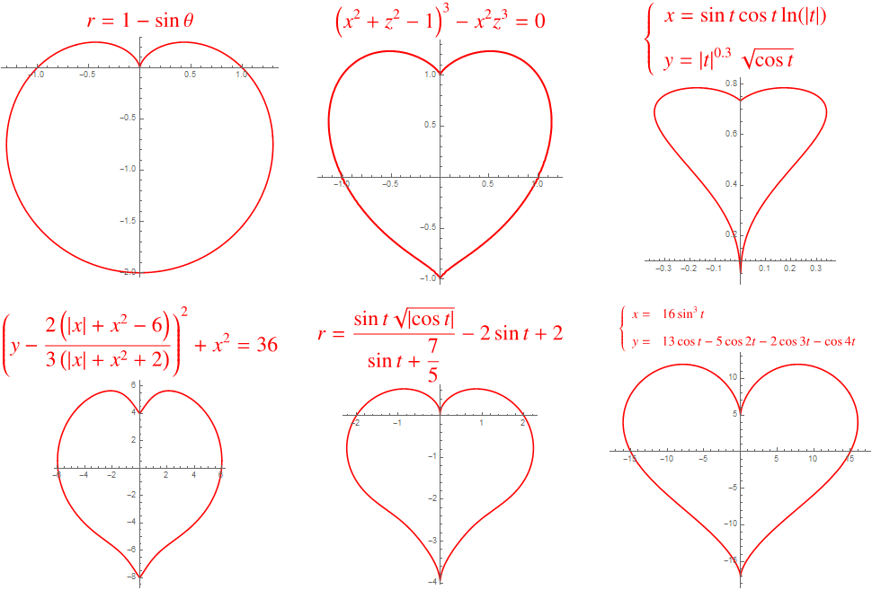
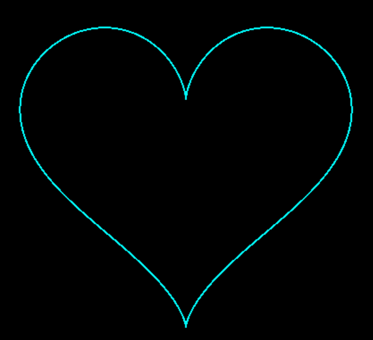
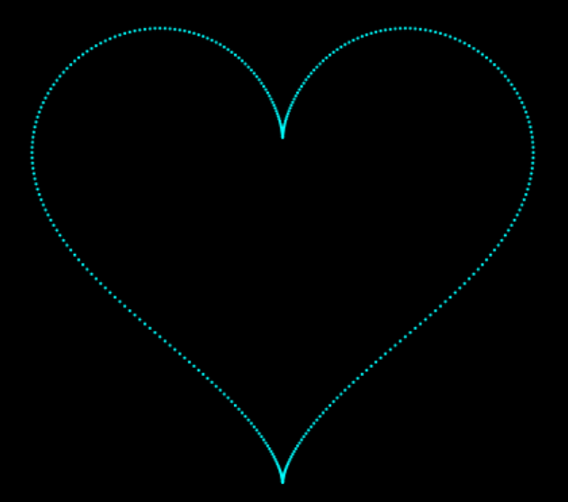
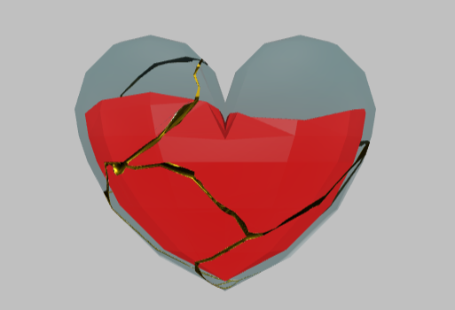
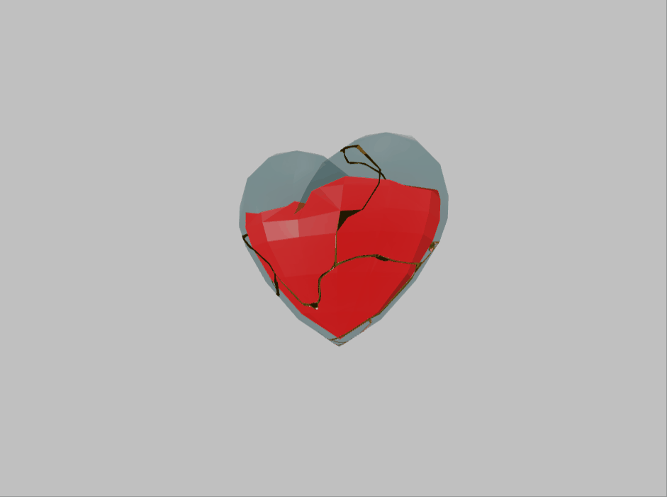

## 前言

大家好啊，我是小包，前段时间想缓缓节奏，没想到一放松就是这么久，想死大家了，回归回归，开启开卷旅途！虽说天天偷懒，闲暇偷学了一些 `Threejs`，最近的文章应该都会围绕着 `Threejs` 来展开。

本篇算是 `Threejs` 专栏的开篇之作，但小包这次不想上来就讲大道理，教如何使用 `Threejs`，而是准备先以一个**浪漫的案例**让大家初步体验一下 2D 整活与 3D 整活的差别。

最近程序员有点火，火的有点突然，《点燃我，温暖你》一剧中程序员李峋给女朋友送了一个超级炫酷的跳动爱心，这个被称为"李峋浪漫爱心"的片段瞬间出现在了好多地方，包括我的家庭群 😂

喃，它就这个样子，讲实话，的确有点炫酷。虽然小包很菜，但对于美的向往是无穷的，就这么愉快的决定了，本文的案例便就是**李峋浪漫爱心**和 3D 爱心。


## 李峋浪漫爱心代码实现

先来看效果:

### 实现分析

咱们首先来分析一下实现要点:

- 爱心是核心组成，可以初步看做多层爱心: 外层爱心、爱心轮廓、内层爱心等
- 使用粒子组成爱心
- 炫酷的动画，这部分是难点

### 爱心实现

在前端中，你问如何绘制一个图像，那 `canvas` 不逞多让，其提供的 `lineTo` 和 `stroke` 方法可以绘制出你想要的任何图形。

那么难点来了，**lineTo 连线点要如何确定，也就是爱心各个位置的点如何得出**。遇事不决找数学。

高等数学中，极坐标系中有几个超级经典的曲线，例如浪漫的心形线、阿基米德螺线等。小包沿着这个思路就开始查度娘，竟然找到了这么多爱心的绘制方式，数学家的浪漫(傲娇的大拇指 👍)。



六种爱心各有各的不同，爱心一很可爱，爱心六更动感一些，顺从内心，选择爱心六。(当然我不会说重要原因之一是参数方程的模式容易绘制)

**Step1: 根据方程编写出爱心点的生成函数**

```js
// scale 为放大倍数
// width height 为画布大小，将生成的爱心移到画布中央
function generatorHeart(t, scale = 11.6) {
  let x = 16 * Math.sin(t) ** 3;
  let y = -(
    13 * Math.cos(t) -
    5 * Math.cos(2 * t) -
    2 * Math.cos(3 * t) -
    Math.cos(4 * t)
  );
  x = x * scale + width / 2;
  y = y * scale + height / 2;
  return new Point(x, y);
}
```

**Step2: 生成一圈爱心点**

`t` 的取值范围为 `[0,2Π]`，循环生成 `360` 个点。

```js
const hearts = [];
for (let i = 0; i < 360; i++) {
  hearts.push(generatorHeart(2 * Math.PI * (i / 360)));
}
```

**Step3: 绘制爱心**

遍历每个点，使用 `canvas` 连成线。

```js
function drawHeart2(context, points) {
  context.beginPath();
  points.forEach((point) => {
    context.strokeStyle = "#00ffff";
    context.lineTo(point.x, point.y);
    context.stroke();
  });
  context.closePath();
}
```



等等，我们要的是粒子爱心，应该怎样由连线爱心转化为粒子爱心那？

**Step4: 粒子爱心**

`canvas` 提供了 `arc` 方法可以绘制圆或者弧，使用 `fill` 可以填充对应图形，因此可以借助 `arc` 方法生成多个很小的圆，形成粒子效果。

```js
function drawHeart(context, points) {
  points.forEach((point) => {
    context.beginPath();
    context.fillStyle = "#00ffff";
    context.arc(point.x, point.y, point.size, 0, Math.PI * 2);
    context.fill();
    context.closePath();
  });
}
```



### 整体结构实现

这部分开始咱们首先来梳理一下整体代码，丰满一下整体的逻辑，再继续制造浪漫。

**Step1: 定义 Point 类**

`Point` 为每个粒子的基类，共需要 `x,y,size` 三个属性。

```js
class Point {
  constructor(x, y, size) {
    this.x = x;
    this.y = y;
    this.size = size;
  }
}
```

**Step2: 定义 Heart 类，将与爱心相关的代码都集成到类中**

这里小包先抛出几个问题，咱们一起来思考 `Heart` 类应该有什么？

1. 如何实现爱心动起来的效果？

这里借助了帧动画的思想，先提前计算出各帧中粒子的对应位置，通过 `window.requestAnimationFrame` 的回调函数每次重新刷新画布，绘制对应帧的图像。

2. 爱心边缘的粒子可以通过公式生成，那爱心内部和爱心外部的粒子如何生成？

说实话最开始小包没有想到解决办法，既可以保证粒子的随机分布，还能保证粒子的尽可能均匀，这看起来是个令人挠头的数学问题。在这个危难之间，[码农高天](https://www.bilibili.com/video/BV16g411B7Ff/)大佬给出了他的解决方案，原版代码是用 `python` 实现的，小包就借鉴了大佬实现方案中的核心公式，将其转换为前端版本。

有了上面的分析，`Heart` 类所具备的东西就有初步头绪了。

- 各层爱心粒子及其初始化生成函数
- 帧动画各帧中粒子位置计算函数
- 爱心外层的粒子根据各帧生成，爱心边缘和内部的粒子根据公式计算每帧的位置

```js
// 代码为简化版
class Heart {
  constructor(particles, generateFrame) {
    this.particles = particles;
    this.generateFrame = generateFrame; // 帧数量
    this.boardHeart = []; // 爱心的轮廓
    this.middleHeart = []; // 爱心轮廓内部
    this.centerHeart = []; // 爱心中间
    this.allHearts = []; // 所有的爱心粒子
    this.initHeart(); // 初始化爱心内部粒子

    for (let i = 0; i < generateFrame; i++) {
      this.calcFrame(i); // 计算 20 帧图像
    }
  }
  initHeart() {
    // 爱心边缘粒子
    for (let i = 0; i < this.particles; i++) {
      const deg = (2 * Math.PI * rand(0, 360)) / 360;
      this.boardHeart.push(generatorHeart(deg));
    }
    this.boardHeart.forEach((point) => {
      for (let j = 0; j < 3; j++) {
        this.middleHeart.push(
          // 根据公式生成内部粒子
          scatterHeart(point, 0.05 * rand(j, j + 1, false))
        );
      }
    });
    // 根据类似规则继续生成几层内部粒子
  }
  calc_position(point, ratio) {
    // 计算对应粒子在每个帧对应的位置
    const force =
      1 / ((point.x - width / 2) ** 2 + (point.y - height / 2) ** 2) ** 0.52;
    const dx = ratio * force * (point.x - width / 2) + rand(-1, 1, false);
    const dy = ratio * force * (point.y - height / 2) + rand(-1, 1, false);

    return new Point(point.x - dx, point.y - dy, 0);
  }

  calcFrame(frame) {
    // 计算每帧对应的粒子的位置
    const ratio = 20 * curve((frame / 18) * Math.PI);
    const haloRadius = Math.floor(4 + 6 * (1 + curve((frame / 18) * Math.PI)));
    const haloNums = Math.floor(
      this.particles * 2 +
        this.particles * 3 * Math.abs(curve((frame / 18) * Math.PI) ** 2)
    );

    const nowFramePoints = [];
    const haloSet = new Set();
    for (let i = 0; i < haloNums; i++) {
      const delta = rand(0, 360);
      let point = generatorHeart(2 * Math.PI * (delta / 360));
      let shrinkPoint = shrinkHeart(point, haloRadius);
      shrinkPoint.x += rand(-20, 20);
      shrinkPoint.y += rand(-20, 20);
      shrinkPoint.size = rand(0.4, 1.4, false);
      nowFramePoints.push(shrinkPoint);
    }
    this.boardHeart.forEach((point) => {
      const calcPoint = this.calc_position(point, ratio);
      calcPoint.size = rand(0.6, 1.6, false);
      nowFramePoints.push(calcPoint);
    });
    this.middleHeart.forEach((point) => {
      const calcPoint = this.calc_position(point, ratio);
      calcPoint.size = rand(0.4, 1.4, false);
      nowFramePoints.push(calcPoint);
    });
    this.centerHeart.forEach((point) => {
      const calcPoint = this.calc_position(point, ratio);
      calcPoint.size = rand(0.4, 1.4, false);
      nowFramePoints.push(calcPoint);
    });

    this.allHearts[frame] = nowFramePoints;
  }
}
```

### 爱心跳动——收官

各帧的粒子位置计算完毕后，利用 `requestAnimationFrame` 和 `canvas` 实现爱心跳动效果。

```js
// 根据位置和大小绘制全部粒子
function drawHeart(context, points) {
  points.forEach((point) => {
    context.beginPath();
    context.fillStyle = "#00ffff";
    context.arc(point.x, point.y, point.size, 0, Math.PI * 2);
    context.fill();
    context.closePath();
  });
}
// 帧动画切换
function render(k) {
  heartCtx.clearRect(0, 0, width, height);
  drawHeart(heartCtx, heartCls.allHearts[k]);
}
let k = 0;
(function animateloop() {
  k++;
  k = k % 80;
  if (k % 4 === 0) {
    render(k / 4);
  }
  requestAnimationFrame(animateloop);
})();
```

## 3D 爱心

李峋浪漫爱心的代码实现起来还是有几分麻烦的，下面咱们来初步体验一下简单的 3D 开发。本文小包不会细讲各种概念，咱们就一起顺着走一遍，体验一下 `Threejs` 的强大和魅力。

### 基础配置

> 本部分代码基于 Vite + Vue3 开发

**Step1: 设置 scene，通俗来讲就是给个展示的地，划个地盘**

```js
const scene = new THREE.Scene();
```

**Step2: 添加 camera，地盘搭好了，得有个看客，camera 就是定义这个看客欣赏的方式**

```js
const camera = new THREE.PerspectiveCamera(
  45,
  window.innerWidth / window.innerHeight,
  0.01,
  10000
);
camera.position.set(0, 0, 300);
camera.aspect = window.innerWidth / window.innerHeight;
camera.updateProjectionMatrix();
scene.add(camera);
```

**Step3: 设置 renderer，决定将场地中的何种东西以何种样式展示给看客看**

```js
const renderer = new THREE.WebGLRenderer({
  antialias: true, // 抗锯齿
});
renderer.setSize(window.innerWidth, window.innerHeight);
renderer.outputEncoding = THREE.sRGBEncoding;
renderer.setPixelRatio(window.devicePixelRatio);
```

**Step4: 添加 light，打个光，万事具备了，得来个炫酷的光感，设置一些来自四面八方的光照**

```js
const light1 = new THREE.DirectionalLight(0x333333, 1);
light1.position.set(0, 0, 20);
scene.add(light1);
const light2 = new THREE.DirectionalLight(0x333333, 1);
light2.position.set(0, 0, -10);
scene.add(light2);
const light3 = new THREE.DirectionalLight(0x333333, 1);
light3.position.set(20, 0, 0);
scene.add(light3);
const light4 = new THREE.DirectionalLight(0x333333, 1);
light4.position.set(-20, 0, 0);
scene.add(light4);
const light5 = new THREE.DirectionalLight(0x333333, 1);
light5.position.set(0, 10, 0);
scene.add(light5);
const light6 = new THREE.DirectionalLight(0x333333, 0.3);
light6.position.set(5, 20, 0);
scene.add(light6);
const light7 = new THREE.DirectionalLight(0xeeeeee, 0.3);
light7.position.set(0, 20, 5);
scene.add(light7);
const light8 = new THREE.DirectionalLight(0x333333, 0.3);
light8.position.set(0, 20, -5);
scene.add(light8);
const light9 = new THREE.DirectionalLight(0x333333, 0.3);
light9.position.set(-5, 10, 0);
scene.add(light9);
const light10 = new THREE.AmbientLight(0x333333, 1);
light10.position.set(0, 100, 100);
scene.add(light10);
```

**Step5: 一切硬件条件都具备了，引入模型爱心，模型哪里来的，先保密一下**

```js
onMounted(() => {
  canvasDom.value.appendChild(renderer.domElement);
  renderer.setClearColor("#000");
  scene.background = new THREE.Color("#C0C0C0");
  scene.environment = new THREE.Color("#C0C0C0");
  render();

  // 引入 loader
  const loader = new GLTFLoader();
  loader.setMeshoptDecoder(MeshoptDecoder);
  loader.load("/model/heart.glb", (gltf) => {
    const heart = gltf.scene;
    scene.add(heart);
  });
});
```



> 忽略小包丑陋可怜的配色，配色真的是小包的世界难题。

**Step6: 给模型添加几个简单动效**

这里使用 `gsap` 动画库给爱心添加一个跳跃动画和旋转动画，让爱心"活"起来。

```js
gsap.to(heart.rotation, {
  y: Math.PI * 2,
  duration: 6,
  repeat: -1,
});
gsap.to(heart.position, {
  y: 0.8,
  duration: 1,
  yoyo: true,
  repeat: -1,
});
```



一个简单的 3D 爱心效果就轻松的实现了，如果你想了解更多 `Threejs` 的知识和案例，务必关注小包的专栏: [Three 从入门到实战](https://juejin.cn/column/7140955761605083150)

https://zcxiaobao.github.io/3d/heart/index.html

## 源码仓库

## 总结

本文小包分别带大家实现了**李峋浪漫爱心**和 `3D` 爱心，李峋浪漫爱心实现起来非常炫酷，但实现难度偏高；3D 爱心的难度就相对低很多，只要你能找到炫酷的 3D 模型，就可以实现一个不错的效果，相对的 3D 效果受模型的限制性也较大，但谁又能拒绝这满屏幕的立体炫酷感那？

接下来跟着小包一起拥抱 `Threejs`，一起去 `3D` 的世界遨游吧。
