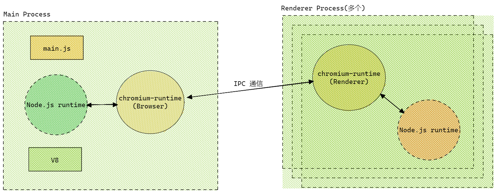

## 前言

`Electron` 是使用 JavaScript，HTML 和 CSS 构建跨平台的桌面应用程序的框架，可兼容 Mac、Windows 和 Linux，构建出三个平台的应用程序。 `Electron` 是如何实现跨端的那？

实现一个跨端框架，有三个问题必须要解决，分别是 UI 渲染、原生 `API` 以及客户端构建方式。`Electron` 的跨端原理并不难：其通过集成浏览器内核，使用前端的技术来实现不同平台下的渲染，并结合了 `Chromium` 、`Node.js` 和用于调用系统本地功能的 `API` 三大板块。

- `Chromium` 为 `Electron` 提供强大的 UI 渲染能力，`Chromium` 本身跨平台，因此无需考虑代码的兼容性。最重要的是，可以使用前端三板斧进行 `Electron` 开发。
- `Chromium` 不具备原生 GUI 的操作能力，因此 `Electron` 内部集成 `Node.js`，编写 UI 的同时也能够调用操作系统的底层 `API`，例如 path、fs、crypto 等模块。
- `Native API` 为 `Electron` 提供原生系统的 GUI 支持，`Electron` 可以调用原生应用程序接口。

总结起来，`Chromium` 负责页面 UI 渲染，`Node.js` 负责业务逻辑，`Native API` 则提供原生能力和跨平台。

上面粗略讲解了 `Electron` 的跨端原理，下面我们来深究一下。

## `Chromium` 架构

`JavaScript` 是单线程语言，但浏览器是多线程的，`Chromium` 作为 Chrome 的实验版，自然也是基于多线程工作机制。(图源: [`Chromium` 官网](https://www.`Chromium`.org/developers/design-documents/multi-process-architecture/))

`Chromium` 的多进程模式主要由三部分: 浏览器端(Browser)、渲染器端(Render)、浏览器与渲染器的通信方式(IPC)

### 浏览器进程

浏览器 Browser 只有一个，当 Chrome 打开时，进程启动。

### 渲染进程管理

每个渲染进程都有一个全局 RenderProcess 对象，可以管理其与父浏览器进程之间的通信，并维护其全局状态。浏览器同时为每个渲染进程维护对应的 RenderViewHost，用来管理浏览器状态，并与渲染器交流。浏览器与渲染器通过 IPC 进行通信。

### view 管理

每个渲染器可以维护多个 RenderView 对象，当新开窗口或者标签页后，渲染进程就会创建一个 RenderView，RenderView 对象与它在浏览器进程中对应的 RenderViewHost 和 webkit 嵌入层通信，就可以绘制出网页内容(这里是我们日常主要关注的地方)。

## `Electron` 架构解析

`Electron` 架构参考了 `Chromium` 的多进程架构模式，即将主进程和渲染进程隔离，并且在 `Chromium` 多进程架构基础上做一定扩展。

将上面复杂的 `Chromium` 架构简化:

`Chromium` 运行时由一个 `Browser Process`，以及一个或者多个 `Renderer Process` 构成。`Renderer Process` 负责渲染页面 Web ，`Browser Process` 负责管理各个 `Renderer Process` 以及其他功能(菜单栏、收藏夹等)

下面我们看一下啊 `Electron` 架构有那些变化？

`Electron` 架构中仍然使用了 `Chromium` 的 `Renderer Process` 渲染界面，`Renderer Process` 可以有多个，互相独立不干扰。由于 `Electron` 为其集成了 Node，`Renderer Process` 可以调用 Node `API`。主要负责: 利用 HTML 和 CSS 渲染页面；利用 `JavaScript` 实现页面交互效果。

Browser 线程与 `Chromium` 架构有了很多区别，`Electron` 将其更改名 Main Process，每个应用程序只能有一个主线程.主线程位于 `Node.js` 下运行，因此其可以调用系统底层功能。其主要负责渲染进程的创建；系统底层功能及原生资源的调用；应用生命周期的控制(包裹启动、推出以及一些事件监听)

经过上面的分析，`Electron` 多进程的系统架构可以总结为下图:

可以发现，主线程和渲染线程都集成了 Native `API` 和 `Node.js`，渲染线程还集成 `Chromium` 内核，最终实现跨端开发。

### Node 与 `Chromium`

Node 的事件循环与浏览器的事件循环有明显不同，`Chromium` 既然是 Chrome 的实验版，自然与浏览器实现相同。

Node 的事件循环基于 libuv 实现，而 `Chromium` 基于 message bump 实现。主线程只能同时运行一个事件循环，因此需要将两个完全不同的事件循环整合起来。

具体解决方案有两种:

- 使用 libuv 实现 message bump 将 `Chromium` 集成到 `Node.js`
- 将 `Node.js` 集成到 `Chromium`

`Electron` 最初的方案是第一种，使用 libuv 实现 message bump，但不同的系统 GUI 事件循环不同，例如 mac 为 NSRunLoop，Linux 为 glib，实现过程特别复杂，资源消耗和延迟问题无法得到有效解决，最终放弃了第一种方案。

`Electron` 第二次尝试使用小间隔的定时器来轮询 GUI 事件循环，但此方案 CPU 占用高，并且 GUI 响应速度慢。

libuv 后来引入了 backend_fd 概念，backend_fd 轮询事件循环的文件描述符，因此 `Electron` 通过轮询 backend_fd 来得到 libuv 的新事件实现 `Node.js` 与 `Chromium` 事件循环的融合(第二种方案)。

下面这张 PPT 完美的描述了上述过程([图源:Electron: The Event Loop Tightrope - Shelley Vohr | JSHeroes 2019](https://www.youtube.com/watch?v=OPhb5GoV8Xk))

参考链接: https://www.chromium.org/developers/design-documents/multi-process-architecture/

http://jlord.us/essential-electron/

https://juejin.cn/post/7051784134838091812

https://www.electronjs.org/blog/electron-internals-node-integration
