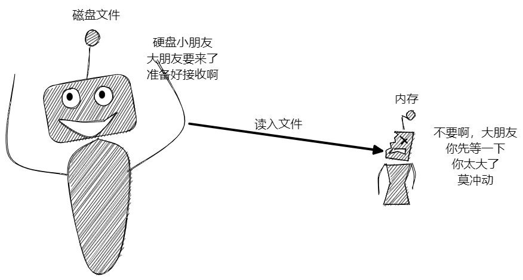
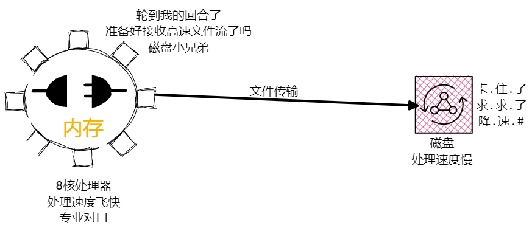

## 流是什么？

流，通俗来讲就是数据流动，数据从一个地方缓慢的流到另一个地方。

举个栗子，可以借助水管中的水流来辅助理解，当打开水龙头后，水便可以从源头流出水龙头；关闭水龙头，水便不再流动。

## 为什么需要流

那为什么会需要流呐？

- 其它介质和内存的数据规模不一致，例如磁盘的内存往往远远大于内存，因此磁盘中有可能会出现大于内存的文件，此时内存无法一次读入该文件。这种情形可以把水库比作磁盘，洗碗池比作内存，如果不加限制，水库的水量轻轻拿捏洗碗池，因此就需要水管来进行传输，限制水的流量。



- 其他介质和内存的数据处理能力不一致，内存的处理速度其他介质很难比，内存迅速处理数据，一波流传给硬盘，硬盘很难吃得消。



为了更深刻得理解流的作用，接下来我们来试一下不使用流需要如何进行文件读写。

### 文件读写

首先我们来实现最简单的文件拷贝功能，这个比较简单，我们可以借助 `fs` 模块的 `readFile` 和 `writeFile` 方法来实现。

> readFile 和 writeFile 并没有 promise 化，可以借助 util.promiseify 方法将其 promise 化，但这里并不是文章的重点，因此依旧采用回调的方式

```js
const fs = require("fs");
const path = require("path");
// 利用 path 上的方法组装路径
fs.readFile(path.resolve(__dirname, "test.txt"), (err, data) => {
  if (err) return console.log("error", err);
  fs.writeFile(path.resolve(__dirname, "result.txt"), data, () => {
    console.log("拷贝成功");
  });
});
```

上面的代码虽然成功实现了文件拷贝，但问题也很明显，不适用于大文件，当文件大于或接近内存时，会淹没内存，这也响应了为什么需要流的第一点。

对于大文件，如何进行读写那：**边读边写，读一点写一点，这样我们便可以控制文件读写的速率**，也称作分片读写。总的来说就是边读边写。

### 分片读写

分片读写需要使用 `fs` 模块中的 `read，write，close，open` 方法。

> 既然 fs 有方法可以实现边读边写，那为什么还会有流的出现的？这几个方法太麻烦了，参数太多，这里只做一个演示。

首先来实现单个文字的读写。

```js
// 创建一个存储单位 1 的 Buffer 空间，来存储中间读取的数据
let buf = Buffer.alloc(1);
// 读取源文件中的数据
fs.open(path.resolve(__dirname, "test.js"), "r", function (err, rfd) {
  // rfd 可以理解为文字指针
  // 你看到了吗？6 个参数，麻爪
  // 甚至都有点解释不动
  fs.read(rfd, buf, 0, 1, 0, function (err, bytesRead) {
    // bytesRead读取到的字节长度
    // 读取到的第一个数据存入 buf 中
    console.log(buf); // <Buffer 31>
    // 打开目标文件。
    fs.open(path.resolve(__dirname, "result.js"), "w", function (err, wfd) {
      // 6 个参数
      // 这里做的就是将 buf 内容写入 result
      fs.write(wfd, buf, 0, 1, 0, function (err, bytesWritten) {
        console.log("拷贝成功");
      });
    });
  });
});
```

上面的方法实现了单次数据的读取，我们只需要重复这个过程就可以实现大文件的读写。

如何重复实现上述过程那？递归，没错，就是递归，将读写部分封装成函数，在写成功的回调函数中再次调用该函数。

```js
// source 源文件
// target 目标文件
// cb 回调函数
// bufferSize buffer固定长度，即一次读写的数量
function copy(source, target, cb, bufferSize = 3) {
  const SOURCE_PATH = path.resolve(__dirname, source);
  const TARGET_PATH = path.resolve(__dirname, target);
  let buf = Buffer.alloc(bufferSize); // 创建 buffer 实例
  let rOffset = 0; // 读取偏移量
  let wOffset = 0; // 写入偏移量
  fs.open(SOURCE_PATH, "r", function (err, rfd) {
    if (err) return cb(err);
    fs.open(TARGET_PATH, "w", function (err, wfd) {
      if (err) return cb(err);
      // 递归读写函数 next
      function next() {
        fs.read(rfd, buf, 0, bufferSize, rOffset, function (err, bytesRead) {
          if (err) return cb(err);
          // bytesRead 代表一次读取的字节数
          // 当 bytesRead 为 0 时，代表文件已经成功读完
          // 则可以停止读写操作，关闭文件
          if (bytesRead == 0) {
            let index = 0;
            let done = () => {
              if (++index == 2) {
                cb();
              }
            };
            fs.close(wfd, done);
            fs.close(rfd, done);
            return;
          }
          fs.write(
            wfd,
            buf,
            0,
            bytesRead,
            wOffset,
            function (err, bytesWritten) {
              if (err) return cb(err);
              // 读取成功，并更新偏移量
              rOffset += bytesRead;
              wOffset += bytesWritten;
              next();
            }
          );
        });
      }
      next();
    });
  });
}
copy("test.js", "result.js", function (err) {
  if (err) return console.log(err);
  console.log("拷贝成功");
});
```

这样我们就成功地实现大文件分片读写，但可以明显发现：

- write/read 方法参数多，用起来非常繁琐
- 上面的代码有些回调地狱的倾向，不宜维护和扩展

因此，流就出现了，下面一起来了解一下 nodejs 中的流。

## 可读流及源码编写

`node` 中有四种流，下面我们来依次介绍一下，本文主要介绍 `Readable` 可读流的使用及其源码编写。

> Node.js 中的流同样位于 fs 模块

### EventListener

`Nodejs` 中的流都继承于 `EventListener`，也就是说其工作原理都是基于发布订阅模式。

### Readable 可读流

可读流用于文件内容的读取，它主要有两种读取模式:

- 流动模式: 可读流自动读取数据，通过 `EventListener` 接口将数据传递给应用
- 暂停模式: 这种模式下不会主动通过 `EventListener` 给应用传递数据，当显式调用 `stream.read` 后重启数据流动

通过 `createReadStream` 方法可以创建可读流，该方法有两个参数:

- 参数一读取文件的路径
- 参数二是 `options` 配置项，该项有八个参数，但日常我们只需要常用带星号的几个配置。

  - `flags*`：标识位，默认为 r；
  - `encoding`：字符编码，默认为 null；
  - `fd`：文件描述符，默认为 null；
  - `mode`：权限位，默认为 0o666；
  - `autoClose`：是否自动关闭文件，默认为 true；
  - `start`：读取文件的起始位置；
  - `end`：读取文件的（包含）结束位置；
  - `highWaterMark*`：最大读取文件的字节数，默认 `64 * 1024`。

`highWaterMark` 是最值得注意的，它表示每次读取的文件字节长度。

看起来流的参数很多，用起来会很复杂，那你就错了，下面来看个例子。

```js
// 流是基于发布订阅模式实现的
// 因此我们只需要订阅对应事件即可
const fs = require("fs");
const path = require("path");
// 返回一个可读流
const rs = fs.createReadStream(path.resolve(__dirname, "test.txt"), {
  highWaterMark: 3, // 每次读取 3kb
});
// 文件打开的钩子函数
rs.on("open", (fd) => {
  console.log(fd); // 3
});
// 当可读流处于流动模式时，data 事件会不断触发
// 在这里我们可以获取到读取的数据，进行后续操作
rs.on("data", (chunk) => {
  console.log(chunk);
});
rs.on("end", () => {
  console.log("end"); // 结束事件
});
```

`data` 事件会一直触发，也就是说在文件读取完成前，`data` 会一直传递数据，有时候我们并非需要一直读取，例如读取一下暂停一下，那该如何实现那？

```js
// 借助 pause 和 resume 方法可以实现数据读取的暂停与恢复
rs.on("data", function (data) {
  // 读取的数据为 buffer 类型
  console.log(`读取了 ${data.length} 字节数据 : ${data.toString()}`);

  //使流动模式的流停止触发'data'事件，切换出流动模式，数据都会保留在内部缓存中。
  rs.pause();

  //等待3秒后，再恢复触发'data'事件，将流切换回流动模式。
  setTimeout(function () {
    rs.resume();
  }, 3000);
});
```

下面我们来实现一下可读流的源码。

### 源码实现

**Step1: 定义可读流**

可读流继承于 `EventListener`，因此我们首先建立 `ReadStream` 类继承于 `EventListener`，这样 `ReadStream` 便可以使用 `EventListener` 类的方法。

> EventListener 实现其实并不困难，小包前面的文章也讲过 EventListener 源码的解读及编写。

```js
let fs = require("fs");
let EventEmitter = require("events");
class ReadStream extends EventEmitter {}
```

**Step2: 参数配置**

可读流有两个参数，`path` 路径和 `options` 配置项，我们把对应的参数配置在类上，因此我们需要编写一下构造函数。

```js
constructor(path, options = {}) {
  // 使用继承，子类必须调用 super 函数
  super();
  this.path = path; //指定要读取的文件地址
  this.highWaterMark = options.highWaterMark || 64 * 1024;
  this.autoClose = options.autoClose || true; //是否自动关闭文件
  this.start = options.start || 0; // 从文件哪个位置开始读取
  this.end = options.end || null; // null表示没传递
  this.encoding = options.encoding || null;// buffer编码
  this.flags = options.flags || 'r';
}
```

除了 `ReadStream` 所需的参数外，我们还需要添加几个控制参数

- `pos`: 记录当前文件读取到的位置
- `flowing`: 当前读取的模式，`true` 为流动模式
- `buffer`: 每次读取内容的存储位置

```js
constructor() {
  // ...
  this.pos = this.start;
  this.flowing = null;
  this.buffer = Buffer.alloc(this.highWaterMark);
}
```

Step3: 打开待读文件

ReadStream 中分别使用 close、open、error 注册事件来控制对应行为的产生，当打开文件后，触发 open 事件；打开失败，触发 error 事件。

这里我们处理一下上面几个事件的触发时机，使用 fs.open 方法来打开文件。

```js
open() {
    fs.open(this.path, this.flags, (err, fd) => {
        if (err) {
            if (this.autoClose) { // 如果需要自动关闭则去关闭文件
                this.destroy(); // 销毁(关闭文件，触发关闭事件)
            }
            this.emit('error', err); // 打开错误，触发 error 事件
            return;
        }
        this.fd = fd; // 保存文件描述符，方便后续轮询判断
        this.emit('open', this.fd); // 文件打开，触发 open 事件
    });
}
```

**Step4: 读取文件内容**

上文提到，`ReadStream` 有两种模式: 流动模式和暂停模式，并用 `flowing` 属性来标识两种模式。

`ReadStream` 通过监听 `data` 事件来启动文件读取，即:

```js
rs.on("data", (chunk) => {
  console.log(chunk);
});
```

这里实现有两个难点:

1. 当监听 `data` 事件后，`ReadStream` 才开启数据读取，那应该如何监听 `data` 事件的注册那？
2. `fs.open` 是异步读取操作，因此有可能出现 `data` 事件触发时，文件还未读取完毕，那我们应该如何处理这种情况那？

一个问题一个问题来解决，`EventListener` 中提供了 `newListener` 事件，当注册新事件后，该事件的处理函数触发，因此我们可以监听该事件，判断事件类型，如果为 `data` 事件，打开 `flowing`，开始读取

```js
class ReadStream extends EventEmitter {
  constructor(path, options) {
    // 监听newListener事件，判断当前监听事件是否为 data 事件
    // 如果为 data 事件，开启文件读取
    this.on("newListener", (type) => {
      if (type === "data") {
        //  开启流动模式，开始读取文件中的内容
        this.flowing = true;
        this.read();
      }
    });
  }
}
```

由于 `data` 事件的触发可能发生在 `fs.open` 读取之前，因此 `read` 函数中要做一个**轮询操作**，每次判断是否成功读取。

```js
read() {
    // 文件如果未打卡，fd 是没有值的
    if (typeof this.fd !== "number") {
        // 如果文件未打开，触发 open 事件
        return this.once("open", () => this.read());
    }
}
```

**Step5: 编写 read 方法**

上面编写完毕后，我们可以成功的监听到 `data` 事件，且可以打开文件，后续就可以进行文件的读取了。

文件读取的内容上文案例中提到过，即利用 `fs.read` 方法进行读取，下面直接在源码上进行解释。

```js
class ReadStream extends EventEmitter {
  read() {
    // 计算当前读取字节
    const howManyToRead = this.end
      ? Math.min(this.highWaterMark, this.end - this.pos + 1)
      : this.highWaterMark;
    // 创建 buffer 实例
    const buffer = Buffer.alloc(howManyToRead);
    // 利用 fs.read 进行文件内容读取
    fs.read(
      this.fd,
      buffer,
      0,
      howManyToRead,
      this.offset,
      (err, bytesRead) => {
        if (err) return this.destory(err);
        this.pos += bytesRead;
        // 可能存在最后一次的 buffer 大小 大于 实际数据大小的情况，所以使用slice来进行截取
        // 将读取后的内容传递给 data 事件
        this.emit("data", buffer.slice(0, bytesRead));
      }
    );
  }
}
```

这样便可以实现一次读取，一次读取完毕后，接着调用 `read` 方法就可以实现不断读取，即流动模式

```js
read() {
    // ...
    // 流动模式下，循环进行读取
    if (this.flowing) {
         this.read();
    }
}
```

**Step6: 流动模式与暂停模式**

`ReadStream` 使用 `flowing` 来控制可读流的读取与暂停，最后我们来实现可读流的暂停和恢复。

```js
    pause() {
      // 判断当前是否读取完毕了
      if (this.flowing) {
        this.flowing = false;
      }
    }
    resume() {
      // 判断当前是否读取完毕了
      if (!this.flowing) {
        this.flowing = true;
        this.read();
      }
    }

```
