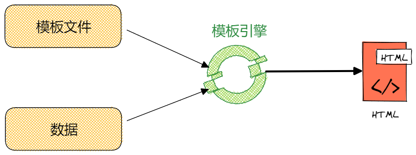
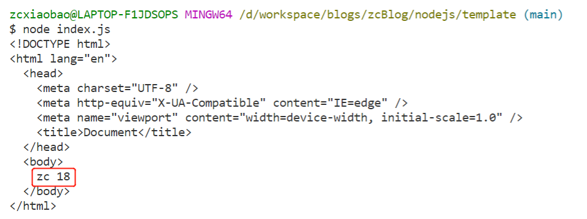
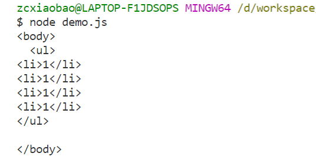
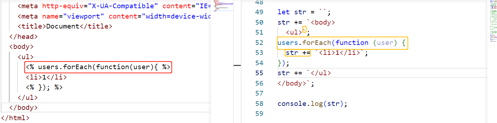
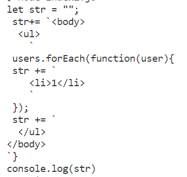
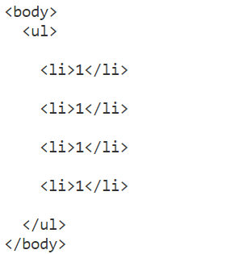
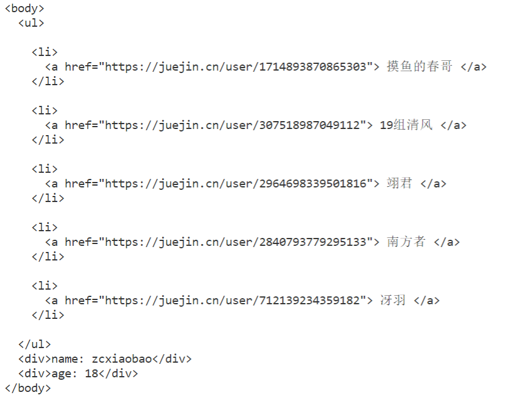

## 前言

> 模板引擎(用于 Web 开发)是为了使用户界面与业务数据(内容)分离而产生的，它可以生成特定格式的文档，用于网站的模板引擎就会生成一个标准的 HTML 文档。模板引擎核心可以总结为两点: 模板文件、数据。



概念看起来还是有些抽象，下面小包举一个 🌰 ：

小包写文一载，接受了很多大佬的帮助，本着开源开放的思想，小包决定公开感谢一番，决定渲染到个人网站上(渲染成 ul/li 标签)。**xdm，别忘了关注一波!**

```js
const users = [
  { name: "摸鱼的春哥", url: "https://juejin.cn/user/1714893870865303" },
  { name: "19组清风", url: "https://juejin.cn/user/307518987049112" },
  { name: "翊君", url: "https://juejin.cn/user/2964698339501816" },
  { name: "南方者", url: "https://juejin.cn/user/2840793779295133" },
  { name: "冴羽", url: "https://juejin.cn/user/712139234359182" },
];
```

如果不使用模板引擎，我们一般会使用字符串拼接进行实现。

```js
let ringleader = "<ul>";
users.forEach((user) => {
  ringleader += `<li><a href="${user.url}">${user.name}</a></li>`;
});
ringleader += "</ul>";
```

可以发现，上面的代码实现非常简单，逻辑也相对明确，但有个明显的问题：数据与结构强耦合，当数据或者结构发生变动时，都需要修改上面的代码，这非常不合理，因此我们需要将数据和结构进行解耦，数据是数据，结构是结构。因此模板引擎出现了，模板引擎核心便是为了实现视图与业务逻辑的分离。

我们以 `ejs` 为例重新实现上述代码:

```html
<!-- demo.html 区域 遵循 ejs 语法-->
<ul>
  <% users.forEach(function(user){ %>
  <li>
    <a href="<%= user.url %>"> <%= user.name %> </a>
  </li>
  <% }); %>
</ul>
```

```js
// js 部分
(async function () {
  let r = await ejs.renderFile("./demo.html", { users });
  console.log(r);
})();
```

```html
<!-- 打印结果 -->
<ul>
  <li>
    <a href="https://juejin.cn/user/1714893870865303"> 摸鱼的春哥 </a>
  </li>
  <li>
    <a href="https://juejin.cn/user/307518987049112"> 19组清风 </a>
  </li>
  <li>
    <a href="https://juejin.cn/user/2964698339501816"> 翊君 </a>
  </li>
  <li>
    <a href="https://juejin.cn/user/2840793779295133"> 南方者 </a>
  </li>
  <li>
    <a href="https://juejin.cn/user/712139234359182"> 冴羽 </a>
  </li>
</ul>
```

通过使用模板引擎 `ejs`，可以成功实现数据与页面的分离。本文的主要内容便是模拟实现一个简单的 `ejs` 模拟引擎。

## ejs 实现

`ejs` 使用 `<%` 和 `%>` 作为标识，本文实现两种常用的 `ejs` 语法:

- `<% script %>` 脚本执行，用于流程控制，无输出
- `<%= value %>` 输出表达式的值，输出会发生 `HTML` 转义

文章最开始小包举了一个 🌰，分别使用字符串拼接和 `ejs` 引擎实现了大佬列表的渲染。问题来了，你认为模板引擎的实现原理是什么？

**字符串拼接**，模板引擎本质上也是基于字符串拼接进行实现。但具体实现思路会有两种:**数组 + join 实现和纯字符串拼接**模式。本文基于字符串拼接进行实现。

### 基础实现

首先来搭建一下 `ejs` 的基本框架：

- 以 `html` 文件作为模板，因此需借助 `node` 中的 `fs` 模块来读取 `html` 文件。
- `fs.readFile` 返回值并非是 `Promise` 对象，借助 `util` 模块的 `promiseify` 将该方法 `Promise` 化
- 使用 `await/async`

```js
// Promise 化
const readFile = util.promisify(fs.readFile);
const ejs = {
  async renderFile(filename, options) {
    // 读取模板内容
    let content = await readFile(filename, "utf8");
  },
};
```

### <%= 语法实现

`template.html` 模板内容如下，当利用 `ejs` 传入 `name` 和 `age` 数据时，对应的替换模板内容。

```html
<!-- template.html -->
<body>
  <%=name%> <%=age%>
</body>
```

遇到格式非常类似的字符串，很容易会想到正则，因此我们可以对读取的文件数据做正则替换，但要注意正则默认是贪婪匹配模式。

小包的正则实现 `/<%=(.+?)%>/g`，`.=?` 中的 `?` 设置非贪婪匹配模式。

字符串方法中的 `replace` 方法非常强大，第一个参数可以是字符串或者正则，第二个参数可以是字符串或者每次匹配都要调用的回调函数。当两个参数分别为正则和回调函数时，正则中的子表达式(即`(content)`)可以与回调函数的参数一一对应。

```js
// options 为传入的数据
async renderFile(filename, options) {
    let content = await readFile(filename, "utf8");
    content = content.replace(/<%=(.+?)%>/g, function () {
      // arguments[1] 对应子表达式1，即 (.+?) 匹配的字符串序列
      return options[arguments[1]];
    });
    return content;
}
```

上述代码有两个关键，小包多嘴两句:

1. 正则: 需使用非贪婪匹配模式，如果使用贪婪模式 `/<%=(.+)%>/g` ，那么匹配结果为 `name%> <%=age`
2. `replace` 回调函数的参数问题: 回调函数中第二个参数依次往后与子表达式一一对应。

传入一些测试数据，测试当前代码可行性

```js
(async function () {
  let r = await ejs.renderFile("./template.html", { name: "zc", age: 18 });
  console.log(r);
})();
```



### <% 语法实现

`<% script %>` 脚本执行，用于流程控制，无输出。这又是什么意思那，看下面例子:

```html
<!-- template2.html -->
<body>
  <ul>
    <% users.forEach(function(user){ %>
    <li>1</li>
    <% }); %>
  </ul>
</body>
```

`users` 数组中有四位大佬，使用 `ejs` 模板引擎渲染后，`<% script %>` 会视为 `JavaScript` 脚本，因此等价于**执行** `users.forEach` 方法，将对应模板渲染为四个 `li` 标签。(也可以借助 vue 中的 v-for 语法进行理解)

`<% script %>` 语法的核心在于转换为 `JavaScript` 脚本执行，而模板引擎的本质在于字符串拼接，因此问题可以转换为**如何在 JavaScript 中执行代码字符串**。

在不考虑 `nodejs` 中 `vm` 模块的前提下，`JavaScript` 中有两种方案可以执行代码字符串:

- `eval` 函数
- `new Function()`

`MDN` 官方文档中如下描述 `eval`: **Never use eval()！** 此外还讲解了 eval 的缺点，例如执行慢，不安全等，最狠的还附带了下面这句话: _Fortunately, there's a very good alternative to eval(): using the Function constructor_

那么理所当然，小包选择 `Function()` 来实现代码字符串执行。

#### 字符串拼接

对于 `template2` 中的模板，我们需要将其拼接成可执行的代码字符串，这部分思想比较简单，但实现起来的确有几分繁琐。

> 该部分为模拟实现，不作为最后的结果

**Step1: 正则**

利用正则提取 `<% script %>` 中的 `script` 部分

```js
<body>
  <ul>users.forEach(function(user){<li>1</li>});</ul>
</body>
```

**Step2: 字符串拼接**

然后将正则替换的结果进行字符串拼接，拼接格式如下:

```js
let str = ``;
str += `<body>
  <ul>`;
users.forEach(function (user) {
  str += `<li>1</li>`;
});
str += `</ul>
</body>`;
```

**Step3: 测试字符串拼接结果**

把上述代码作为 `Node` 代码进行执行，根据执行结果可以证明上述字符串拼接结果是正确

> 为了更好的观看执行结果，小包在 li 后添加 \n 进行换行



**Step4: 编写字符串拼接的代码**

将模板和字符串拼接的结果进行对比，每条 `<% script %>` 指令都经过正则替换后成为三部分，这里我们可以在 `replace` 的回调函数中做文章。

- **`**
- **script**
- **str+= `**



整体内容经过正则替换后，将头部和尾部加上对应字符串即可。

```js
// 添加 \n 为了更好的格式化，看起来更舒服
async renderFile(filename, options) {
    let content = await readFile(filename, "utf8");
    let head = 'let str = "";\n str+= `';
    let body = content.replace(/<%((.+?))%>/g, function () {
      // 替换为三部分
      return "`\n" + arguments[1] + "\n str += `";
    });
    let tail = "`} \n console.log(str)";
    console.log(head + body + tail)
},
```



#### with + Function

模板文件中通常不止会接收一种数据，例如下面的例子:

```html
<body>
  <ul>
    <% users.forEach(function(user){ %>
    <li>1</li>
    <% }); %>
  </ul>
  <div>姓名: <%=name%></div>
  <div>年龄: <%=age%></div>
</body>
```

对于这种情况，按照我们的思路，首先进行字符串拼接，然后利用 `new Function` 将代码字符串转换成函数，执行函数。

```js
new Function("users", "name", "age", templateStr);
```

`new Function` 的参数好像有点奇怪，总不能根据模板来定义参数吧，我们的目标是开发一个标准化的模板引擎，标准格式如下

```js
new Function("options", templateStr);
```

新的问题出现了，如果这样设置，函数内部如何获取模板变量？

`JavaScript` 的变量获取是基于作用域链的，如果当前作用域内没有该变量，会沿着作用域向上查找，直到查到或者到达作用域顶端。

那么有没有一种方案能给某块代码添加一层作用域呐？**with**语句可以将某个对象添加到作用域链的顶部。虽然官方极度不推荐 `with` 的使用，但这是小包目前找到的最好方案。

问题解决了，直接看代码。

```js
const ejs = {
  async renderFile(filename, options) {
    let content = await readFile(filename, "utf8");
    let head = 'let str = "";\n with(options){ \n str+= `';
    let body = content.replace(/<%((.+?))%>/g, function () {
      return "`\n" + arguments[1] + "\n str += `";
    });

    let tail = "`} \nreturn str";
    console.log(head + body + tail);
    let fn = new Function("options", head + body + tail);
    return fn(options);
  },
};
```



### 进一步完善

上面分别讲解了 `<%=` 和 `<%` 的实现，下面小包把它们混合起来。

```html
<body>
  <ul>
    <% users.forEach(function(user){ %>
    <li><%=user.name%></li>
    <% }); %>
  </ul>
</body>
```

有了上面实现的基础，这里就不难实现了。

1. 先实现 `<%=` 语法，将 `<%=value%>` 替换为 `ES6` 语法 `${value}`
2. 实现 `<%` 语法

```js
const ejs = {
  async renderFile(filename, options) {
    // 获取模板数据
    let content = await readFile(filename, "utf8");
    // <%= 语法
    content = content.replace(/<%=(.+?)%>/g, function () {
      return "${" + arguments[1] + "}";
    });
    // <% 语法
    let head = 'let str = "";\n with(options){ \n str+= `';
    let body = content.replace(/<%(.+?)%>/g, function () {
      return "`\n" + arguments[1] + "\n str += `";
    });
    let tail = "`} \nreturn str";
    let fn = new Function("options", head + body + tail);
    return fn(options);
  },
};
```

下面我们来测试一下:

```html
<body>
  <ul>
    <% users.forEach(function(user){ %>
    <li>
      <a href="<%=user.url %>"> <%= user.name %> </a>
    </li>
    <% }); %>
  </ul>
  <div>name: <%=name%></div>
  <div>age: <%=age%></div>
</body>
```

```js
(async function () {
  let r = await ejs.renderFile("./demo.html", {
    users,
    name: "zcxiaobao",
    age: 18,
  });
  console.log(r);
})();
```



## 总结

先来看一下完整版代码，代码一共 `20+` 行，非常精炼，主要实现了 `ejs` 中常用的 `<%` 和 `<%=` 语法。

```js
const util = require("util");
const fs = require("fs");

const readFile = util.promisify(fs.readFile);
const ejs = {
  async renderFile(filename, options) {
    let content = await readFile(filename, "utf8");

    content = content.replace(/<%=(.+?)%>/g, function () {
      return "${" + arguments[1] + "}";
    });
    let head = 'let str = "";\n with(obj){ \n str+= `';

    let body = content.replace(/<%(.+?)%>/g, function () {
      return "`\n" + arguments[1] + "\n str += `";
    });
    let tail = "`} \nreturn str";
    let fn = new Function("obj", head + body + tail);
    return fn(options);
  },
};
```

虽然 `ejs` 代码实现并不多，但其中我们还是可以学习到很多小知识。

- 洞悉模板引擎的实现本质，即字符串拼接
- 使用 `with` 配合 `new Function` 实现 `<%` 语法
- `replace` 配合正则替换
