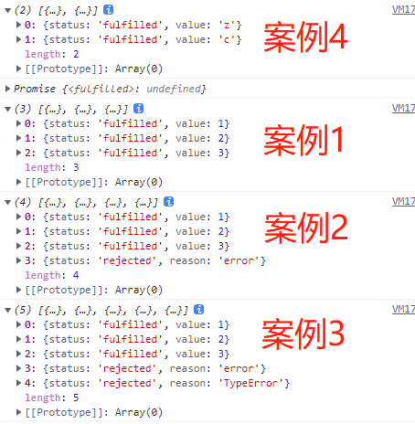

## 前言
本文小包将给大家介绍 `Promise` 中三个比较重要的静态方法三兄弟—— `Promise.all`、`Promise.allSettled`、`Promise.race` 及完善优雅的实现这三种方法。
## Promise.all

`Promise.all` 在目前手写题中热度频度应该是 `top5` 级别的，所以我们要深刻掌握 `Promise.all` 方法。下面首先来简单回顾一下 `all` 方法。

### 基础学习

> `Promise.all` 方法类似于**一群兄弟们并肩前行**，参数可以类比为一群兄弟，只有当兄弟全部快乐，`all` 老大才会收获快乐；只要有一个兄弟不快乐，老大就不会快乐。

`Promise.all()` 方法用于将多个 `Promise` 实例，包装成一个新的 `Promise` 实例。

```js
const p = Promise.all([p1, p2, p3]);
```

`Promise.all` 方法接受一个数组做参数，`p1、p2、p3` 都是 `Promise` 实例。如果不是 `Promise` 实例，则会先调用 `Promise.resolve` 方法将参数先转化为 `Promise` 实例，之后进行下一步处理。

**返回值 p 的状态由 p1、p2、p3 决定，可以分成两种情况**:

- 只有 `p1、p2、p3` 的状态都变成 `fulfilled` ，`p` 的状态才会变成 `fulfilled` ，此时 `p1、p2、p3` 的返回值组成一个数组，传递给 `p` 的回调函数。

- 只要 `p1、p2、p3` 之中有一个被 `rejected` ，`p` 的状态就变成 `rejected` ，此时第一个被 `reject` 的实例的返回值，会传递给 `p` 的回调函数。

```js
// 模拟异步的promise
const p1 = new Promise((resolve, reject) => {
  setTimeout(() => {
    resolve(1);
  }, 1000);
});
// 普通promise
const p2 = Promise.resolve(2);
// 常数值
const p3 = 3;
// 失败的promise
const p4 = Promise.reject("error");
// 异步失败的promise
const p5 = new Promise((resolve, reject) => {
  setTimeout(() => {
    reject("TypeError");
  }, 1000);
});

// 1. promise全部成功
Promise.all([p1, p2, p3])
  .then((data) => console.log(data)) // [1, 2, 3]
  .catch((error) => console.log(error));
// 2. 存在失败的promise
Promise.all([p1, p2, p3, p4])
  .then((data) => console.log(data))
  .catch((error) => console.log(error)); // error

// 3. 存在多个失败的promise

Promise.all([p1, p2, p3, p4, p5])
  .then((data) => console.log(data))
  .catch((error) => console.log(error)); // error
```

从上面案例的输出中，我们可以得出下列结论:

- `p` 状态由参数执行结果决定，全部成功则返回成功，存有一个失败则失败
- 参数为非 `Promise` 实例，会通过 `Promise.resolve` 转化成 `Promise` 实例
- **成功后返回一个数组，数组内数据按照参数顺序排列**
- **短路效应: 只会返回第一个失败信息**

#### Iterator 接口参数

《ES6 入门教程》还指出: **Promise.all 方法可以不是数组，但必须具有 Iterator 接口，且返回的每个成员都是 Promise 实例**

说实话，加粗部分小包是没能完全理解的，难道 `Promise.all` 使用 `Iterator` 类型时，要求迭代项都是 `Promise` 实例吗？我们以 `String` 类型为例，看 `Promise.all` 是否可以支持迭代项为非 `Promise` 实例。

```js
//  ['x', 'i', 'a', 'o', 'b', 'a', 'o']
Promise.all("xiaobao").then((data) => console.log(data));
```

可见 `Promise` 对 `Iterator` 类型的处理与数组相同，如果参数不是 `Promise` 实例，会先调用 `Promise.all` 转化为 `Promise` 实例。

### 思路分析

1. `Promise.all` 会返回一个新 `Promise` 对象

```js
Promise.all = function (promises) {
  return new Promise((resolve, reject) => {});
};
```

2. (**亮点**) `all` 方法参数可以是数组，同样也可以是 `Iterator` 类型，因此应该使用 `for of` 循环进行遍历。

```js
Promise.all = function (promises) {
  return new Promise((resolve, reject) => {
    for (let p of promises) {
    }
  });
};
```

3. 某些参数有可能未必是 `Promise` 类型，因此参数使用前先通过 `Promise.resolve` 转换

```js
Promise.all = function (promises) {
  return new Promise((resolve, reject) => {
    for (let p of promises) {
      // 保证所有的参数为 promise 实例，然后执行后续操作
      Promise.resolve(p).then((data) => {
        //...
      });
    }
  });
};
```

4. `Iterator` 类型我们是无法得知迭代深度，因此我们要维护一个 `count` 用来记录 `promise` 总数，同时维护 `fulfilledCount` 代表完成的 `promise` 数，当 `count === fulfilledCount` ，代表所有传入的 `Promise` 执行成功，返回数据。

```js
Promise.all = function (promises) {
  let count = 0; // promise总数
  let fulfilledCount = 0; // 完成的promise数
  return new Promise((resolve, reject) => {
    for (let p of promises) {
      count++; // promise总数 + 1
      Promise.resolve(p).then((data) => {
        fulfilledCount++; // 完成的promise数量+1
        if (count === fulfilledCount) {
          // 代表最后一个promise完成了
          resolve();
        }
      });
    }
  });
};
```

有可能有的读者会好奇，**为啥 `count === fulfilledCount` 可以判断所有的 promise 都完成了呐**?

`Promise.then` 方法是 `microTasks`(微任务)，当同步任务执行完毕后，`Event Loop` 才会去执行 `microTasks`。`count++` 位于同步代码部分，因此在执行 `promise.then` 方法之前，已经成功的计算出 `promise` 的总数。

然后依次执行 `promise.then` 方法，`fulfilledCount` 增加，当 `count === fulfilledCount` 说明所有的 `promise` 都已经成功完成了。 
5. 返回数据的顺序应该是 `all` 方法中比较难处理的部分。

- 创建一个数组 `result` 存储所有 `promise` 成功的数据
- 在 `for of` 循环中，使用 `let` 变量定义 `i`，其值等于当前的遍历索引
- `let` 定义的变量不会发生变量提升，因此我们直接令 `result[i]` 为 `promise` 成功数据，这样就可以实现按参数输入顺序输出结果

```js
Promise.all = function (promises) {
  const result = []; // 存储promise成功数据
  let count = 0;
  let fulfilledCount = 0;
  return new Promise((resolve, reject) => {
    for (let p of promises) {
      // i为遍历的第几个promise
      // 使用let避免形成闭包问题
      let i = count;
      count++;
      // 保证所有的参数为 promise 实例，然后执行后续操作
      Promise.resolve(p).then((data) => {
        fulfilledCount++;
        // 将第i个promise成功数据赋值给对应位置
        result[i] = data;
        if (count === fulfilledCount) {
          // 代表最后一个promise完成了
          // 返回result数组
          resolve(result);
        }
      });
    }
  });
};
```

6. 处理一下边界情况
   - 某个 `promise` 失败——直接调用 `reject` 即可
   - 传入 `promise` 数量为 `0` ——返回空数组(规范规定)
   - 代码执行过程抛出异常 —— 返回错误信息

```js
// 多余代码省略
Promise.all = function (promises) {
    return new Promise((resolve, reject) => {
        // 3.捕获代码执行中的异常
        try{
            for (let p of promises) {
                Promise.resolve(p).then(data => {}
                                .catch(reject);  // 1.直接调用reject函数返回失败原因
                })
            }
            // 2.传入promise数量为0
            if (count === 0) {
                resolve(result)
            }
        } catch(error) {
            reject(error)
        }
    })
}
```

### 手写源码

我们把上面的代码汇总一下，加上详细的注释，同时测试一下手写 `Promise.all` 是否成功。

```js
Promise.all = function (promises) {
  const result = []; // 存储promise成功数据
  let count = 0; // promise总数
  let fulfilledCount = 0; //完成promise数量
  return new Promise((resolve, reject) => {
    // 捕获代码执行中的异常
    try {
      for (let p of promises) {
        // i为遍历的第几个promise
        // 使用let避免形成闭包问题
        let i = count;
        count++; // promise总数 + 1
        Promise.resolve(p)
          .then((data) => {
            fulfilledCount++; // 完成的promise数量+1
            // 将第i个promise成功数据赋值给对应位置
            result[i] = data;
            if (count === fulfilledCount) {
              // 代表最后一个promise完成了
              // 返回result数组
              resolve(result);
            }
          })
          .catch(reject);
        // 传入promise数量为0
        if (count === 0) {
          resolve(result); // 返回空数组
        }
      }
    } catch (error) {
      reject(error);
    }
  });
};
```

测试代码(使用案例中的测试代码，附加 Iterator 类型 Stirng):

```js
// 1. promise全部成功
Promise.all([p1, p2, p3])
  .then((data) => console.log(data)) // [1, 2, 3]
  .catch((error) => console.log(error));

// 2. 存在失败的promise
Promise.all([p1, p2, p3, p4])
  .then((data) => console.log(data))
  .catch((error) => console.log(error)); // error

// 3. 存在多个失败的promise

Promise.all([p1, p2, p3, p4, p5])
  .then((data) => console.log(data))
  .catch((error) => console.log(error)); // error

// 4. String 类型
Promise.all("zcxiaobao").then((data) => console.log(data));
// ['z', 'c', 'x', 'i', 'a', 'o', 'b', 'a', 'o']
```

## Promise.allSettled

### 基础学习

> 不是每群兄弟们都会碰到好老大(`all` 方法)，`allSettled` 方法他并不管兄弟们的死活，他只管兄弟们是否做了，而他的任务就是把所有兄弟的结果返回。

`Promise.allSettled()` 方法接受一个数组作为参数，数组的每个成员都是一个 `Promise` 对象，并返回一个新的 `Promise` 对象。只有等到参数数组的所有 `Promise` 对象都发生状态变更（不管是 `fulfilled` 还是 `rejected`），返回的 `Promise` 对象才会发生状态变更。


还是以上面的例子为例，我们来看一下与 Promise.all 方法有啥不同。

```js
// 1. promise 全部成功
Promise.allSettled([p1, p2, p3])
  .then((data) => console.log(data)) // [1, 2, 3]
  .catch((error) => console.log(error));
// 2. 存在失败的 promise
Promise.allSettled([p1, p2, p3, p4])
  .then((data) => console.log(data))
  .catch((error) => console.log(error)); // error

// 3. 存在多个失败的 promise

Promise.allSettled([p1, p2, p3, p4, p5])
  .then((data) => console.log(data))
  .catch((error) => console.log(error)); // error

// 4. 传入 String 类型
Promise.allSettled("zc").then((data) => console.log(data));
```



从输出结果我们可以发现:

1. `allSettled` 方法只会成功，不会失败
2. 返回结果每个成员为对象，对象的格式固定
   - 如果 `promise` 成功，对象属性值 `status: fulfilled`，`value` 记录成功值
   - 如果 promise 失败，对象属性值 `status: rejected`，`reason` 记录失败原因。
3. `allSettled` 方法也可以接受 `Iterator` 类型参数

### 思路分析

`allSettled` 方法与 `all` 方法最大的区别在于两点:

1. `allSettled` 方法没有失败情况
2. `allSettled` 方法返回有固定格式

我们可以围绕这两点改造 `all` 方法。

`all` 方法我们是通过计算成功数量来判断是否终结，`allSettled` 方法不计较成功失败，因此我们需要计算成功/失败总数量即可。

在累加完成总数量的过程中，分情况构造 `allSettled` 所需要的数据格式: **成功时压入成功格式，失败时压入失败格式**。

### 源码实现

由于有了 `all` 方法手写的基础，上面就不一步一步啰嗦的实现了。

```js
Promise.allSettled = function (promises) {
  const result = [];
  let count = 0;
  let totalCount = 0; //完成promise数量
  return new Promise((resolve, reject) => {
    try {
      for (let p of promises) {
        let i = count;
        count++; // promise总数 + 1
        Promise.resolve(p)
          .then((res) => {
            totalCount++;
            // 成功时返回成功格式数据
            result[i] = {
              status: "fulfilled",
              value: res,
            };
            // 执行完成
            if (count === totalCount) {
              resolve(result);
            }
          })
          .catch((error) => {
            totalCount++;
            // 失败时返回失败格式数据
            result[i] = {
              status: "rejected",
              reason: error,
            };
            // 执行完成
            if (count === totalCount) {
              resolve(result);
            }
          });
        if (count === 0) {
          resolve(result);
        }
      }
    } catch (error) {
      reject(error);
    }
  });
};
```

## Promise.race
### 基础学习
> `race` 方法形象化来讲就是赛跑机制，只认第一名，不管是成功的第一还是失败的第一。

`Promise.race()` 方法同样是接收多个 `Promise` 实例，包装成一个新的 `Promise` 实例。

```js
const p = Promise.race([p1, p2, p3]);
```
上面案例中，只要 `p1、p2、p3` 之中有一个实例率先改变状态，`p` 的状态就跟着改变。那个率先改变的 `Promise` 实例的返回值，就传递给 `p` 的回调函数。

```js
const p1 = new Promise((resolve, reject) => {
    setTimeout(()=> {
        resolve(1)
    },1000)
})

const p2 = new Promise((resolve, reject) => {
    setTimeout(()=> {
        reject(2)
    },2000)
})

const p3 = 3;

// 成功在先，失败在后
Promise.race([p1, p2]).then(res => {console.log(res)}) // 1
// 同步在先，异步在后
Promise.race([p1, p3]).then(res => console.log(res)) // 3
// String
Promise.race('zc').then(res => console.log(res)) // z
```

### 思路分析
`race` 方法就没有那么多弯弯绕绕了，只要某个 `promise` 改变状态就返回其对应结果。

因此我们只需监听每个 `promise` 的 `then` 与 `catch` 方法，当发生状态改变，直接调用 `resolve` 和 `reject` 方法即可。
### 源码实现
```js
Promise.race(promises) {
    return new Promise((resolve, reject) => {
        for (let p of promises) {
            // Promise.resolve将p进行转化，防止传入非Promise实例
            // race执行机制为那个实例发生状态改变，则返回其对应结果
            // 因此监听
            Promise.resolve(p).then(resolve).catch(reject);
        }
    })
}
```

