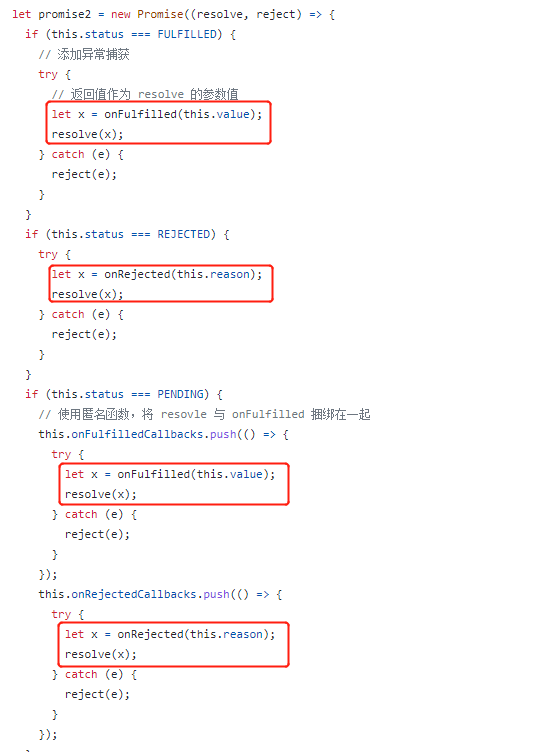
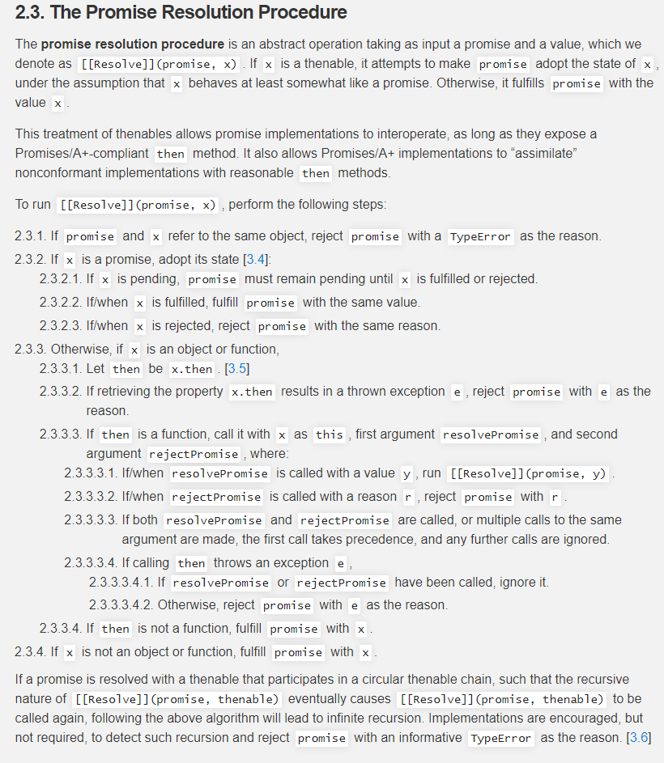
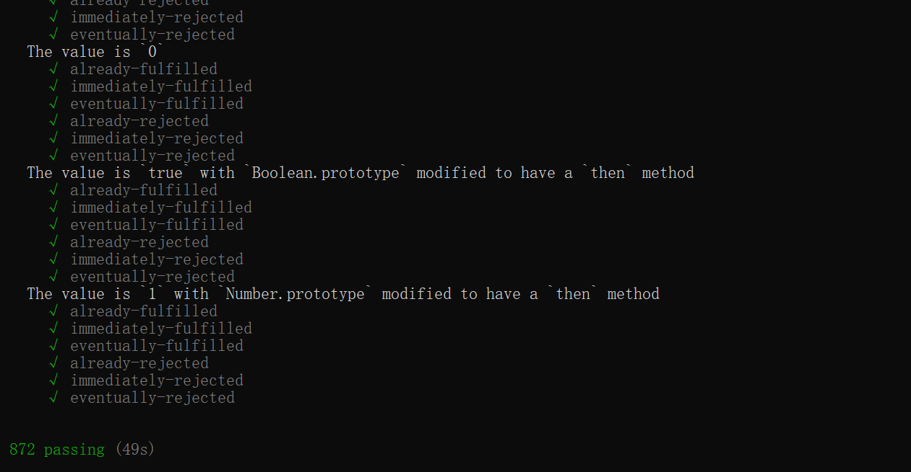

## 前言

在文章的最开始，先谈一下我对 `resolvePromise` 函数的理解。

基础篇部分我们处理了基础 `Promise` 功能，异步逻辑，链式调用，当时链式调用我们是这样处理的:



`then` 方法中按照 `promise` 状态分成了三种情况，每种情况，执行回调函数后的返回值 `x`，直接作为 `promise` 的成功值。

看到这里，你应该会产生疑惑，难道**所有类型的返回值 x 都直接返回**吗？

当然不是，`Promises/A+` 针对返回值 `x` 有非常复杂的处理，这也就是本文要讲解的 **The Promise Resolution Procedure**。

我们从基础篇的实现代码也可以发现，三种情况的处理代码是高度类似的，如果再加入对返回值 `x` 多种情况的处理，代码不堪想象，因此我们将这部分逻辑抽离出来成 `resolvePromise` 方法。

`resolvePromise` 方法接受四个参数:

```js
resolvePromise(promise2, x, resolve, reject);
```

`promise2` 就是 `then` 方法返回值，`x` 是 `then` 回调函数的返回值，我们根据返回值 `x` 的情况，决定调用 `resolve` 或 `reject`。

## 返回值 x

在阅读 `Promises/A+` 规范之前，我们先来思考一下返回值 `x` 会有那些情况:

- `x` 是个普通值(原始类型)
- `x` 是基于 `Promises/A+` 规范 `promise` 对象
- `x` 是基于其他规范的 `promise` 对象
- `x` 就是 `promise2` (x 与 promise2 指向同一对象)

返回值 `x` 的情况是非常复杂的，我们接下来来看一下 `Promises/A+` 规范是如何处理上述多种情况。

## Promises/A+ 规范解读

`Promises/A+` 规范洋洋洒洒的写了很大篇幅:



下面咱们来理解上述规范到底说了什么。

> Promise 解析过程是一个抽象操作，参数值为 promise 和 value，我们将其表示为 `[[Resolve]](promise,x)`

这里与上面讲述的 `resolvePromise` 是相通的，只不过为了代码编写，我们同时将 `promise2` 的 `resovle` 及 `reject` 方法作为参数传入。

> 如果 x 可 thenable，那么我们就认为 x 是一个类 promise 对象，它会尝试让 promise 采用 x 的状态。只要它们符合 Promises/A+ 的 then 方法，允许 promise 对 thenable 的处理进行互操作。

`promise` 有很多规范，`Promises/A+` 只是其中之一，`Promises/A+` 希望自身能兼容其他规范下的 `promise` 对象，判断依据为该对象是否可 `thenable`。

1. 如果 `promise` 和 `x` 引用的同一对象，则以 `TypeError` 理由拒绝 (避免循环引用)

什么情况下会出现这种现象呐？看这样一个栗子:

```js
const p = new Promise((resolve, reject) => {
  resolve(1);
});
const promise2 = p.then((data) => {
  return promise2;
});
// TypeError: Chaining cycle detected for promise #<Promise>
promise2.then(null, (err) => console.log(err));
```

2. 如果 `x` 是一个 `promise` ，采用它的状态
   - 如果 `x` 状态是 `pending` ，则 `promise` 也需要保持 `pending` 状态直至 `x` 状态转变为 `fulfilled` 或 `rejected`
   - 如果 `x` 状态是 `fulfilled` ，则以同样的值完成 `promise`
   - 如果 `x` 状态是 `rejected` ，则以同样的原因拒绝 `promise`

上面规范指出了当返回值 `x` 为 `promise` 对象时，我们应该如何处理，但并没有给出如何判断返回值 `x` 是否为 `promise` 对象

3. `x` 是一个对象或者函数
   - 声明 `then` 其值为 `x.then`
   - 如果检索属性 `x.then` 导致抛出异常 `e`，则以 `e` 为拒绝原因拒绝 `promise。`
   - 如果 `then` 是一个函数，`x` 作为 `then` 的 `this` 调用该方法，第一个参数是成功的回调函数，第二个参数是失败的回调函数—— **判断是否为 promise 的最小判断**
     - 如果成功回调以值 `y` 调用，运行 `[[Resolve]](promise,y)`
     - 如果失败回调以原因 `r` 调用，用 `r` 拒绝 `promise`
     - 如果成功回调与失败回调都被调用或多次调用同一个参数，则第一个调用优先，其他调用都将被忽略。
     - 如果调用 `then` 方法抛出异常 `e`:
       - 若成功回调或失败回调都调用过，忽略
       - 未调用，用 `e` 作为原因拒绝 `promise`
   - 如果 `then` 不是函数，用 `x` 作为值完成 `promise`
4. 如果 `x` 既不是对象也不是函数，使用 `x` 作为值完成 `promise`

我们已经解读规范完毕，小包下面提出几个问题，加深一下大家对 `Promise Resolution` 的理解。

### 问题

1. 检索 `x.then` 属性会存在异常情况，你能举个类似栗子吗?

规范考虑的非常全面，由于 `Promises/A+` 规范可以兼容其他具有 `thenable` 能力的 `promise` 实现，假设这样一个场景:

```js
// 某个人非常变态
// 它给对象x的then属性的getter设置为报错
const x = {};
Object.defineProperty(x, "then", {
  get() {
    throw Error("cant execute then function");
  },
});
// 此时如果在调用 x.then 就会抛出异常
// Uncaught Error: cant execute then function
x.then;
```

2. 为什么 `then` 方法通过 `call` 调用，而非 `x.then` 调用?

then 属性已经被检索成功，如果再次检索，会存在一定风险。还是上面那个栗子，我们稍微改一下:

```js
let n = 0;
const x = {};
Object.defineProperty(x, "then", {
  get() {
    // 修改成第2次调用抛出异常
    n++;
    if (n >= 2) {
      throw Error("cant execute then function");
    }
    return "success";
  },
});
// success
x.then;
// cant execute then function
x.then;
```

`then.call(x)` 与 `x.then` 效果相同，而且通过 `then.call(x)` 可以减少二次检索的风险。

3. 如果成功回调以值 `y` 调用，运行 `[[Resolve]](promise, y)` ，这条规范啥意思？

小包想了很久，终于想通了这里，开始小包误以为此条规范针对了两种 `onfulfilled` 情况:

- `onFulfilled` 函数返回 `Promise` 实例
- `onFulfilled` 函数执行时参数为 `Promsie` 实例。

但经过对比思考，第二种情况是根本无法达到此规范。小包还是对第二种非常好奇，于是去反复翻阅了 `Promises/A+` 规范，发现这竟然是**规范的漏网之鱼**，规范没有提到这点的处理。但我通过在浏览器进行尝试，发现对于第二种情况，`ES6` 同样会对此情况递归解析(有机会小包会单独写文章对比这两种情况)

对于**onFulfilled 返回 Promise 实例**，小包来举个栗子:

```js
const p1 = new Promise((resolve, reject) => {
  resolve("i am p1");
});

const p2 = new Promise((resolve, reject) => {
  resolve("i am p2");
});
const p3 = p2.then((res) => {
  console.log(res);
  return p1;
});

// {
//     [[Prototype]]: Promise
//     [[PromiseState]]: "fulfilled"
//     [[PromiseResult]]: "i am p1"
// }
console.log(p3);
// false
console.log(p3 === p1);
```

从输出结果可以发现，`p2` 的 `then` 方法返回值为 `p1` ，返回的是全新的 `Promise` 实例，与 `p1` 不同，只不过采用了 `p1` 状态。

4. 如果成功回调与失败回调都被调用或多次调用同一个参数，则第一个调用优先，其他调用都将被忽略。这条规范又是在处理什么情况？

看到这条规范，你可能会很奇怪，因为咱们手写的 `Promise` 在基础篇已经处理过当前情况，成功与失败回调只会调用其中之一。 `Promises/A+` 规范中多次提到，可以兼容其他具备 `thenable` 能力的 `promise` 对象，其他规范实现的 `promise` 实例未必会处理此情况，因此此条规范是为了兼容其他不完善的 `promise` 实现。

## 源码实现

### 循环引用

如果 `promise` 和 `x` 引用的同一对象，则以 `TypeError` 理由拒绝。因此我们需要给 `resolvePromise` 添加一步校验:

```js
const resolvePromise = function (promise, x, resolve, reject) {
  // 循环引用，自己等待自己完成
  if (promise === x) {
    // 用一个类型错误，结束掉 promise
    return reject(
      new TypeError(
        `TypeError: Chaining cycle detected for promise #<myPromise> `
      )
    );
  }
};
```

### 判断 x 是否为 promise 实例

通过上面规范的解读，我们可以把判断 `x` 是否为 `promise` 实例归结为以下步骤:

1. `promise` 实例应该是对象或者函数: 首先判断 `x` 是否为对象或函数
2. `promise` 对象必须具备 `thenable` 能力: 接着检索 `x.then` 属性
3. `then` 属性应该是个可执行的函数: 最后判断 `then` 是否为函数 (这是最小判断)
4. 如果上述都满足，`Promises/A+` 就认为 `x` 是一个 `promise` 实例

**精炼一下: 首先判断 x 是否为对象或函数；然后判断 x.then 是否为函数**

我们来编写一下这部分代码:

```js
function resolvePromise(promise, x, resolve, reject) {
  // 判断 x 是否为对象(排除null情况)或函数
  if ((typeof x === "object" && x !== null) || typeof x === "function") {
    // 检索 x.then 可能会抛出异常
    try {
      // 检索 x.then
      let then = x.then;
      // 判断 then 是否为函数
      // 这是最小判断，满足此条件后，认定为 promise 实例
      if (typeof then === "function") {
        // 执行 x.then 会再次检索 then 属性，有风险发生错误
        // 这里的另外两个参数后面会详细讲解
        then.call(x);
      } else {
        // then 方法不是函数，为普通值——{then:123}
        resolve(x);
      }
    } catch (e) {
      // 存在异常，执行 reject(e)
      reject(e);
    }
  } else {
    // 既不是对象也不是函数，说明是普通值，调用 resolve(x) 完成
    resolve(x);
  }
}
```

### 返回值 x 为 promise

上文我们已经对此条规范做了详细的解析，但应该如何实现此条规范呐？非常简单，我们只需对 `then.call(x)` 略作修改即可。

```js
then.call(
  x,
  (y) => {
    // 如果x是一个 promise 就用他的状态来决定 走成功还是失败
    resolvePromise(promise, y, resolve, reject); //递归解析y的值
  },
  (r) => {
    // 一旦失败了 就不在解析失败的结果了
    reject(r);
  }
);
```

不知道大家能不能理解上述递归的原理？小包给举个栗子。

```js
// 假设 y 是 promise，就以下面为例
const y = new Promise((resolve, reject) => {
  resolve(1);
});

// 经过 resolvePromise
resolvePromise(promise, y, resolve, reject);
```

`resolvePromise(promise, y, resolve, reject)` 的执行流程是这样的:

1. 经过一系列判断，最终通过 `y.then` 为函数判断出 `y` 为 `promise`
2. 执行 `then(y, resolvePromsie, rejectPromise)`
3. 上面代码等同于执行下面代码

```js
y.then(
  (y1) => {
    resolvePromise(promise, y1, resolve, reject);
  },
  (r1) => {
    reject(r1);
  }
);
```

4. `y1` 的值是 `1`，为普通值，因此直接调用 `resolve(y1)`
5. 因此实现了 `promise2` 采纳返回值 `x` 的状态

### 兼容不完善的 promise 实现

为了兼容不完善的 `promise` 实现，因此我们需要给 `resolvePromise` 中执行添加一个锁。

```js
function resolvePromise(promise, x, resolve, reject) {
  // 判断 x 是否为对象(排除null情况)或函数
  let called = false;
  if ((typeof x === "object" && x !== null) || typeof x === "function") {
    try {
      let then = x.then;
      if (typeof then === "function") {
        then.call(
          x,
          (y) => {
            // 添加锁，避免成功后执行失败
            if (called) return;
            called = true;
            resolvePromise(promise, y, resolve, reject);
          },
          (r) => {
            // 添加锁，避免失败后执行成功
            if (called) return;
            called = true;
            reject(r);
          }
        );
      } else {
        resolve(x);
      }
    } catch (e) {
      // 添加锁，避免失败后执行成功
      if (called) return;
      called = true;
      reject(e);
    }
  } else {
    // 既不是对象也不是函数，说明是普通值，调用 resolve(x) 完成
    resolve(x);
  }
}
```

### then 方法修改

文章最开始我们提到将 `then` 方法三种情况代码重复度过高，我们将此部分抽离为 `resolvePromise` ，第一个参数为 `promise2`。

我们取出基础篇 `then` 方法部分代码，重点关注 `resolvePromise` 调用部分。你应该很容易问题，promise2 是 then 整体执行完毕后才可以访问，resolvePromise 此时应该是无法访问到该方法。

```js
then(onFulfilled, onRejected) {
  let promise2 = new Promise((resolve, reject) => {
    if (this.status === FULFILLED) {
      try {
        let x = onFulfilled(this.value);
        resolvePromise(promise2, x, resolve, reject);
      } catch (e) {
        reject(e);
      }
    }
  });
  return promise2;
}
```

因此我们需要给 resolvePromise 加一下异步操作，本手写使用 setTimeout 实现。

```js
then(onFulfilled, onRejected) {
  let promise2 = new Promise((resolve, reject) => {
    if (this.status === FULFILLED) {
      // 这样resolvePromise执行时，就可以获取promise2对象了
      setTimeout(() => {
        try {
          let x = onFulfilled(this.value);
          resolvePromise(promise2, x, resolve, reject);
        } catch (e) {
          reject(e);
        }
      }, 0)
    }
  });
  return promise2;
}
```

实现到这里，手写 `Promise` 就全部剧终了，下面我们来测试一下我们的手写 `Promise` 是否可以通过 `Promises/A+` 提供的案例测试。

完整版 promise 代码: [手写 Promise](./MyPromise/promise.js)

## 案例测试

### 延迟对象

在我们的手写 `Promise` 中添加 `deferred` 部分代码:

```js
Promise.deferred = function () {
  let dfd = {};
  dfd.promise = new Promise((resolve, reject) => {
    dfd.resolve = resolve;
    dfd.reject = reject;
  });
  return dfd;
};
```

### promises-aplus-tests

使用 `npm` 安装 `promises-aplus-tests`。

```js
npm i promises-aplus-tests
```

然后进入到待测试的 promise 文件夹，执行

```js
promises-aplus-tests promise.js
```



测试通过，大功告成!
