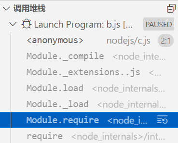

## 前言

模块是 `nodejs` 中非常核心重要的概念，而围绕模块还有个更核心的东西，那就是 `require` 函数，大家相比或多或少听说过或者使用过该函数，但你知道它的实现机理吗？你能实现它吗？

学习本文，你能收获:

- 🌟 小包带你学习 `require` 执行的全流程
- 🌟 `require` 源码的阅读
- 🌟 掌握简易版 `require` 源码的手写

## 1.预备知识

在正式阅读 `require` 源码之前，先来补充一些基础知识。

### 1.1 CommonJS 规范

`CommonJS` 规范指出:每一个文件就是一个模块，拥有自己独立的作用域、变量以及方法等，对其他的模块都不可见。每个模块内部都存有 `module` 对象代表当前模块。`module` 对象的 `exports` 属性(`module.exports`)是对外的接口，**加载某个模块，实际上就是加载该模块的 `module.exports` 属性**。

下面简单介绍一下 `module` 对象上的属性

- `exports`: 模块对外的接口，表示模块对外输出的值
- `id`: 模块的标识符，通常为带有绝对路径的模块文件名
- `filename`: 带有绝对路径的模块文件名
- `parent`: 返回一个对象，表示调用该模块的模块
- `children`: 返回一个数组，表示该模块使用的其他模块集合
- `loaded`: 返回布尔值，表示模块是否加载完成

**CommonJS 规范的注意事项:**

1. 模块存在缓存机制，**第一次加载后模块会被缓存**，因此多次重复引用或加载会读取缓存。
2. `require` 加载模块**输出的是 module.exports 的拷贝**，因此该值一旦被输出后，模块中值发生改变不会影响导出值。

### 1.2 require, module 等属性挂载在哪里？

学习 nodejs 过程中，你应该都会做过这样的一个尝试:

```js
console.log(global.require); // undefined
console.log(global.module); // undefined
console.log(global.__filename); // undefined
console.log(global.exports); // undefined
console.log(global.__dirname); // undefined
```

可见 `require` ，`module`，`__dirname`，`__filename`，`exports` 这五大常用属性，并非挂载到全局对象 `global` 上

**那为什么 node 中我们可以直接引用那？**

`node` 中每个文模块其实都包裹在函数中，上面的属性是函数的参数，因此模块内部就可以直接调用这几个属性。

```js
function (exports, require, module, __filename, __dirname) {
  // 模块内容
});
```

### 1.3 执行代码字符串的方式

前端中，字符串如何能变成 `JS` 执行呢？小包这里提供三种方法:

- `eval`: 传言中很罪恶的方法，不建议使用
- `new Function()`

`new Function` 支持接收一段字符串来创建一个函数:

```js
// argN 是传入的参数
new Function(arg1, arg2, ...argN, functionBody);
```

我们来看一个栗子:

```js
var multiply = new Function("x", "y", "return x * y");
// 但浏览器通常不支持这种不安全的操作
multiply(1, 2); // 返回2
```

但这个特性并不是完美的，使用 `new Function` 创建的函数不会创建当前环境的闭包，它们总是**被创建在全局环境**。也就是说，使用 `new Function` 定义的函数在运行时这能访问**全局变量和自己的局部变量**，而不能访问它们被 `Function` 构造函数创建时所在的作用域的变量。

```js
// node 下测试
global.globalA = 1; // 位于全局对象global上
var notGlobalB = 2; //  this !== global
new Function("console.log(globalA)")(); // 1
new Function("console.log(notGlobalB)")(); // notGlobalB is not defined
```

通过案例，我们可以发现 `Function` 可以获取全局变量，因此还是会出现变量污染的情况。这种方案也不是最佳字符串执行方案。**Function 是模板引擎的实现原理**，小包后面会专门讲解。

- `vm` 模块

> 沙箱模式给模块提供一个环境运行而不影响其它模块和它们私有的沙箱。

`vm` 是 `node` 提供的内置模块，上面有两个比较常用的方法:

```js
const vm = require("vm");
global.a = 100;
// 运行在当前环境中[当前作用域]
vm.runInThisContext("console.log(a)"); // 100
// 运行在新的环境中[其他作用域]
vm.runInNewContext("console.log(a)"); // a is not defined
```

- `runInThisContext` 可以访问到自身局部变量和全局变量
- `runInNewContext` 只能访问到自身局部变量

我们绘制一个比较简单的图来描述两者的执行环境区别。


## 2.reqiure 源码解读

我们借助一个简单的模块引入栗子，通过 `VScode` 提供的调用堆栈一起来阅读 `require` 源码，理解 `CommonJS` 模块加载流程。

```js
// a.js
const a = 100;
module.exports = a;

// b.js
const a = require("./a"); // 断点位置
console.log(a);
```

当我们运行调试后，我们可以看到，调用堆栈中共有六层，下面我们来挨着阅读每步到底做了什么。



### 2.1 调用父模块的 require 方法


这里的父模块指的是调用模块的当前模块。`mod` 即为模块 `b` ，`path` 为模块 `a` 的相对路径。


通过源码我们可以发现 `Module.prototype` 上面的 `require` 方法主要做了两件事: 检验路径名是否合法；调用 `Module.\_load` 方法

### 2.2 调用 Module.\_load 方法

`Module.\_load` 方法源码比较长， `node` 对该方法提供非常详细的注释，它是这么说的:

1. 如果缓存存在该模块，直接从缓存中返回
2. 如果该模块为原生模块，调用 `NativeModule.prototype.compileForPublicLoader` 来加载模块，若加载成功，返回此原生模块
3. 否则，根据路径创建一个新的模块，同时存入缓存中，返回新创建模块

下面小包把 `Module.\_load` 方法精炼一下:

#### 2.2.1 获取绝对路径

```js
// 如果跟随着小包调试，你会发现此时的 filename 已经是绝对路径了，而且拥有后缀名
const filename = Module._resolveFilename(request, parent, isMain);
```

#### 2.2.2 根据路径名检查缓存

```js
  const cachedModule = Module._cache[filename];
  // 如果存在缓存，直接返回缓存中模块
  if (cachedModule !== undefined) {
    // ...
  }
};


```

#### 2.2.3 原生模块

若该模块为原生模块，加载原生模块，加载成功后返回模块。

```js
const mod = loadNativeModule(filename, request);
if (mod && mod.canBeRequiredByUsers) return mod.exports;
```

#### 2.2.4 创建新模块

不满足上述情况，需要根据调用 `Module.prototype.load` 方法创建一个新模块，并返回新模块的 `exports`。

**Step1: 根据文件绝对路径创建新模块:**

```js
const module = cachedModule || new Module(filename, parent);
```

**Step2: 将新模块存入缓存中:**

```js
Module._cache[filename] = module;
```

**Step3: 调用 Module.prototype.load 方法，根据 filename 加载模块**

```js
module.load(filename);
```

**Step4: 返回 module.exports 属性:**

```js
return module.exports;
```

### 2.3 调用 load 方法

`load` 方法挂载在 `Module.prototype` 上，其源码较短，我们来一起大致看一下:


阅读源码，注释是非常重要的，第一行注释其实就奠定了该方法的基调: **给定文件名，将其传递给合适的扩展处理程序**

有了注释的解释，源码读起来就简单多了，`Module.prototype.load` 方法的功能是**根据不同的后缀名调用其对应的处理函数**。

**Step1: 获取文件后缀名:**

```js
// 通过 findLongestRegisteredExtension 获取文件后缀名
const extension = findLongestRegisteredExtension(filename);
```

**Step2: 根据后缀名执行对应的处理函数:**

```js
// 核心步骤
Module._extensions[extension](this, filename);
```

除了上面核心的步骤，`Module.prototype.load` 方法还做了两件事:

- 将 `module` 变量的部分属性进行赋值: `filename`，`paths`，`loaded`
- 还做了 `mjs` 后缀文件的处理

### 2.4 Module.\_extensions

阅读源码之前，就设想过 `require` 会如何实现处理多种格式文件的功能，同时要兼顾好程序的可扩展性及可维护性。

但最后不得不说 `node` 还是给小包好好上了一课。这是一个非常简单但却非常有用的思想，`node` 是这样实现的:

- `Module.\_extensions` 是一个对象
- 对象的键为文件后缀名，值为对应后缀处理函数，参数为当前模块

```js
Module._extensions = {
  ".js"(module) {},
  ".json"(module) {},
};
```

因此如果你需要修改某种后缀的处理函数或者增加新的可支持文件名，只需要修改对应的键或者值即可。 **大大的赞!!!**

`Module.\_extensions` 目前只配置了 `.js .json .node` 三种后缀名，`.node` 后缀应该是 `nodejs` 内部使用的，因此我们主要介绍 `.json` 和 `.js` 后缀的对应处理函数。

#### 2.4.1 module.exports 的中介作用

理解 `.json` 和 `.js` 后缀的对应处理函数的工作机制之前，我们必须有一个东西要想清楚，那就是 `node` 是如何获取到调用模块的对外输出值那？

上文讲过，`module.exports` 是对外的接口，**加载某个模块，实际上就是加载该模块的 module.exports 属性**。而且我们在阅读 `Module.\_load` 方法时也可以发现，无论是原生模块还是新创建的文件模块，最终都返回了 `module.exports` 。

可见 `module.exports` 对象在 `require` 中就起到了关键的中介作用，因此我们将模块里面的值加载到 `module.exports` 里面，然后外部接收 `module.exports` ，就可以获取模块的导出值。

那我们如何将模块里面的导出值转移到 `module.exports` 中呐？

### 2.5 json 处理函数

`JSON` 指的是 `JavaScript` 对象表示法，属性值使用双引号包裹起来。类似下面:

```json
{
  "name": "zcxiaobao",
  "age": 18
}
```

`JavaScript` 中提供了 `JSON.parse` 和 `JSON.stringify` 方法进行对象与 `JSON` 的转换。

调用 `JSON.parse` 方法将读入的 `JSON` 内容转化为对象，然后赋值给 `module.exports` 就可以获取到 `JSON` 模块的输出值。

我们来看一下源码中是不是如此处理 `.json` 文件的:


```js
// 同步读取 json 文件内容
const content = fs.readFileSync(filename, "utf-8");
// 将内容转化为 Object ，赋值给 module.exports
module.exports = JSONParse(stripBOM(content));
```

### 2.6 js 处理函数

我们仍然使用最开始的栗子:

```js
// a.js
const a = 100;
module.exports = a;
```

读入 `js` 文件后，获取的内容是一段代码字符串，并且包含 `module.exports` 赋值，因此我们只需要将当前代码字符串执行即可。由于 `node` 中每个模块里都包裹在函数中，因此执行代码字符串之前，需要包裹一层函数。

**Step1：读取代码字符串**

程序会首先读取 `a.js` 文件，我们可以成功读取到代码字符串 `'const a = 100;\r\nmodule.exports = a;\r\n'` 。

**Step2：包裹外层函数**

`node` 每个模块都是包裹在函数中的，因此我们需要给代码字符串包裹一层函数。包裹后的结果如下:

```js
function (exports, require, module, __filename, __dirname){\nconst a = 100;\r\nmodule.exports = a;\r\n}
```

**Step3：vm.runInThisContext 将其转化成 js 语法**
`vm.runInThisContext` 将包裹后的函数代码字符串转换成 `js` 语法，等待执行。

**Step4：函数调用，module.exports 接收到导出值**


源码实现的思想和上面类似，我们来粗略的阅读一下。

#### 2.6.1 Module.\_extensions[.js]


源码中核心步骤主要有两步:

1. `fs.readFileSync` 读取文件
2. `Module.\_compile` 编译读取的代码字符串

#### 2.6.2 Module.\_compile

`Module.compile` 方法实现源码比较多，小包在这里提取其核心部分

```js
const compiledWrapper = wrapSafe(filename, content, this);
const dirname = path.dirname(filename);
const require = makeRequireFunction(this, redirects);
let result;
const exports = this.exports;
const thisValue = exports;
const module = this;

result = compiledWrapper.call(
  thisValue,
  exports,
  require,
  module,
  filename,
  dirname
);

return result;
```

#### 2.6.3 wapeSafe 方法

`wapeSafe` 方法完成了我们 **js 处理函数** 所分析的 `Step2` 和 `Step3`，最终将代码字符串转换为可执行的 `js` 函数。


> `compileFunction` 是 `nodejs` 提供的另一种实现上述功能的方法，当前方法无法阅读源码。

#### 2.6.4 执行 compiledWrapper

通过 `wrapSafe` 成功返回可执行函数后，我们就可以传入模块所需要的五个参数，然后执行方法即可。

### 2.7 流程总结


## 3.require 实现

通过阅读上面的源码，我们来实现简易可加载文件模块的 `require` 方法，下面我们来大致总结一下核心要点

1. 解析路径，把相对路径转化为绝对路径，同时添加后缀名
2. 根据解析后的绝对路径，检测缓存是否存在该模块，若存在直接返回；不存在，创建新的模块
3. 根据路径的后缀名，执行相对应的处理函数

### 3.1 实现整体框架

根据上面的分析以及源码的流程，这个部分我们先把 `require` 方法的整体框架搭建起来。

**Step1: Module 构造函数**

```js
// Module 只保存核心的 id 和 exports属性
// id 代表模块路径
function Module(id) {
  this.id = id;
  this.exports = {};
}
```

**Step2: 将相对路径转换为绝对路径的方法**

读文件模块时，我们通常传入相对路径，因此我们需要首先将相对路径转换为绝对路径，这里我们延续 `node` 中的设置，将此方法继续声明为 `Module.\_resolveFilename`

```js
Module._resolveFilename = function () {};
```

**Step3: Module.\_cache 模块缓存**

`require` 加载模块时会首先去缓存中进行查找，因此我们声明一个缓存区 `_cache`，挂载到 `Module` 上

```js
Module._cache = {};
```

**Step4: 新模块的创建方法**

当缓存中无法找到该模块时，我们需要根据传入的绝对路径创建新模块并加载该模块。 (这里不考虑原生模块情况)

```js
// 模块的加载方法
Module.load = function () {
  // this.id 可以获取到文件的路径
};
```

**Step5: Module.\_extensions 模块处理函数**

上文我们讲过，`nodejs` 根据文件后缀名采取了策略模式，每种后缀名执行其对应的处理函数，函数的参数为当前模块。

```js
Module._extensions = {
  ".js"(module) {},
  ".json"(module) {},
};
```

**Step6: nodejs 每个文件模块都包裹在函数中，我们预先配置好函数的头尾**

```js
Module.funcWrap = [
  `(function(exports,require,module,__filename,__dirname){`,
  `})`,
];
```

### 3.2 require 方法

上文详细的讲过 `require` 的流程，这里就不多做赘述。`require` 方法流程可以总结为以下步骤:

1. 将路径转换成绝对路径
2. 检查缓存中是否存在该文件模块，存在则返回
3. 缓存中不存在，则创建新模块
4. 将模块存入缓存中
5. 加载模块
6. 返回 `module.exports`

```js
// 为了与nodejs做区分
function Require(filename) {
  filename = Module._resolveFilename(filename);
  const cacheModule = Module._cache[filename];
  if (cacheModule) {
    return cacheModule.exports;
  }
  const module = new Module(filename);
  Module._cache[filename] = module;
  return module.exports;
}
```

### 3.3 \_resolveFilename 方法

引用一个文件模块时，有时候我们会书写后缀，有时候不会，这两种情况我们都需要考虑。

```js
const a = require("./a.js");
const b = require("./b");
```

我们通过 `fs.existsSync` 方法来检测当前路径是否存在。

**Case1: 书写后缀情况**

`__dirname` 可以获取当前文件的工作目录，因此我们使用 `path.resolve` 方法将 `__dirname` 与 `filename` 进行拼接可以得到文件模块的绝对路径。

```js
Module._resolveFilename = function (filename) {
  let absFilePath = path.resolve(__dirname, filename);
  // 检测引入时传入后缀情况
  let isExists = fs.existsSync(absFilePath);
  if (isExists) {
    return absFilePath;
  }
};
```

**Case2: 未书写后缀情况**

如果引用文件模块时未书写后缀，那我们要去尝试添加后缀，`Module.\_extensions` 存取了每种后缀的处理函数，因此使用其键的顺序去尝试添加后缀。

```js
Module._resolveFilename = function (filename) {
  let absFilePath = path.resolve(__dirname, filename);
  // 检测引入时传入后缀情况
  let isExists = fs.existsSync(absFilePath);
  if (isExists) {
    return absFilePath;
  } else {
    let extensions = Object.keys(Module._extensions);
    for (let ext of extensions) {
      // 尝试拼接后缀
      let absPathAndExt = absFilePath + ext;
      if (fs.existsSync(absPathAndExt)) {
        return absPathAndExt;
      }
    }
    // 所有后缀情况拼接失败，抛出错误
    throw new Error("module not exists");
  }
};
```

### 3.4 Module.prototype.load 方法

`Module.prototype.load` 方法主要就是为不同的后缀派发对应的处理函数，同时执行该函数，因此这里将其浓缩为两步:

```js
// 1. 获取后缀名
// 2. 执行该后缀名的对应处理函数
Module.prototype.load = function () {
  // extname 可以获取路径的后缀名
  const ext = path.extname(this.id);
  Module._extensions[ext](this);
};
```

### 3.5 \_extensions[json]

我们上文分析过 `.json` 后缀的处理方法，这里就直接进行实现

```js
Module._extensions = {
  ".json"(module) {
    let content = fs.readFileSync(module.id, "utf8");
    module.exports = JSON.parse(content);
  },
};
```

### 3.6 \_extensions[js]

`.js` 后缀的处理源码分成了 `\_extensions[js]` 和 `Module.compile` 方法进行实现，这里对实现思路进行总结:

1. `fs.readFileSync` 读取模块内容，获取代码字符串
2. 将代码字符串外层包裹 `Module.funcWrap` 形成一个函数代码字符串
3. 调用 `vm.runInThisContext` 方法将其转换成可执行 `js` 语法
4. 初始化每个模块所需要的 `require`，`exports`，`module`，`filename `和 `dirname`
5. 调用函数，传入上述参数

```js
Module._extensions = {
  ".js"(module) {
    let content = fs.readFileSync(module.id, "utf8");
    content = `${Module.funcWrap[0]}${content}${Module.funcWrap[1]}`;
    let func = vm.runInThisContext(content);
    const exports = module.exports;
    const dirname = path.dirname(module.id);
    const thisValue = module.exports;
    func.call(thisValue, exports, Require, module.id, dirname);
  },
};
```

完整源码: [简易 require 实现](./require.js)

## 总结

通过学习 `require` 源码，可以更深刻理解 `require` 函数。下面咱们来总结一下:

1. 每个模块里 `exports`, `require`, `module`, `__filename`, `__dirname` 并不是全局变量，是在模块加载过程中引入的。(`Module.prototype.load` 方法)
2. 初始状态下 `module.exports`，`exports`，`this` 指向同一个对象(`Module.\_extensions[.js]`)，因此一定意义上这三者是通用的，但如果对它们进行重复赋值，结果就不一定了。

```js
const a = 100;
exports = { a };
```

我们可以获取到 `b` 吗？不能。下面把这个过程用代码实现一下:

```js
function require() {
  let module.exports = exports = {};
  exports = {a: 100};
  return module.exports;
}
```

`require` 返回值为 `module.exports` 属性，我们修改了 `exports` 指向，`exports` 不再指向 `module.exports` ，因此我们获取不到 `b`。

3. 模块的加载是同步的: 读取文件内容使用 `fs.readFileSync` 方法
4. 同步读取代码字符串后，首先将代码字符串用函数(参数为上面的几个参数)包裹起来，然后调用 `vm` 模块转换为可执行 `js` 语法。
5. 模块的**缓存先于模块加载**，可以避免循环引用问题，下次再次加载会直接返回缓存，如果此时模块未加载完毕，可能会获取到不完整的 `exports`
