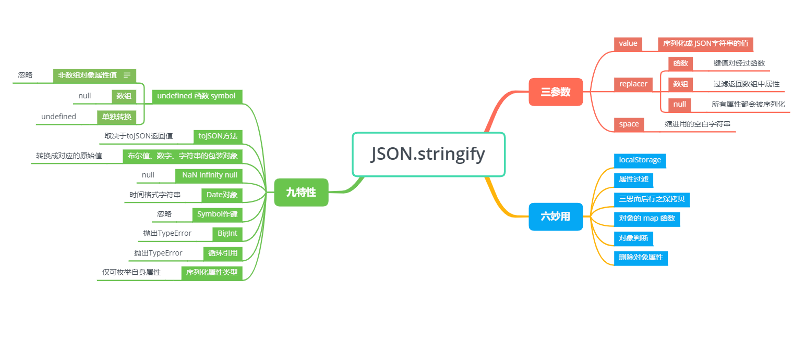

## 前言
`JSON.stringify` 作为日常开发中经常使用的方法，你真的能灵活运用它吗？

学习本文之前，小包想让大家带着几个问题，一起来深入学习 `stringify` 。
+ `stringify` 函数有几个参数，每个参数分别有啥用啊?
+ `stringify` 序列化准则有哪些啊?
  + 函数序列化中会如何处理?
  + `null、undefined、NaN` 等特殊的值又会如何处理?
  + `ES6` 后增加的 `Symbol` 类型、`BigInt` 序列化过程中会有特别处理吗?
+ `stringify` 为什么不适合做深拷贝?
+ 你能想到那些 `stringify` 的妙用?

整个文章的脉络跟下面思维导图一致，大家可以先留一点印象。



## 三参数
在日常编程中，我们经常 `JSON.stringify` 方法将某个对象转换成 `JSON` 字符串形式。

```js
const stu = {
    name: 'zcxiaobao',
    age: 18
}

// {"name":"zcxiaobao","age":18}
console.log(JSON.stringify(stu));
```

但 `stringify` 真的就这么简单吗？我们先来看一下 `MDN` 中对 `stringify` 的定义。

[MDN](https://developer.mozilla.org/zh-CN/docs/Web/JavaScript/Reference/Global_Objects/JSON/stringify#syntax) 中指出: `JSON.stringify()` 方法将一个 `JavaScript` 对象或值转换为 `JSON` 字符串，如果指定了一个 `replacer` 函数，则可以选择性地替换值，或者指定的 `replacer` 是数组，则可选择性地仅包含数组指定的属性。

看完定义，小包就一惊，`stringfy` 不止一个参数吗？当然了，`stringify` 有三个参数。

咱们来看一下 `stringify` 语法和参数介绍:
```js
JSON.stringify(value[, replacer [, space]])
```
- `value`: 将要序列后成 JSON 字符串的值。
- `replacer`(可选)
  1. 如果该参数是一个**函数**，则在序列化过程中，被序列化的值的每个属性都会经过该函数的转换和处理；
  2. 如果该参数是一个**数组**，则只有包含在这个数组中的属性名才会被序列化到最终的 `JSON` 字符串中
  3. 如果该参数为 `null` 或者未提供，则对象所有的属性都会被序列化。
- `space`(可选): 指定缩进用的空白字符串，用于美化输出
  1. 如果参数是个数字，它代表有多少的空格。上限为10。
  2. 该值若小于1，则意味着没有空格
  3. 如果该参数为字符串（当字符串长度超过10个字母，取其前10个字母），该字符串将被作为空格
  4. 如果该参数没有提供（或者为 null），将没有空格

### replacer
我们来尝试一下 `replacer` 的使用。

1. `replacer` 作为函数

`replacer` 作为函数，它有两个参数，键(`key`) 和 值(`value`)，并且两个参数都会被序列化。

在开始时，**replacer 函数会被传入一个空字符串作为 key 值，代表着要被 stringify 的这个对象**。理解这点很重要，`replacer` 函数并非是上来就把对象解析成键值对形式，而是先传入了**待序列化对象**。随后每个对象或数组上的属性会被依次传入。 **如果函数返回值为undefined或者函数时，该属性值会被过滤掉**，其余按照返回规则。
```js
// repalcer 接受两个参数 key value
// key value 分别为对象的每个键值对
// 因此我们可以根据键或者值的类型进行简单筛选
function replacer(key, value) {
  if (typeof value === "string") {
    return undefined;
  }
  return value;
}
// function 可自己测试
function replacerFunc(key, value) {
  if (typeof value === "string") {
    return () => {};
  }
  return value;
}
const foo = {foundation: "Mozilla", model: "box", week: 45, transport: "car", month: 7};
const jsonString = JSON.stringify(foo, replacer);
```
`JSON` 序列化结果为 `{"week":45,"month":7}`

但如果序列化的是数组，若 `replacer` 函数返回 `undefined` 或者函数，当前值不会被忽略，而将会被 `null` 取代。

```js
const list = [1, '22', 3]
const jsonString = JSON.stringify(list, replacer)
```

`JSON` 序列化的结果为 '[1,null,3]'

2. `replacer` 作为数组

作为数组比较好理解，过滤数组中出现的键值。

```js
const foo = {foundation: "Mozilla", model: "box", week: 45, transport: "car", month: 7};
const jsonString = JSON.stringify(foo, ['week', 'month']);
```

JSON 序列化结果为 `{"week":45,"month":7}`, 只保留 `week` 和 `month` 属性值。


## 九特性
### 特性一: undefined、函数、Symbol值
1. 出现在非数组对象属性值中: `undefined`、任意函数、`Symbol` 值在序列化过程中将会被**忽略**
2. 出现在数组中: `undefined`、任意函数、`Symbol`值会被转化为 **null**
3. 单独转换时: 会返回 **undefined**


```js
// 1. 对象属性值中存在这三种值会被忽略
const obj = {
  name: 'zc',
  age: 18,
  // 函数会被忽略
  sayHello() {
    console.log('hello world')
  },
  // undefined会被忽略
  wife: undefined,
  // Symbol值会被忽略
  id: Symbol(111),
  // [Symbol('zc')]: 'zc',
}
// 输出结果: {"name":"zc","age":18}
console.log(JSON.stringify(obj));

// 2. 数组中这三种值会被转化为 null
const list = [
  'zc', 
  18, 
  // 函数转化为 null
  function sayHello() {
    console.log('hello world')
  }, 
  // undefined 转换为 null
  undefined, 
  // Symbol 转换为 null
  Symbol(111)
]

// ["zc",18,null,null,null]
console.log(JSON.stringify(list))

// 3. 这三种值单独转化将会返回 undefined

console.log(JSON.stringify(undefined))  // undefined
console.log(JSON.stringify(Symbol(111))) // undefined
console.log(JSON.stringify(function sayHello() { 
  console.log('hello world')
})) // undefined
```


### 特性二: toJSON() 方法
转换值如果有 `toJSON()` 方法，`toJSON()` 方法返回什么值，序列化结果就返回什么值，其余值会被忽略。

```js
const obj = {
  name: 'zc',
  toJSON(){
    return 'return toJSON'
  }
}
// return toJSON
console.log(JSON.stringify(obj));
```
### 特性三: 布尔值、数字、字符串的包装对象
**布尔值、数字、字符串的包装对象在序列化过程中会自动转换成对应的原始值**

```js
JSON.stringify([new Number(1), new String("zcxiaobao"), new Boolean(true)]);
// [1,"zcxiaobao",true]
```

### 特性四: NaN Infinity null
特性四主要针对 `JavaScript` 里面的特殊值，例如 `Number` 类型里的 `NaN` 和 `Infinity` 及 null 。此三种数值**序列化过程中都会被当做 `null`** 。

```js
// [null,null,null,null,null]
JSON.stringify([null, NaN, -NaN, Infinity, -Infinity])

// 特性三讲过布尔值、数字、字符串的包装对象在序列化过程中会自动转换成对应的原始值
// 隐式类型转换就会调用包装类，因此会先调用 Number => NaN
// 之后再转化为 null
// 0/0 => Infinity => null
JSON.stringify([Number('123a'), +'123a', 0/0])
```

### 特性五: Date对象
`Date` 对象上部署了 `toJSON` 方法(同 `Date.toISOString()`)将其转换为字符串，因此 **JSON.stringify() 将会序列化 Date 的值为时间格式字符串**。

```js
// "2022-03-06T08:24:56.138Z"
JSON.stringify(new Date())
```
### 特性六: Symbol
特性一提到，`Symbol` 类型当作值来使用时，对象、数组、单独使用分别会被忽略、转换为 `null` 、转化为 `undefined`。

同样的，**所有以 Symbol 为属性键的属性都会被完全忽略掉，即便 replacer 参数中强制指定包含了它们**。

```js
const obj = {
  name: 'zcxiaobao',
  age: 18,
  [Symbol('lyl')]: 'unique'
}
function replacer(key, value) {
  if (typeof key === 'symbol') {
    return value;
  }
}

// undefined
JSON.stringify(obj, replacer);
```
通过上面案例，我们可以看出，虽然我们通过 `replacer` 强行指定了返回 `Symbol` 类型值，但最终还是会被忽略掉。
### 特性七: BigInt
`JSON.stringify` 规定: **尝试去转换 `BigInt` 类型的值会抛出 `TypeError`**

```js
const bigNumber = BigInt(1)
// Uncaught TypeError: Do not know how to serialize a BigInt
console.log(JSON.stringify(bigNumber))
```
### 特性八: 循环引用
特性八指出: **对包含循环引用的对象（对象之间相互引用，形成无限循环）执行此方法，会抛出错误**

日常开发中深拷贝最简单暴力的方式就是使用 `JSON.parse(JSON.stringify(obj))`，但此方法下的深拷贝存在巨坑，关键问题就在于 `stringify` 无法处理循环引用问题。

```js
const obj = {
  name: 'zcxiaobao',
  age: 18,
}

const loopObj = {
  obj
}
// 形成循环引用
obj.loopObj = loopObj;
JSON.stringify(obj)

/* Uncaught TypeError: Converting circular structure to JSON
    --> starting at object with constructor 'Object'
    |     property 'loopObj' -> object with constructor 'Object'
    --- property 'obj' closes the circle
    at JSON.stringify (<anonymous>)
    at <anonymous>:10:6
*/
```
### 特性九: 可枚举属性
对于对象(包括 `Map/Set/WeakMap/WeakSet`)的序列化，除了上文讲到的一些情况，`stringify` 也明确规定，**仅会序列化可枚举的属性**

```js
// 不可枚举的属性默认会被忽略
// {"age":18}
JSON.stringify(
    Object.create(
        null,
        {
            name: { value: 'zcxiaobao', enumerable: false },
            age: { value: 18, enumerable: true }
        }
    )
);
```
## 六妙用
### localStorage
`localStorage` 对象用于长久保存整个网站的数据，保存的数据没有过期时间，直到手动去删除。通常我们以对象形式进行存储。

1. 单纯调用 `localStorage` 对象方法
```js
const obj = {
  name: 'zcxiaobao',
  age: 18
}
// 单纯调用 localStorage.setItem()

localStorage.setItem('zc', obj);

// 最终返回结果是 [object Object]
// 可见单纯调用localStorage是失败的
console.log(localStorage.getItem('zc'))
```
2. `localStorage` 配合 `JSON.stringify` 方法
```js

localStorage.setItem('zc', JSON.stringify(obj));

// 最终返回结果是 {name: 'zcxiaobao', age: 18}
console.log(JSON.parse(localStorage.getItem('zc')))
```
### 属性过滤
来假设这样一个场景，后端返回了一个很长的对象，对象里面属性很多，而我们只需要其中几个属性，并且这几个属性我们要存储到 `localStorage` 中。

1. 方案一: 解构赋值+ `stringify` 
```js
// 我们只需要 a,e,f 属性
const obj = {
  a:1, b:2, c:3, d:4, e:5, f:6, g:7
}
// 解构赋值
const {a,e,f} = obj;
// 存储到localStorage
localStorage.setItem('zc', JSON.stringify({a,e,f}))
// {"a":1,"e":5,"f":6}
console.log(localStorage.getItem('zc'))
```
2. 使用 `stringify` 的 `replacer` 参数
  
```js
// 借助 replacer 作为数组形式进行过滤
localStorage.setItem('zc', JSON.stringify(obj, ['a','e','f']))
// {"a":1,"e":5,"f":6}
console.log(localStorage.getItem('zc'))
```
当 `replacer` 是数组时，可以简单的过滤出我们所需的属性，是一个不错的小技巧。


### 三思而后行之深拷贝
使用 `JSON.parse(JSON.stringify)` 是实现对象的深拷贝最简单暴力的方法之一。但也正如标题所言，使用该种方法的深拷贝要深思熟虑。
1. 循环引用问题，`stringify` 会报错
2. 函数、`undefined`、`Symbol` 会被忽略
3. `NaN`、`Infinity` 和 `-Infinity` 会被序列化成 `null` 
4. ...

因此在使用 `JSON.parse(JSON.stringify)` 做深拷贝时，一定要深思熟虑。如果没有上述隐患，`JSON.parse(JSON.stringify)` 是一个可行的深拷贝方案。
### 对象的 map 函数
在使用数组进行编程时，我们会经常使用到 `map` 函数。有了 `replacer` 参数后，我们就可以借助此参数，实现对象的 `map` 函数。

```js
const ObjectMap = (obj, fn) => {
  if (typeof fn !== "function") {
    throw new TypeError(`${fn} is not a function !`);
  }
  // 先调用 JSON.stringify(obj, replacer) 实现 map 功能
  // 然后调用 JSON.parse 重新转化成对象
  return JSON.parse(JSON.stringify(obj, fn));
};

// 例如下面给 obj 对象的属性值乘以2

const obj = {
  a: 1,
  b: 2,
  c: 3
}
console.log(ObjectMap(obj, (key, val) => {
  if (typeof value === "number") {
    return value * 2;
  }
  return value;
}))
```

很多同学有可能会很奇怪，为什么里面还需要多加一部判断，直接 `return value * 2` 不可吗？

上文讲过，`replacer` 函数首先传入的是待序列化对象，**对象 * 2 => NaN => toJSON(NaN) => undefined => 被忽略**，就没有后续的键值对解析了。

### 删除对象属性
借助 `replacer` 函数，我们还可以删除对象的某些属性。

```js
const obj = {
  name: 'zcxiaobao',
  age: 18
}
// {"age":18}
JSON.stringify(obj, (key, val) => {
  // 返回值为 undefined时，该属性会被忽略 
  if (key === 'name') {
    return undefined;
  }
  return val;
})
```

### 对象判断
`JSON.stringify` 可以将对象序列化为字符串，因此我们可以借助字符串的方法来实现简单的对象相等判断。

```js
//判断数组是否包含某对象
const names = [
  {name:'zcxiaobao'},
  {name:'txtx'},
  {name:'mymy'},
];
const zcxiaobao = {name:'zcxiaobao'};
// true
JSON.stringify(names).includes(JSON.stringify(zcxiaobao))
 
// 判断对象是否相等
const d1 = {type: 'div'}
const d2 = {type: 'div'}

// true
JSON.stringify(d1) === JSON.stringify(d2);
```

#### 数组对象去重
借助上面的思想，我们还能实现简单的数组对象去重。

但由于 `JSON.stringify` 序列化 `{x:1, y:1}` 和 `{y:1, x:1}` 结果不同，因此在开始之前我们需要处理一下数组中的对象。

1. 方法一: 将数组中的每个对象的键按字典序排列
```js
arr.forEach(item => {
  const newItem = {};
  Object.keys(item)   // 获取对象键值
        .sort()       // 键值排序
        .map(key => { // 生成新对象
          newItem[key] = item[key];
        })
  // 使用 newItem 进行去重操作
})
```
但方法一有些繁琐，`JSON.stringify` 提供了 `replacer` 数组格式参数，可以过滤数组。

2. 方法二: 借助 `replacer` 数组格式

```js
function unique(arr) {
  const keySet = new Set();
  const uniqueObj = {}
  // 提取所有的键
  arr.forEach(item => {
    Object.keys(item).forEach(key => keySet.add(key))
  })
  const replacer = [...keySet];
  arr.forEach(item => {
    // 所有的对象按照规定键值 replacer 过滤
    unique[JSON.stringify(item, replacer)] = item;
  })
  return Object.keys(unique).map(u => JSON.parse(u))
}

// 测试一下
unique([{}, {}, 
      {x:1},
      {x:1},
      {a:1},
      {x:1,a:1},
      {x:1,a:1},
      {x:1,a:1,b:1}
      ])

// 返回结果
[{},{"x":1},{"a":1},{"x":1,"a":1},{"x":1,"a":1,"b":1}]
```
## 后语

我是 **战场小包** ，一个快速成长中的小前端，希望可以和大家一起进步。

如果喜欢小包，可以在 **[掘金](https://juejin.cn/user/4424090519078430 "https://juejin.cn/user/4424090519078430")** 关注我，同样也可以关注我的小小公众号——**[小包学前端](https://zcxiaobao.gitee.io/wx-demo/wx.png)**。

一路加油，冲向未来!!!

## 疫情早日结束 人间恢复太平
---
theme: fancy
---
## 前言
`JSON.stringify` 作为日常开发中经常使用的方法，你真的能灵活运用它吗？

学习本文之前，小包想让大家带着几个问题，一起来深入学习 `stringify` 。
+ `stringify` 函数有几个参数，每个参数分别有啥用啊?
+ `stringify` 序列化准则有哪些啊?
  + 函数序列化中会如何处理?
  + `null、undefined、NaN` 等特殊的值又会如何处理?
  + `ES6` 后增加的 `Symbol` 类型、`BigInt` 序列化过程中会有特别处理吗?
+ `stringify` 为什么不适合做深拷贝?
+ 你能想到那些 `stringify` 的妙用?

整个文章的脉络跟下面思维导图一致，大家可以先留一点印象。


## 三参数
在日常编程中，我们经常 `JSON.stringify` 方法将某个对象转换成 `JSON` 字符串形式。

```js
const stu = {
    name: 'zcxiaobao',
    age: 18
}

// {"name":"zcxiaobao","age":18}
console.log(JSON.stringify(stu));
```

但 `stringify` 真的就这么简单吗？我们先来看一下 `MDN` 中对 `stringify` 的定义。

[MDN](https://developer.mozilla.org/zh-CN/docs/Web/JavaScript/Reference/Global_Objects/JSON/stringify#syntax) 中指出: `JSON.stringify()` 方法将一个 `JavaScript` 对象或值转换为 `JSON` 字符串，如果指定了一个 `replacer` 函数，则可以选择性地替换值，或者指定的 `replacer` 是数组，则可选择性地仅包含数组指定的属性。

看完定义，小包就一惊，`stringfy` 不止一个参数吗？当然了，`stringify` 有三个参数。

咱们来看一下 `stringify` 语法和参数介绍:
```js
JSON.stringify(value[, replacer [, space]])
```
- `value`: 将要序列后成 JSON 字符串的值。
- `replacer`(可选)
  1. 如果该参数是一个**函数**，则在序列化过程中，被序列化的值的每个属性都会经过该函数的转换和处理；
  2. 如果该参数是一个**数组**，则只有包含在这个数组中的属性名才会被序列化到最终的 `JSON` 字符串中
  3. 如果该参数为 `null` 或者未提供，则对象所有的属性都会被序列化。
- `space`(可选): 指定缩进用的空白字符串，用于美化输出
  1. 如果参数是个数字，它代表有多少的空格。上限为10。
  2. 该值若小于1，则意味着没有空格
  3. 如果该参数为字符串（当字符串长度超过10个字母，取其前10个字母），该字符串将被作为空格
  4. 如果该参数没有提供（或者为 null），将没有空格

### replacer
我们来尝试一下 `replacer` 的使用。

1. `replacer` 作为函数

`replacer` 作为函数，它有两个参数，键(`key`) 和 值(`value`)，并且两个参数都会被序列化。

在开始时，**replacer 函数会被传入一个空字符串作为 key 值，代表着要被 stringify 的这个对象**。理解这点很重要，`replacer` 函数并非是上来就把对象解析成键值对形式，而是先传入了**待序列化对象**。随后每个对象或数组上的属性会被依次传入。 **如果函数返回值为undefined或者函数时，该属性值会被过滤掉**，其余按照返回规则。
```js
// repalcer 接受两个参数 key value
// key value 分别为对象的每个键值对
// 因此我们可以根据键或者值的类型进行简单筛选
function replacer(key, value) {
  if (typeof value === "string") {
    return undefined;
  }
  return value;
}
// function 可自己测试
function replacerFunc(key, value) {
  if (typeof value === "string") {
    return () => {};
  }
  return value;
}
const foo = {foundation: "Mozilla", model: "box", week: 45, transport: "car", month: 7};
const jsonString = JSON.stringify(foo, replacer);
```
`JSON` 序列化结果为 `{"week":45,"month":7}`

但如果序列化的是数组，若 `replacer` 函数返回 `undefined` 或者函数，当前值不会被忽略，而将会被 `null` 取代。

```js
const list = [1, '22', 3]
const jsonString = JSON.stringify(list, replacer)
```

`JSON` 序列化的结果为 '[1,null,3]'

2. `replacer` 作为数组

作为数组比较好理解，过滤数组中出现的键值。

```js
const foo = {foundation: "Mozilla", model: "box", week: 45, transport: "car", month: 7};
const jsonString = JSON.stringify(foo, ['week', 'month']);
```

JSON 序列化结果为 `{"week":45,"month":7}`, 只保留 `week` 和 `month` 属性值。


## 九特性
### 特性一: undefined、函数、Symbol值
1. 出现在非数组对象属性值中: `undefined`、任意函数、`Symbol` 值在序列化过程中将会被**忽略**
2. 出现在数组中: `undefined`、任意函数、`Symbol`值会被转化为 **null**
3. 单独转换时: 会返回 **undefined**


```js
// 1. 对象属性值中存在这三种值会被忽略
const obj = {
  name: 'zc',
  age: 18,
  // 函数会被忽略
  sayHello() {
    console.log('hello world')
  },
  // undefined会被忽略
  wife: undefined,
  // Symbol值会被忽略
  id: Symbol(111),
  // [Symbol('zc')]: 'zc',
}
// 输出结果: {"name":"zc","age":18}
console.log(JSON.stringify(obj));

// 2. 数组中这三种值会被转化为 null
const list = [
  'zc', 
  18, 
  // 函数转化为 null
  function sayHello() {
    console.log('hello world')
  }, 
  // undefined 转换为 null
  undefined, 
  // Symbol 转换为 null
  Symbol(111)
]

// ["zc",18,null,null,null]
console.log(JSON.stringify(list))

// 3. 这三种值单独转化将会返回 undefined

console.log(JSON.stringify(undefined))  // undefined
console.log(JSON.stringify(Symbol(111))) // undefined
console.log(JSON.stringify(function sayHello() { 
  console.log('hello world')
})) // undefined
```


### 特性二: toJSON() 方法
转换值如果有 `toJSON()` 方法，`toJSON()` 方法返回什么值，序列化结果就返回什么值，其余值会被忽略。

```js
const obj = {
  name: 'zc',
  toJSON(){
    return 'return toJSON'
  }
}
// return toJSON
console.log(JSON.stringify(obj));
```
### 特性三: 布尔值、数字、字符串的包装对象
**布尔值、数字、字符串的包装对象在序列化过程中会自动转换成对应的原始值**

```js
JSON.stringify([new Number(1), new String("zcxiaobao"), new Boolean(true)]);
// [1,"zcxiaobao",true]
```

### 特性四: NaN Infinity null
特性四主要针对 `JavaScript` 里面的特殊值，例如 `Number` 类型里的 `NaN` 和 `Infinity` 及 null 。此三种数值**序列化过程中都会被当做 `null`** 。

```js
// [null,null,null,null,null]
JSON.stringify([null, NaN, -NaN, Infinity, -Infinity])

// 特性三讲过布尔值、数字、字符串的包装对象在序列化过程中会自动转换成对应的原始值
// 隐式类型转换就会调用包装类，因此会先调用 Number => NaN
// 之后再转化为 null
// 0/0 => Infinity => null
JSON.stringify([Number('123a'), +'123a', 0/0])
```

### 特性五: Date对象
`Date` 对象上部署了 `toJSON` 方法(同 `Date.toISOString()`)将其转换为字符串，因此 **JSON.stringify() 将会序列化 Date 的值为时间格式字符串**。

```js
// "2022-03-06T08:24:56.138Z"
JSON.stringify(new Date())
```
### 特性六: Symbol
特性一提到，`Symbol` 类型当作值来使用时，对象、数组、单独使用分别会被忽略、转换为 `null` 、转化为 `undefined`。

同样的，**所有以 Symbol 为属性键的属性都会被完全忽略掉，即便 replacer 参数中强制指定包含了它们**。

```js
const obj = {
  name: 'zcxiaobao',
  age: 18,
  [Symbol('lyl')]: 'unique'
}
function replacer(key, value) {
  if (typeof key === 'symbol') {
    return value;
  }
}

// undefined
JSON.stringify(obj, replacer);
```
通过上面案例，我们可以看出，虽然我们通过 `replacer` 强行指定了返回 `Symbol` 类型值，但最终还是会被忽略掉。
### 特性七: BigInt
`JSON.stringify` 规定: **尝试去转换 `BigInt` 类型的值会抛出 `TypeError`**

```js
const bigNumber = BigInt(1)
// Uncaught TypeError: Do not know how to serialize a BigInt
console.log(JSON.stringify(bigNumber))
```
### 特性八: 循环引用
特性八指出: **对包含循环引用的对象（对象之间相互引用，形成无限循环）执行此方法，会抛出错误**

日常开发中深拷贝最简单暴力的方式就是使用 `JSON.parse(JSON.stringify(obj))`，但此方法下的深拷贝存在巨坑，关键问题就在于 `stringify` 无法处理循环引用问题。

```js
const obj = {
  name: 'zcxiaobao',
  age: 18,
}

const loopObj = {
  obj
}
// 形成循环引用
obj.loopObj = loopObj;
JSON.stringify(obj)

/* Uncaught TypeError: Converting circular structure to JSON
    --> starting at object with constructor 'Object'
    |     property 'loopObj' -> object with constructor 'Object'
    --- property 'obj' closes the circle
    at JSON.stringify (<anonymous>)
    at <anonymous>:10:6
*/
```
### 特性九: 可枚举属性
对于对象(包括 `Map/Set/WeakMap/WeakSet`)的序列化，除了上文讲到的一些情况，`stringify` 也明确规定，**仅会序列化可枚举的属性**

```js
// 不可枚举的属性默认会被忽略
// {"age":18}
JSON.stringify(
    Object.create(
        null,
        {
            name: { value: 'zcxiaobao', enumerable: false },
            age: { value: 18, enumerable: true }
        }
    )
);
```
## 六妙用
### localStorage
`localStorage` 对象用于长久保存整个网站的数据，保存的数据没有过期时间，直到手动去删除。通常我们以对象形式进行存储。

1. 单纯调用 `localStorage` 对象方法
```js
const obj = {
  name: 'zcxiaobao',
  age: 18
}
// 单纯调用 localStorage.setItem()

localStorage.setItem('zc', obj);

// 最终返回结果是 [object Object]
// 可见单纯调用localStorage是失败的
console.log(localStorage.getItem('zc'))
```
2. `localStorage` 配合 `JSON.stringify` 方法
```js

localStorage.setItem('zc', JSON.stringify(obj));

// 最终返回结果是 {name: 'zcxiaobao', age: 18}
console.log(JSON.parse(localStorage.getItem('zc')))
```
### 属性过滤
来假设这样一个场景，后端返回了一个很长的对象，对象里面属性很多，而我们只需要其中几个属性，并且这几个属性我们要存储到 `localStorage` 中。

1. 方案一: 解构赋值+ `stringify` 
```js
// 我们只需要 a,e,f 属性
const obj = {
  a:1, b:2, c:3, d:4, e:5, f:6, g:7
}
// 解构赋值
const {a,e,f} = obj;
// 存储到localStorage
localStorage.setItem('zc', JSON.stringify({a,e,f}))
// {"a":1,"e":5,"f":6}
console.log(localStorage.getItem('zc'))
```
2. 使用 `stringify` 的 `replacer` 参数
  
```js
// 借助 replacer 作为数组形式进行过滤
localStorage.setItem('zc', JSON.stringify(obj, ['a','e','f']))
// {"a":1,"e":5,"f":6}
console.log(localStorage.getItem('zc'))
```
当 `replacer` 是数组时，可以简单的过滤出我们所需的属性，是一个不错的小技巧。


### 三思而后行之深拷贝
使用 `JSON.parse(JSON.stringify)` 是实现对象的深拷贝最简单暴力的方法之一。但也正如标题所言，使用该种方法的深拷贝要深思熟虑。
1. 循环引用问题，`stringify` 会报错
2. 函数、`undefined`、`Symbol` 会被忽略
3. `NaN`、`Infinity` 和 `-Infinity` 会被序列化成 `null` 
4. ...

因此在使用 `JSON.parse(JSON.stringify)` 做深拷贝时，一定要深思熟虑。如果没有上述隐患，`JSON.parse(JSON.stringify)` 是一个可行的深拷贝方案。
### 对象的 map 函数
在使用数组进行编程时，我们会经常使用到 `map` 函数。有了 `replacer` 参数后，我们就可以借助此参数，实现对象的 `map` 函数。

```js
const ObjectMap = (obj, fn) => {
  if (typeof fn !== "function") {
    throw new TypeError(`${fn} is not a function !`);
  }
  // 先调用 JSON.stringify(obj, replacer) 实现 map 功能
  // 然后调用 JSON.parse 重新转化成对象
  return JSON.parse(JSON.stringify(obj, fn));
};

// 例如下面给 obj 对象的属性值乘以2

const obj = {
  a: 1,
  b: 2,
  c: 3
}
console.log(ObjectMap(obj, (key, val) => {
  if (typeof value === "number") {
    return value * 2;
  }
  return value;
}))
```

很多同学有可能会很奇怪，为什么里面还需要多加一部判断，直接 `return value * 2` 不可吗？

上文讲过，`replacer` 函数首先传入的是待序列化对象，**对象 * 2 => NaN => toJSON(NaN) => undefined => 被忽略**，就没有后续的键值对解析了。

### 删除对象属性
借助 `replacer` 函数，我们还可以删除对象的某些属性。

```js
const obj = {
  name: 'zcxiaobao',
  age: 18
}
// {"age":18}
JSON.stringify(obj, (key, val) => {
  // 返回值为 undefined时，该属性会被忽略 
  if (key === 'name') {
    return undefined;
  }
  return val;
})
```

### 对象判断
`JSON.stringify` 可以将对象序列化为字符串，因此我们可以借助字符串的方法来实现简单的对象相等判断。

```js
//判断数组是否包含某对象
const names = [
  {name:'zcxiaobao'},
  {name:'txtx'},
  {name:'mymy'},
];
const zcxiaobao = {name:'zcxiaobao'};
// true
JSON.stringify(names).includes(JSON.stringify(zcxiaobao))
 
// 判断对象是否相等
const d1 = {type: 'div'}
const d2 = {type: 'div'}

// true
JSON.stringify(d1) === JSON.stringify(d2);
```

#### 数组对象去重
借助上面的思想，我们还能实现简单的数组对象去重。

但由于 `JSON.stringify` 序列化 `{x:1, y:1}` 和 `{y:1, x:1}` 结果不同，因此在开始之前我们需要处理一下数组中的对象。

1. 方法一: 将数组中的每个对象的键按字典序排列
```js
arr.forEach(item => {
  const newItem = {};
  Object.keys(item)   // 获取对象键值
        .sort()       // 键值排序
        .map(key => { // 生成新对象
          newItem[key] = item[key];
        })
  // 使用 newItem 进行去重操作
})
```
但方法一有些繁琐，`JSON.stringify` 提供了 `replacer` 数组格式参数，可以过滤数组。

2. 方法二: 借助 `replacer` 数组格式

```js
function unique(arr) {
  const keySet = new Set();
  const uniqueObj = {}
  // 提取所有的键
  arr.forEach(item => {
    Object.keys(item).forEach(key => keySet.add(key))
  })
  const replacer = [...keySet];
  arr.forEach(item => {
    // 所有的对象按照规定键值 replacer 过滤
    unique[JSON.stringify(item, replacer)] = item;
  })
  return Object.keys(unique).map(u => JSON.parse(u))
}

// 测试一下
unique([{}, {}, 
      {x:1},
      {x:1},
      {a:1},
      {x:1,a:1},
      {x:1,a:1},
      {x:1,a:1,b:1}
      ])

// 返回结果
[{},{"x":1},{"a":1},{"x":1,"a":1},{"x":1,"a":1,"b":1}]
```
## 后语

我是 **战场小包** ，一个快速成长中的小前端，希望可以和大家一起进步。

如果喜欢小包，可以在 **[掘金](https://juejin.cn/user/4424090519078430 "https://juejin.cn/user/4424090519078430")** 关注我，同样也可以关注我的小小公众号——**[小包学前端](https://zcxiaobao.gitee.io/wx-demo/wx.png)**。

一路加油，冲向未来!!!

## 疫情早日结束 人间恢复太平
